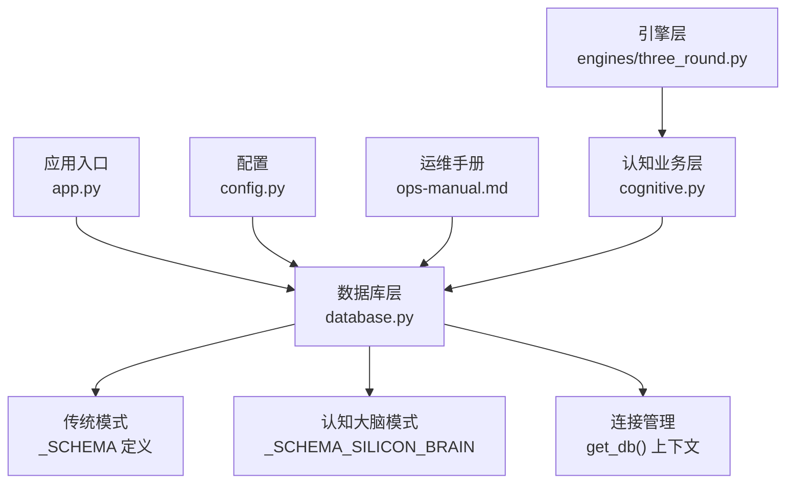
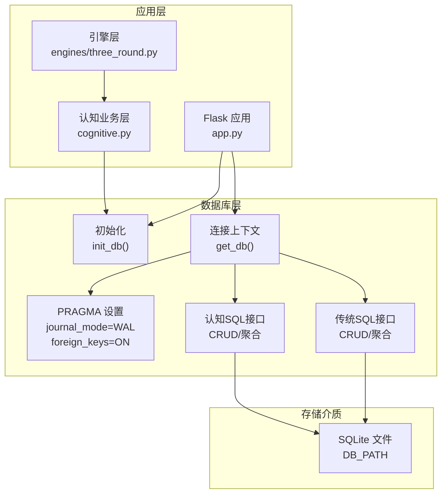
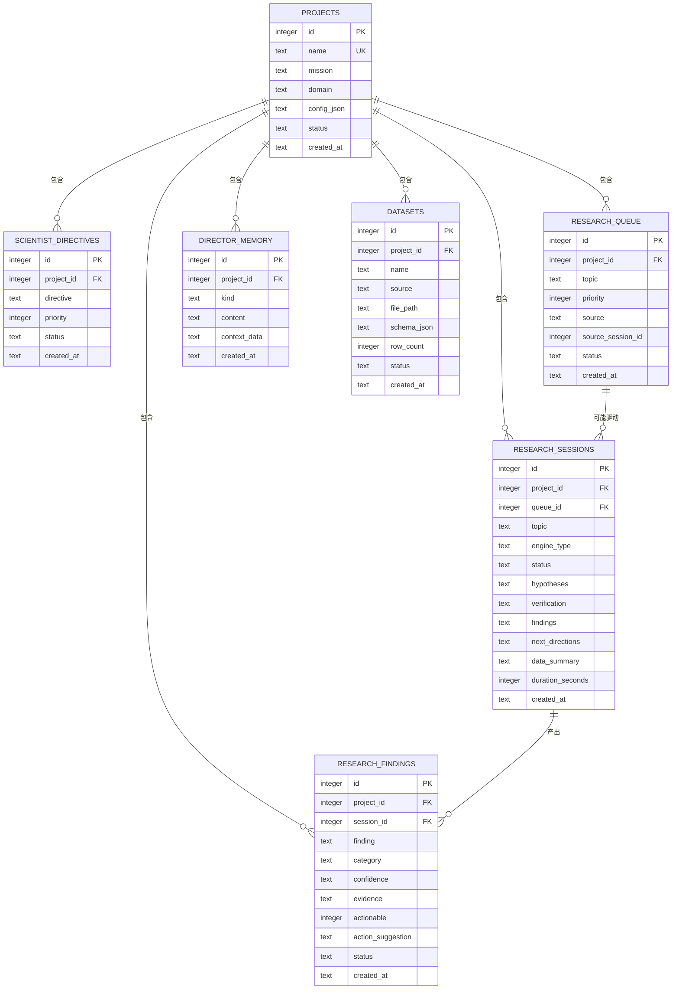
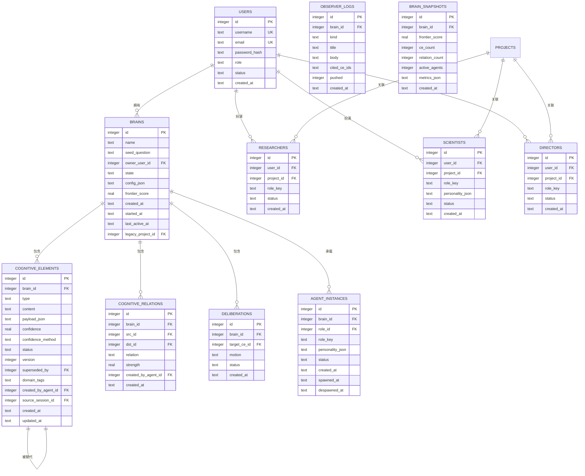
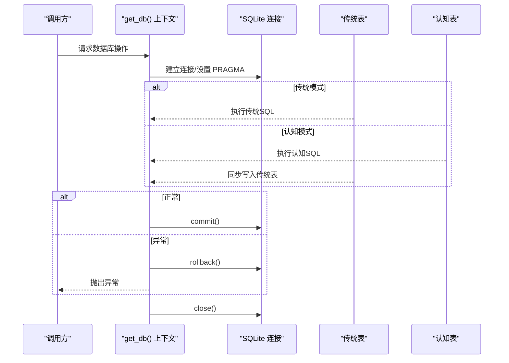
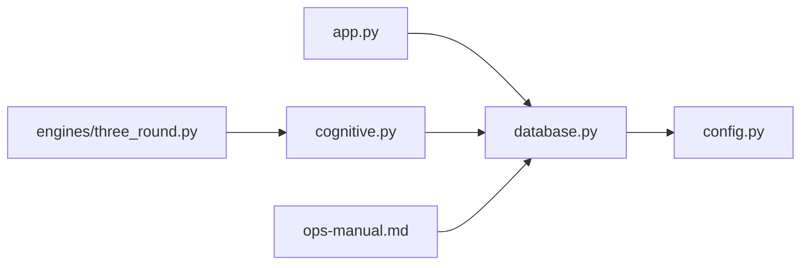
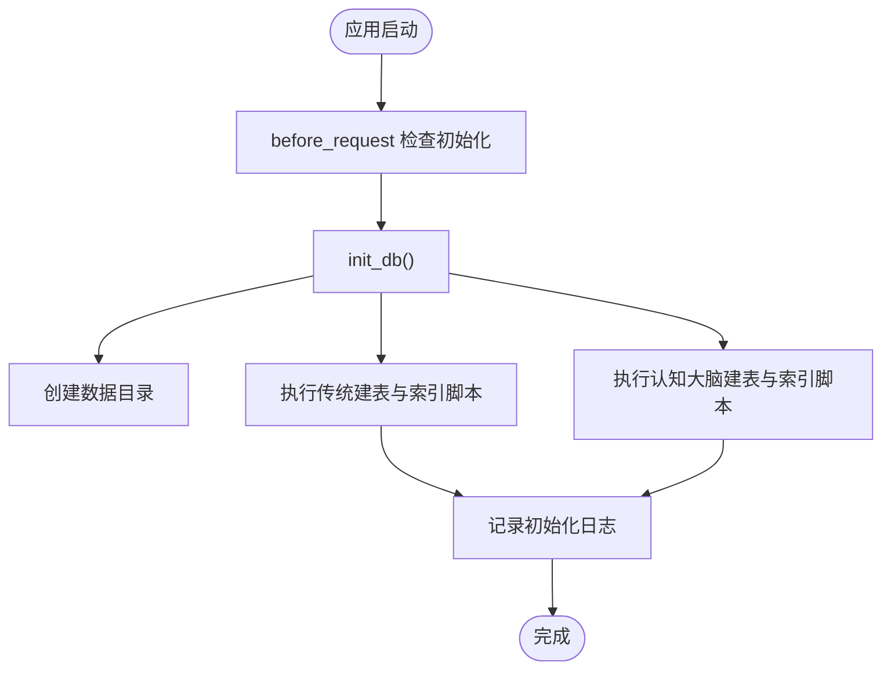

# 数据库架构

<cite>
**本文引用的文件**
- [database.py](file://database.py)
- [config.py](file://config.py)
- [app.py](file://app.py)
- [ops-manual.md](file://docs/ops-manual.md)
- [cognitive.py](file://cognitive.py)
- [engines/three_round.py](file://engines/three_round.py)
</cite>

## 目录
1. [简介](#简介)
2. [项目结构](#项目结构)
3. [核心组件](#核心组件)
4. [架构总览](#架构总览)
5. [详细组件分析](#详细组件分析)
6. [依赖分析](#依赖分析)
7. [性能考量](#性能考量)
8. [故障排查指南](#故障排查指南)
9. [结论](#结论)
10. [附录](#附录)

## 简介
本文件系统化梳理 AInstein 的数据库架构与设计要点，覆盖 SQLite 数据库的表结构、实体关系、连接与事务管理、并发控制、索引与查询优化、迁移与版本策略，以及备份与恢复机制。特别关注新增的认知大脑（Silicon Brain）架构，包括13个新增数据库表及其双写机制的实现。目标是帮助开发者与运维人员快速理解并高效维护该数据库层。

## 项目结构
数据库相关的核心实现集中在 database.py，配置项由 config.py 提供，应用启动时通过 app.py 初始化数据库；运维手册中提供了数据库位置、备份/恢复、清理等操作指引。新增的认知大脑架构通过独立的模式定义与现有项目表结构并存，形成兼容层设计。

图表来源
- [app.py:15-20](file://app.py#L15-L20)
- [database.py:101-123](file://database.py#L101-L123)
- [config.py:4](file://config.py#L4)
- [ops-manual.md:100-163](file://docs/ops-manual.md#L100-L163)
- [cognitive.py:1-37](file://cognitive.py#L1-L37)
- [engines/three_round.py:115-154](file://engines/three_round.py#L115-L154)

章节来源
- [database.py:101-123](file://database.py#L101-L123)
- [config.py:4](file://config.py#L4)
- [app.py:15-20](file://app.py#L15-L20)

## 核心组件
- **双模式架构**：传统项目管理表与认知大脑表并存，通过_init_db()同时应用两种模式，确保向后兼容。
- **数据库初始化与模式定义**：在模块加载时定义完整的建表语句与索引，并通过 init_db() 在应用启动时执行。
- **连接管理与事务**：通过上下文管理器统一建立连接、启用 WAL 日志模式与外键约束，自动提交或回滚异常，确保事务一致性。
- **实体与接口**：围绕项目、队列、会话、发现、记忆、数据集等传统实体，以及认知元素、关系、大脑、观察员、研究人员等新实体提供增删查改接口，支持统计聚合查询。

章节来源
- [database.py:101-123](file://database.py#L101-L123)
- [database.py:127-168](file://database.py#L127-L168)
- [database.py:173-187](file://database.py#L173-L187)
- [database.py:192-227](file://database.py#L192-L227)
- [database.py:232-261](file://database.py#L232-L261)
- [database.py:266-294](file://database.py#L266-L294)
- [database.py:299-319](file://database.py#L299-L319)
- [database.py:324-343](file://database.py#L324-L343)

## 架构总览
数据库层采用"单机 SQLite + WAL + 外键约束"的轻量级架构，配合应用层的上下文事务管理，满足中小规模科研探索场景的数据持久化需求。新增的认知大脑架构通过独立模式与现有系统并存，形成兼容层设计。运维手册补充了数据库位置、备份/恢复与清理策略，便于生产环境落地。

图表来源
- [app.py:15-20](file://app.py#L15-L20)
- [database.py:101-123](file://database.py#L101-L123)
- [config.py:4](file://config.py#L4)
- [cognitive.py:1-37](file://cognitive.py#L1-L37)
- [engines/three_round.py:115-154](file://engines/three_round.py#L115-L154)

## 详细组件分析

### 传统表结构与实体关系
- **项目 projects**：承载项目元信息与配置，作为其他实体的根。
- **科学家指令 scientist_directives**：与项目关联，记录研究方向与优先级。
- **研究队列 research_queue**：按优先级与状态调度待研究主题。
- **研究会话 research_sessions**：一次具体的研究过程，可关联队列项。
- **研究发现 research_findings**：会话产出的发现条目，支持分类、置信度与行动建议。
- **主管记忆 director_memory**：项目维度的记忆片段，支持按 kind 分类检索。
- **数据集 datasets**：项目下的数据集清单，记录来源、路径、模式与行数。

图表来源
- [database.py:11-98](file://database.py#L11-L98)

章节来源
- [database.py:11-98](file://database.py#L11-L98)

### 新增认知大脑表结构与实体关系
新增的13个数据库表构成了完整的认知大脑架构，支持智能体协作、知识图谱构建和认知演进：

#### 核心大脑表
- **用户 users**：认证与授权基础，支持角色管理。
- **大脑 brains**：认知主体，承载种子问题、状态管理和配置。
- **认知元素 cognitive_elements**：知识单元，支持12种类型（观察、问题、假设、证据等）。
- **认知关系 cognitive_relations**：元素间的关联，支持强度权重。
- **审议 deliberations**：对特定认知元素的讨论和决策过程。

#### 角色与实例表
- **研究人员 researchers**：项目级研究人员角色。
- **科学家 scientists**：专业研究角色，支持个性化的研究方法。
- **主管 directors**：项目管理者角色，负责整体方向把控。
- **代理实例 agent_instances**：智能体运行实例，支持生命周期管理。

#### 观察与监控表
- **观察员 logs observers**：记录观察员的日志和报告。
- **大脑快照 brain_snapshots**：定期捕获大脑状态指标。

图表来源
- [database.py:108-285](file://database.py#L108-L285)

章节来源
- [database.py:108-285](file://database.py#L108-L285)

### 连接管理与事务处理
- **连接建立**：每次数据库访问通过上下文管理器 get_db() 获取连接，设置行工厂以字典形式返回结果。
- **事务控制**：try/finally 结构确保异常时回滚，无异常时提交；finally 中关闭连接，避免资源泄漏。
- **并发与一致性**：启用 WAL 模式提升并发读写能力；开启外键约束保证参照完整性。
- **双写机制**：在认知大脑模式下，关键操作同时写入传统表和新表，确保数据一致性。

图表来源
- [database.py:109-122](file://database.py#L109-L122)
- [engines/three_round.py:115-154](file://engines/three_round.py#L115-L154)

章节来源
- [database.py:109-122](file://database.py#L109-L122)
- [engines/three_round.py:115-154](file://engines/three_round.py#L115-L154)

### 并发控制机制
- **WAL 模式**：提升多读并发与写入吞吐，降低锁竞争。
- **外键约束**：在插入/更新阶段强制参照完整性，避免悬挂引用。
- **应用层串行化**：当前未见显式的分布式锁或重试逻辑，建议在需要强一致性的关键流程中引入应用层重试或外部协调（如 Redis 锁）。
- **双写一致性**：通过事务保证传统表和认知表的同时成功或失败。

章节来源
- [database.py:113-114](file://database.py#L113-L114)

### 数据模型设计原则
- **主键与唯一性**：所有实体主键自增；项目名称唯一，避免重复项目；用户名和邮箱在用户表中唯一。
- **外键与级联**：通过 REFERENCES 约束保证父子关系；未见显式 ON DELETE 行为，默认遵循数据库默认行为。
- **索引优化**：
  - **传统表**：队列按 project_id 与 status 组合索引，会话按 project_id 与 created_at 排序索引，发现、记忆、数据集按 project_id 与 created_at 排序索引。
  - **认知表**：大脑按 owner_user_id 与 state 组合索引，认知元素按 brain_id 与 type/status 组合索引，以及按 brain_id 与 created_at 降序索引。
- **查询性能考虑**：
  - 使用组合索引匹配常见过滤条件（如 project_id + status）。
  - 时间序列查询优先利用 created_at 索引。
  - 聚合统计通过原生 SQL 实现，减少应用层二次处理。
  - 认知元素查询支持按类型、状态和时间的灵活过滤。

章节来源
- [database.py:11-98](file://database.py#L11-L98)
- [database.py:147-168](file://database.py#L147-L168)
- [database.py:108-285](file://database.py#L108-L285)

### 数据库迁移与版本管理策略
- **当前策略**：SQLite 单机文件，通过运维脚本进行备份/恢复与清理。
- **双模式兼容**：新旧表结构并存，通过_init_db()同时应用两种模式，确保向后兼容。
- **扩展策略**：当业务增长超出 SQLite 能力时，可迁移至 PostgreSQL。运维手册提供了迁移步骤与替换方案思路（替换驱动、调整 SQL 语法、修改配置）。

章节来源
- [ops-manual.md:484-505](file://docs/ops-manual.md#L484-L505)

### ER 图与表结构图
- **传统 ER 图**：已在上节给出，展示实体间的一对多关系与外键约束。
- **认知大脑 ER 图**：新增13个表的完整关系图，包括用户、大脑、认知元素、关系、角色实例等。
- **表结构图**：包含所有新增表的字段定义，支持主键、唯一性、默认值、类型与注释。

## 依赖分析
- **模块耦合**：
  - database.py 依赖 config.DB_PATH 提供数据库路径。
  - app.py 在请求前调用 init_db() 确保数据库可用。
  - cognitive.py 依赖 database.py 提供的认知接口。
  - engines/three_round.py 通过认知模块实现双写机制。
- **外部依赖**：
  - SQLite 本地文件存储。
  - 运维依赖 sqlite3 命令行工具与系统备份脚本。

图表来源
- [app.py:15-20](file://app.py#L15-L20)
- [database.py:6](file://database.py#L6)
- [config.py:4](file://config.py#L4)
- [cognitive.py:1-37](file://cognitive.py#L1-L37)
- [engines/three_round.py:115-154](file://engines/three_round.py#L115-L154)
- [ops-manual.md:100-163](file://docs/ops-manual.md#L100-L163)

章节来源
- [app.py:15-20](file://app.py#L15-L20)
- [database.py:6](file://database.py#L6)
- [config.py:4](file://config.py#L4)

## 性能考量
- **索引命中**：确保高频过滤条件（如 project_id、status、created_at）走索引扫描。
- **写入热点**：WAL 模式已缓解写入阻塞，仍建议批量写入与合理拆分任务。
- **查询限制**：列表接口普遍带 LIMIT，避免全表扫描。
- **清理策略**：定期清理过期会话与无效发现，保持表规模可控。
- **双写开销**：认知大脑模式下的双写机制会增加写入成本，建议在批量操作时优化事务处理。

## 故障排查指南
- **数据库位置确认**：检查 DB_PATH 是否正确，确保目录存在且可写。
- **双写问题排查**：检查传统表和认知表的数据一致性，确认事务是否正常提交。
- **备份与恢复**：
  - 手动备份：复制 .db 文件生成带时间戳的副本。
  - 定时备份：建议加入系统计划任务。
  - 从 SQL 恢复：先停止服务，删除旧库，再导入 SQL。
- **常用查询**：进入 sqlite3 后可查看表结构、统计数据与最近记录。
- **清理与维护**：删除过期会话、清理无效发现、执行 VACUUM 释放空间。

章节来源
- [ops-manual.md:108-163](file://docs/ops-manual.md#L108-L163)

## 结论
该数据库层以 SQLite 为核心，结合 WAL 与外键约束，在应用层通过上下文管理器实现可靠的事务控制。新增的认知大脑架构通过独立模式与现有系统并存，形成完整的双模式设计。表结构清晰、索引覆盖常见查询路径，适合中小规模科研探索场景。随着业务增长，可按运维手册指引平滑迁移到 PostgreSQL，并配套引入分布式锁与监控告警以增强可靠性。

## 附录

### 数据库初始化流程

图表来源
- [app.py:15-20](file://app.py#L15-L20)
- [database.py:101-106](file://database.py#L101-L106)
- [database.py:288-294](file://database.py#L288-L294)

### 认知元素类型定义
认知元素支持12种类型，严格遵循硅基大脑蓝图规范：
- 观察（observation）：L0原始层数据
- 问题（question）：L1推测层问题
- 假设（hypothesis）：L1推测层假设
- 证据（evidence）：L2证据层证据
- 反证（counter_evidence）：L2证据层反证
- 推论（inference）：L3推理层推论
- 论证（argument）：L3推理层论证
- 结论（conclusion）：L4认知层结论
- 观点（perspective）：L4认知层观点
- 洞察（insight）：L4认知层洞察
- 共识（consensus）：L5集体层共识
- 分歧（dissent）：L5集体层分歧

**章节来源**
- [cognitive.py:24-37](file://cognitive.py#L24-L37)