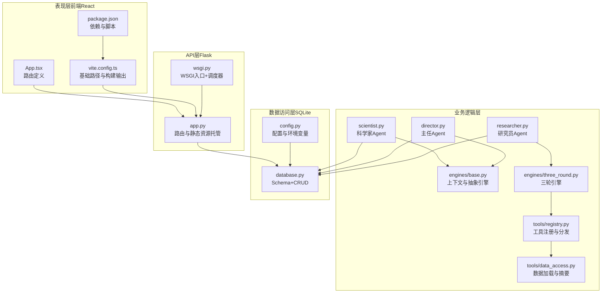
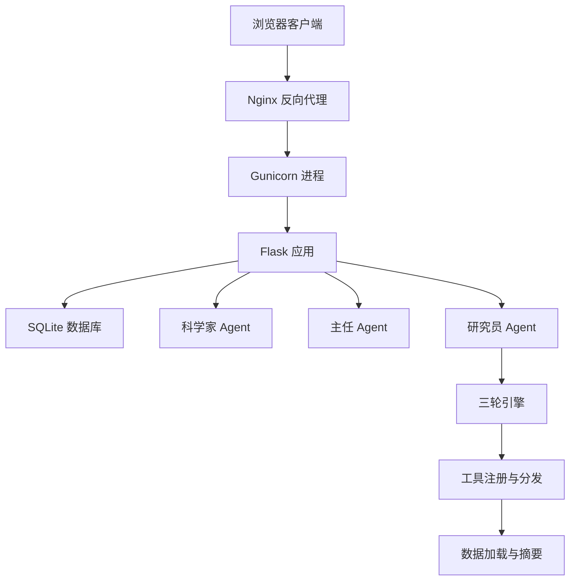
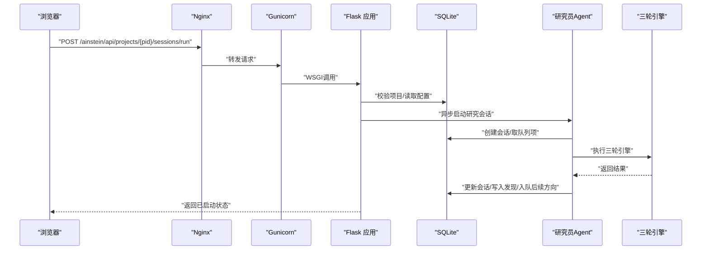
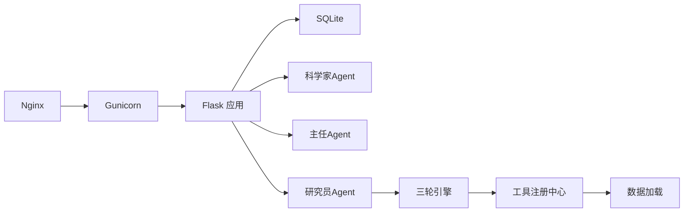

# 整体架构设计

<cite>
**本文引用的文件**
- [app.py](file://app.py)
- [wsgi.py](file://wsgi.py)
- [config.py](file://config.py)
- [database.py](file://database.py)
- [README.md](file://README.md)
- [frontend/package.json](file://frontend/package.json)
- [frontend/vite.config.ts](file://frontend/vite.config.ts)
- [frontend/src/App.tsx](file://frontend/src/App.tsx)
- [agents/researcher.py](file://agents/researcher.py)
- [agents/scientist.py](file://agents/scientist.py)
- [agents/director.py](file://agents/director.py)
- [engines/base.py](file://engines/base.py)
- [engines/three_round.py](file://engines/three_round.py)
- [tools/registry.py](file://tools/registry.py)
- [tools/data_access.py](file://tools/data_access.py)
</cite>

## 目录
1. [简介](#简介)
2. [项目结构](#项目结构)
3. [核心组件](#核心组件)
4. [架构总览](#架构总览)
5. [详细组件分析](#详细组件分析)
6. [依赖分析](#依赖分析)
7. [性能考虑](#性能考虑)
8. [故障排查指南](#故障排查指南)
9. [结论](#结论)
10. [附录](#附录)

## 简介
本设计文档面向AInstein（爱因斯坦）项目的整体架构，采用分层架构模式，包含表现层（前端React）、API层（Flask）、业务逻辑层（Agent与引擎）、数据访问层（SQLite）。文档阐述前后端分离实现方式（静态资源托管、单页应用路由、API接口设计），Flask应用初始化与请求处理流程，以及WSGI部署架构（Gunicorn进程管理与Nginx反向代理）。同时提供系统架构图与组件关系图，帮助读者快速理解各层职责与数据流。

## 项目结构
AInstein采用“前端React + 后端Flask”的前后端分离架构。前端通过Vite构建，产物输出到后端静态目录，由Flask统一托管；后端以Flask为核心，提供REST风格API，并通过WSGI入口由Gunicorn托管。业务逻辑由三级Agent（科学家→主任→研究员）与研究引擎（三轮引擎）构成，数据持久化使用SQLite，配合索引优化查询性能。

图表来源
- [app.py:11-38](file://app.py#L11-L38)
- [wsgi.py:74-82](file://wsgi.py#L74-L82)
- [database.py:101-123](file://database.py#L101-L123)
- [engines/base.py:11-49](file://engines/base.py#L11-L49)
- [engines/three_round.py:22-179](file://engines/three_round.py#L22-L179)
- [tools/registry.py:24-43](file://tools/registry.py#L24-L43)
- [tools/data_access.py:10-43](file://tools/data_access.py#L10-L43)
- [agents/scientist.py:14-75](file://agents/scientist.py#L14-L75)
- [agents/director.py:14-124](file://agents/director.py#L14-L124)
- [agents/researcher.py:14-114](file://agents/researcher.py#L14-L114)
- [frontend/src/App.tsx:1-13](file://frontend/src/App.tsx#L1-L13)
- [frontend/vite.config.ts:4-11](file://frontend/vite.config.ts#L4-L11)
- [frontend/package.json:6-22](file://frontend/package.json#L6-L22)

章节来源
- [README.md:71-92](file://README.md#L71-L92)
- [frontend/vite.config.ts:4-11](file://frontend/vite.config.ts#L4-L11)
- [frontend/src/App.tsx:1-13](file://frontend/src/App.tsx#L1-L13)
- [app.py:11-38](file://app.py#L11-L38)

## 核心组件
- 表现层（前端React）
  - 使用React + Vite + TypeScript，路由基于react-router-dom，构建产物输出至frontend/dist，并设置基础路径为“/ainstein/”，以便与后端统一前缀。
  - 关键文件：frontend/src/App.tsx（路由定义）、frontend/vite.config.ts（基础路径与输出目录）、frontend/package.json（依赖与脚本）。
- API层（Flask）
  - 初始化Flask应用，设置静态目录与URL前缀，提供健康检查、项目、队列、会话、发现、数据集、指令与调度等API。
  - 关键文件：app.py（路由与静态资源托管）、wsgi.py（WSGI入口与调度器锁）。
- 业务逻辑层
  - 三级Agent：科学家（制定策略与初始主题）、主任（每日复盘与队列治理）、研究员（执行三轮引擎研究）。
  - 研究引擎：三轮引擎（假设生成→工具检验→验证总结），工具注册与分发，数据加载与摘要。
  - 关键文件：agents/scientist.py、agents/director.py、agents/researcher.py、engines/base.py、engines/three_round.py、tools/registry.py、tools/data_access.py。
- 数据访问层（SQLite）
  - 定义项目、指令、队列、会话、发现、记忆、数据集等表结构，提供增删改查与统计聚合方法，使用WAL模式与外键约束提升并发与一致性。
  - 关键文件：database.py（Schema与CRUD）、config.py（配置与环境变量）。

章节来源
- [frontend/src/App.tsx:1-13](file://frontend/src/App.tsx#L1-L13)
- [frontend/vite.config.ts:4-11](file://frontend/vite.config.ts#L4-L11)
- [frontend/package.json:6-22](file://frontend/package.json#L6-L22)
- [app.py:11-177](file://app.py#L11-L177)
- [wsgi.py:74-82](file://wsgi.py#L74-L82)
- [agents/scientist.py:14-75](file://agents/scientist.py#L14-L75)
- [agents/director.py:14-124](file://agents/director.py#L14-L124)
- [agents/researcher.py:14-114](file://agents/researcher.py#L14-L114)
- [engines/base.py:11-49](file://engines/base.py#L11-L49)
- [engines/three_round.py:22-179](file://engines/three_round.py#L22-L179)
- [tools/registry.py:24-43](file://tools/registry.py#L24-L43)
- [tools/data_access.py:10-43](file://tools/data_access.py#L10-L43)
- [database.py:101-344](file://database.py#L101-L344)
- [config.py:1-11](file://config.py#L1-L11)

## 架构总览
AInstein采用“Nginx → Gunicorn → Flask → Agent/Engine → SQLite”的部署链路。Nginx负责静态资源与反向代理，Gunicorn承载Flask应用，APScheduler在WSGI进程中负责定时任务（科学家/主任/研究员的周期性执行）。前端通过统一前缀“/ainstein/”访问静态资源与API，Flask提供REST接口并持久化状态。

图表来源
- [README.md:71-83](file://README.md#L71-L83)
- [wsgi.py:74-82](file://wsgi.py#L74-L82)
- [app.py:11-177](file://app.py#L11-L177)
- [database.py:101-344](file://database.py#L101-L344)
- [engines/three_round.py:22-179](file://engines/three_round.py#L22-L179)
- [tools/registry.py:24-43](file://tools/registry.py#L24-L43)
- [tools/data_access.py:10-43](file://tools/data_access.py#L10-L43)

## 详细组件分析

### 前端（React + Vite）
- 路由与页面
  - 使用react-router-dom进行路由配置，根路径与项目详情页分别映射到Dashboard与ProjectDetail页面。
- 构建与部署
  - Vite构建时设置base为“/ainstein/”，输出目录为dist，与后端静态托管路径一致。
- 与后端协作
  - 前端通过统一前缀“/ainstein/api/...”访问后端API，确保与Nginx路径前缀保持一致。

章节来源
- [frontend/src/App.tsx:1-13](file://frontend/src/App.tsx#L1-L13)
- [frontend/vite.config.ts:4-11](file://frontend/vite.config.ts#L4-L11)
- [frontend/package.json:6-22](file://frontend/package.json#L6-L22)

### Flask应用（API层）
- 初始化与静态资源托管
  - 设置static_folder与static_url_path，将frontend/dist作为静态资源目录，统一前缀为“/ainstein/static”。
  - 提供SPA回退：当请求的静态文件不存在时，回退到index.html，支持前端路由。
- 请求处理流程
  - 健康检查、项目管理、队列管理、会话管理、发现查询、数据集上传、科学家/主任/研究员触发等API均在app.py中定义。
  - 所有API返回JSON格式响应，错误场景返回相应HTTP状态码。
- 中间件与生命周期
  - 在请求进入前确保数据库初始化，避免重复初始化。
- 开发与生产差异
  - 开发模式下可直接运行Flask；生产模式通过Gunicorn托管。

章节来源
- [app.py:11-38](file://app.py#L11-L38)
- [app.py:43-177](file://app.py#L43-L177)

### WSGI部署与调度（APScheduler）
- WSGI入口
  - wsgi.py导出application（即Flask app），供Gunicorn加载。
- 调度器与锁
  - 使用文件锁保证同一时间仅有一个进程启动调度器，避免重复执行定时任务。
  - 调度器按UTC时间执行：研究员每日03:30、主任每日10:00、科学家每周一06:00。
- 与Flask集成
  - 在WSGI启动时初始化数据库，确保调度器与应用共享同一DB实例。

章节来源
- [wsgi.py:74-82](file://wsgi.py#L74-L82)
- [wsgi.py:13-71](file://wsgi.py#L13-L71)

### 数据访问层（SQLite）
- Schema与索引
  - 定义项目、指令、队列、会话、发现、记忆、数据集等表，建立多处索引以优化查询。
- 事务与连接
  - 使用上下文管理器封装连接，启用WAL模式与外键约束，自动提交/回滚，关闭连接。
- CRUD与统计
  - 提供项目、指令、队列、会话、发现、记忆、数据集的增删改查与统计聚合方法。

章节来源
- [database.py:101-344](file://database.py#L101-L344)
- [config.py:1-11](file://config.py#L1-L11)

### 业务逻辑层（Agent与引擎）
- 科学家Agent
  - 基于项目使命与领域，生成研究指令与初始主题，写入数据库并记录策略记忆。
- 主任Agent
  - 每日对最近会话、开放发现、队列与记忆进行审查，更新发现状态、新增主题、积累记忆。
- 研究员Agent
  - 从队列选取主题，结合数据集摘要、近期发现与指令，调用三轮引擎执行研究，持久化结果并生成后续方向。
- 引擎与工具
  - 三轮引擎：假设生成→工具检验→验证总结；工具注册中心提供统计与网络搜索等工具，支持LLM调用与JSON解析。

章节来源
- [agents/scientist.py:14-75](file://agents/scientist.py#L14-L75)
- [agents/director.py:14-124](file://agents/director.py#L14-L124)
- [agents/researcher.py:14-114](file://agents/researcher.py#L14-L114)
- [engines/base.py:11-49](file://engines/base.py#L11-L49)
- [engines/three_round.py:22-179](file://engines/three_round.py#L22-L179)
- [tools/registry.py:24-43](file://tools/registry.py#L24-L43)
- [tools/data_access.py:10-43](file://tools/data_access.py#L10-L43)

### API接口设计（示例）
- 健康检查
  - GET /ainstein/api/health → 返回服务状态
- 项目管理
  - GET /ainstein/api/projects → 列出项目
  - POST /ainstein/api/projects → 创建项目
  - GET /ainstein/api/projects/:pid → 获取项目详情（含统计）
- 队列管理
  - GET /ainstein/api/projects/:pid/queue → 列出队列
  - POST /ainstein/api/projects/:pid/queue → 添加主题
- 会话管理
  - GET /ainstein/api/projects/:pid/sessions → 列出会话
  - GET /ainstein/api/projects/:pid/sessions/:sid → 获取会话
  - POST /ainstein/api/projects/:pid/sessions/run → 触发会话执行
- 发现查询
  - GET /ainstein/api/projects/:pid/findings → 查询发现（支持状态与分类过滤）
- 数据集管理
  - GET /ainstein/api/projects/:pid/datasets → 列表
  - POST /ainstein/api/projects/:pid/datasets/upload → 上传文件并解析Schema
- 科学家/主任
  - GET /ainstein/api/projects/:pid/directives → 指令列表
  - POST /ainstein/api/projects/:pid/scientist/run → 触发科学家
  - GET /ainstein/api/projects/:pid/memory → 记忆列表
  - POST /ainstein/api/projects/:pid/director/run → 触发主任

章节来源
- [app.py:43-177](file://app.py#L43-L177)

### 请求处理序列（以“触发会话执行”为例）

图表来源
- [app.py:95-104](file://app.py#L95-L104)
- [agents/researcher.py:14-114](file://agents/researcher.py#L14-L114)
- [engines/three_round.py:22-179](file://engines/three_round.py#L22-L179)
- [database.py:232-261](file://database.py#L232-L261)

## 依赖分析
- 组件耦合与内聚
  - Flask路由层与数据库层松耦合，通过database.py集中管理CRUD；Agent层与引擎层解耦，通过上下文与工具注册中心交互。
- 外部依赖
  - LLM调用（DashScope/Anthropic协议）、APScheduler（定时任务）、Pandas/Numpy/Scipy（统计工具）、Vite/React（前端构建与运行）。
- 部署依赖
  - Nginx（静态资源与反向代理）、Gunicorn（WSGI进程管理）。

图表来源
- [app.py:11-177](file://app.py#L11-L177)
- [wsgi.py:74-82](file://wsgi.py#L74-L82)
- [database.py:101-344](file://database.py#L101-L344)
- [engines/three_round.py:22-179](file://engines/three_round.py#L22-L179)
- [tools/registry.py:24-43](file://tools/registry.py#L24-L43)
- [tools/data_access.py:10-43](file://tools/data_access.py#L10-L43)

章节来源
- [README.md:85-92](file://README.md#L85-L92)
- [frontend/package.json:11-22](file://frontend/package.json#L11-L22)

## 性能考虑
- 数据库
  - WAL模式提升并发写入性能；外键约束保障一致性；多处索引优化常见查询。
- 引擎与工具
  - 限制工具调用轮次与消息长度，避免LLM调用超时；对JSON解析失败进行降级处理。
- 前后端
  - 前端构建base路径与后端静态托管路径一致，减少资源404与重定向开销。
- 部署
  - Gunicorn多进程承载Flask，Nginx反代提升静态资源与并发处理能力。

## 故障排查指南
- 健康检查
  - 访问“/ainstein/api/health”确认服务可用。
- 数据库初始化
  - 若首次启动未见数据，请确认数据库初始化是否成功，检查DB_PATH与权限。
- 调度器冲突
  - 若出现重复执行，检查锁文件与进程数，确保仅一个进程持有调度器锁。
- LLM调用失败
  - 检查API Key与Base URL配置，确认模型名称正确。
- 文件上传与解析
  - 确认上传文件类型与大小限制，查看日志中的解析警告信息。

章节来源
- [app.py:43-45](file://app.py#L43-L45)
- [database.py:101-106](file://database.py#L101-L106)
- [wsgi.py:13-25](file://wsgi.py#L13-L25)
- [config.py:4-11](file://config.py#L4-L11)
- [app.py:123-152](file://app.py#L123-L152)

## 结论
AInstein通过清晰的分层架构实现了前后端分离与可扩展的AI研究流程。Flask提供简洁稳定的API层，WSGI与Gunicorn支撑生产部署，APScheduler保障周期性任务执行。数据库层以SQLite为基础，配合索引与事务机制满足中小规模数据需求。该架构易于维护与扩展，适合在资源受限环境中稳定运行。

## 附录
- 部署建议
  - Nginx监听80/443，反代至Gunicorn；Gunicorn以多进程运行Flask；APScheduler在WSGI进程中启动。
- 开发与调试
  - 前端使用Vite热更新；后端使用Flask debug模式；生产环境使用Gunicorn与Nginx。