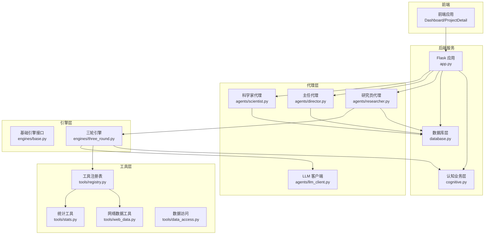
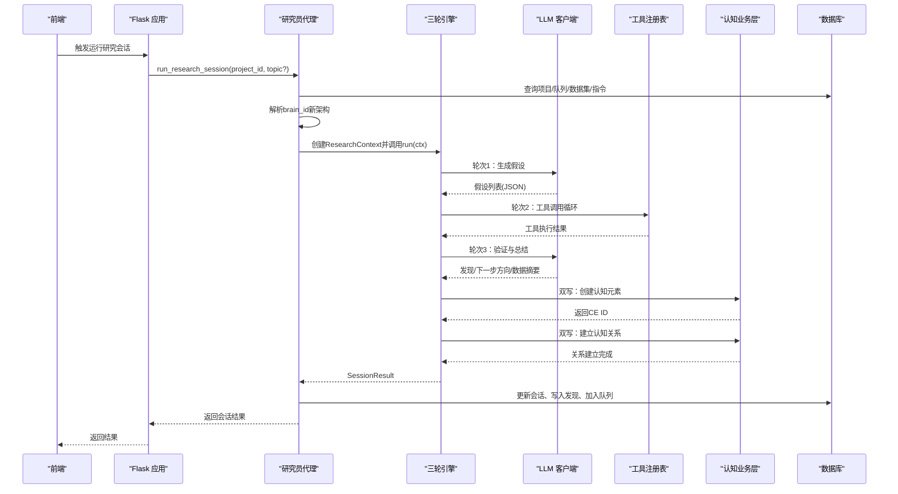
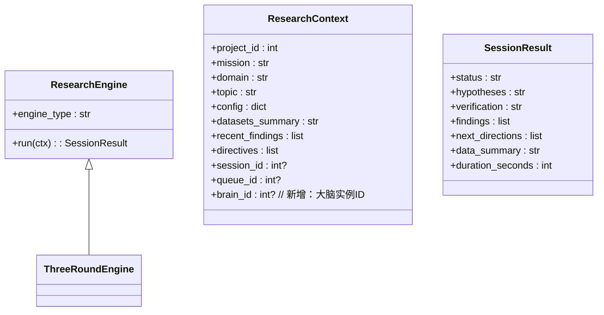
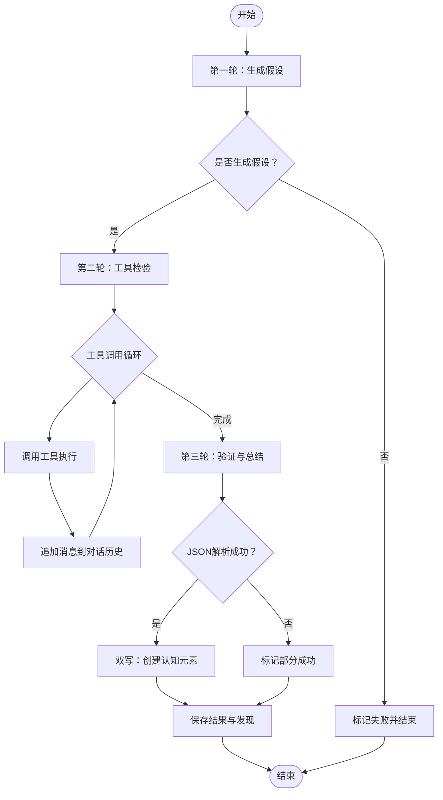
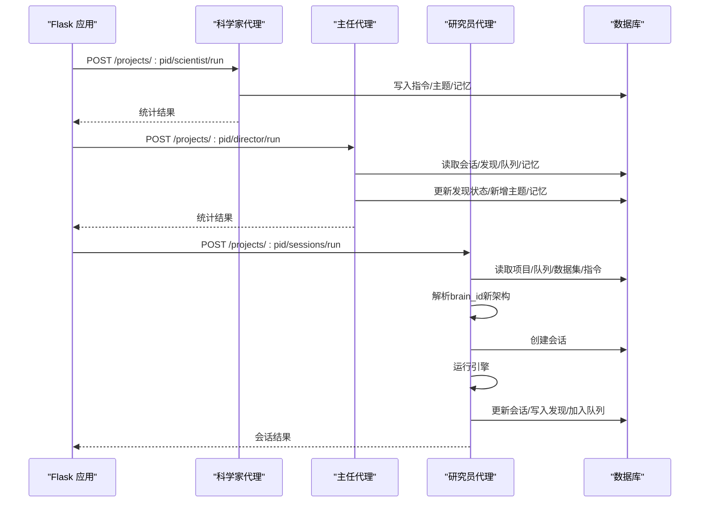
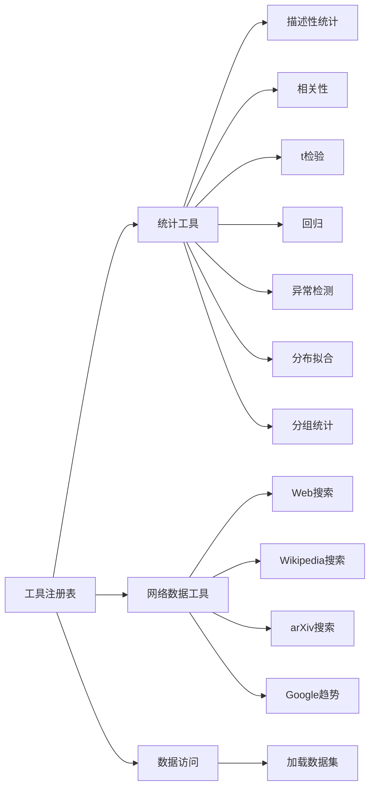
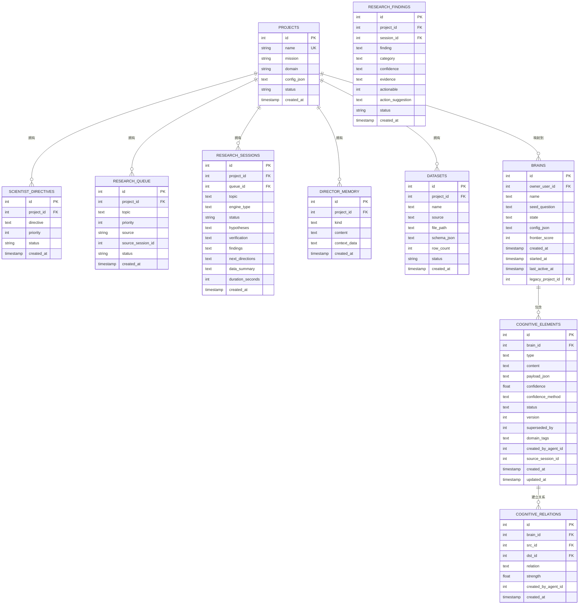
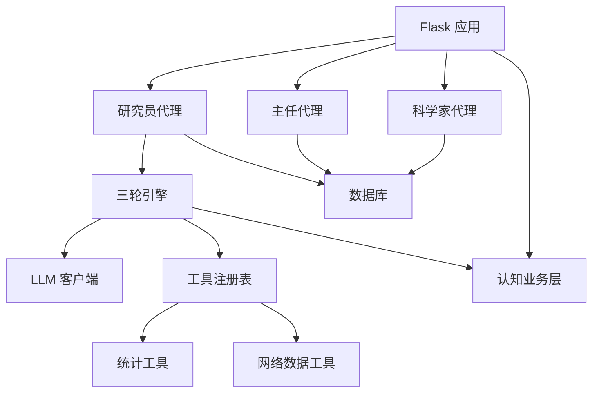

# 研究引擎架构

<cite>
**本文档引用的文件**
- [engines/base.py](file://engines/base.py)
- [engines/three_round.py](file://engines/three_round.py)
- [agents/researcher.py](file://agents/researcher.py)
- [agents/director.py](file://agents/director.py)
- [agents/scientist.py](file://agents/scientist.py)
- [agents/llm_client.py](file://agents/llm_client.py)
- [tools/registry.py](file://tools/registry.py)
- [tools/data_access.py](file://tools/data_access.py)
- [tools/stats.py](file://tools/stats.py)
- [tools/web_data.py](file://tools/web_data.py)
- [database.py](file://database.py)
- [config.py](file://config.py)
- [app.py](file://app.py)
- [cognitive.py](file://cognitive.py)
- [prompts/three_round.txt](file://prompts/three_round.txt)
- [prompts/director.txt](file://prompts/director.txt)
- [prompts/researcher.txt](file://prompts/researcher.txt)
</cite>

## 更新摘要
**变更内容**
- 新增双写架构支持，实现新旧数据结构的并行写入
- 集成brain_id解析逻辑，实现项目与大脑实例的关联
- 引入新认知架构，通过cognitive.py管理认知元素和关系
- 建立置信度系统，支持认知元素的置信度管理和传播
- 完善第三轮双写机制，实现假设、证据、结论的完整知识图谱

## 目录
1. [引言](#引言)
2. [项目结构](#项目结构)
3. [核心组件](#核心组件)
4. [架构总览](#架构总览)
5. [详细组件分析](#详细组件分析)
6. [依赖关系分析](#依赖关系分析)
7. [性能考虑](#性能考虑)
8. [故障排查指南](#故障排查指南)
9. [结论](#结论)
10. [附录](#附录)

## 引言
本文件面向研究引擎的架构设计与实现，重点阐述以下内容：
- 抽象设计：BaseEngine基类的接口定义与通用能力
- 三轮研究流程：每一轮目标、输入输出与处理逻辑
- 双写架构：新旧数据结构的并行写入机制
- 认知元素系统：基于brain_id的智能知识管理
- 扩展机制：新引擎开发规范、接口适配与配置管理
- 与代理系统的集成：参数传递、结果回传与状态更新
- 架构图与流程图：研究流程执行顺序与决策逻辑

## 项目结构
系统采用"代理-引擎-工具-数据库"分层组织，前端通过Flask API驱动后端流程。新增的双写架构支持新旧数据结构的并行管理。



**图表来源**
- [app.py:1-182](file://app.py#L1-L182)
- [agents/researcher.py:1-135](file://agents/researcher.py#L1-L135)
- [agents/director.py:1-124](file://agents/director.py#L1-L124)
- [agents/scientist.py:1-75](file://agents/scientist.py#L1-L75)
- [engines/base.py:1-53](file://engines/base.py#L1-L53)
- [engines/three_round.py:1-558](file://engines/three_round.py#L1-L558)
- [tools/registry.py:1-181](file://tools/registry.py#L1-L181)
- [tools/stats.py:1-120](file://tools/stats.py#L1-L120)
- [tools/web_data.py:1-164](file://tools/web_data.py#L1-L164)
- [tools/data_access.py:1-43](file://tools/data_access.py#L1-L43)
- [database.py:1-877](file://database.py#L1-L877)
- [cognitive.py:1-516](file://cognitive.py#L1-L516)

**章节来源**
- [app.py:1-182](file://app.py#L1-L182)
- [database.py:1-877](file://database.py#L1-L877)

## 核心组件
- 基础引擎接口
  - 接口职责：定义引擎类型标识与统一的run(ctx)入口
  - 关键属性/方法：engine_type属性、run(ctx)：执行一次研究会话，返回SessionResult
  - **新增**：brain_id支持，实现双写架构的基础
- 研究上下文与结果
  - ResearchContext：封装项目信息、任务主题、数据摘要、近期发现、指令等
  - **更新**：新增brain_id字段，支持认知元素双写
  - SessionResult：封装会话结果，包含假设、验证、发现、下一步方向、数据摘要与耗时
- LLM客户端
  - 统一调用接口：call_llm(model, system, messages, ...)，支持工具调用与JSON提取
- 工具注册表
  - 提供工具注册、LLM工具定义、分发执行与错误处理
- 数据访问
  - 加载数据集与构建数据摘要，供LLM上下文使用
- 数据库层
  - 项目、指令、队列、会话、发现、记忆、数据集等实体的CRUD与查询
  - **新增**：大脑、认知元素、认知关系等新架构支持
- **新增**：认知业务层
  - 提供认知元素的创建、查询、关系建立等业务逻辑
  - 支持置信度管理、知识图谱聚合、认知边界计算

**章节来源**
- [engines/base.py:11-53](file://engines/base.py#L11-L53)
- [agents/llm_client.py:24-114](file://agents/llm_client.py#L24-L114)
- [tools/registry.py:24-43](file://tools/registry.py#L24-L43)
- [tools/data_access.py:10-43](file://tools/data_access.py#L10-L43)
- [database.py:101-877](file://database.py#L101-L877)
- [cognitive.py:1-516](file://cognitive.py#L1-L516)

## 架构总览
研究引擎围绕"三轮研究流程"展开：假设生成、工具检验、验证与总结。代理层负责编排与状态管理，工具层提供数据与统计能力，数据库持久化状态与结果。**新增**的双写架构支持同时维护新旧两套数据结构，实现平滑迁移。



**图表来源**
- [agents/researcher.py:14-135](file://agents/researcher.py#L14-L135)
- [engines/three_round.py:28-558](file://engines/three_round.py#L28-L558)
- [agents/llm_client.py:24-114](file://agents/llm_client.py#L24-L114)
- [tools/registry.py:24-43](file://tools/registry.py#L24-L43)
- [database.py:232-295](file://database.py#L232-L295)
- [cognitive.py:108-157](file://cognitive.py#L108-L157)

## 详细组件分析

### 基础引擎与上下文
- BaseEngine抽象接口
  - engine_type：引擎类型标识
  - run(ctx)：执行一次研究会话，返回SessionResult
- 上下文与结果
  - **更新**：ResearchContext新增brain_id字段，支持双写架构
  - SessionResult：标准化输出，便于代理层统一处理



**图表来源**
- [engines/base.py:38-53](file://engines/base.py#L38-L53)
- [engines/base.py:11-36](file://engines/base.py#L11-L36)
- [engines/three_round.py:22-27](file://engines/three_round.py#L22-L27)

**章节来源**
- [engines/base.py:11-53](file://engines/base.py#L11-L53)

### 三轮研究流程
- 第一轮：假设生成
  - 输入：主题、指令、近期发现、数据摘要
  - 输出：若干可检验假设（含测试计划与预期列）
  - 处理：构造系统提示词，调用LLM生成JSON
- 第二轮：工具检验
  - 输入：假设列表、可用工具、可用数据集
  - 输出：逐个假设的检验结果（含工具调用与返回）
  - 处理：循环调用LLM进行工具调用，工具执行由注册表分发
- 第三轮：验证与总结
  - 输入：原始假设、检验结果
  - 输出：每个假设的判定、关键发现、下一步方向、数据摘要
  - 处理：LLM综合证据生成JSON，组装最终结果
  - **新增**：第三轮双写机制，创建认知元素并建立关系



**图表来源**
- [engines/three_round.py:28-558](file://engines/three_round.py#L28-L558)
- [prompts/three_round.txt:1-15](file://prompts/three_round.txt#L1-L15)

**章节来源**
- [engines/three_round.py:28-558](file://engines/three_round.py#L28-L558)
- [prompts/three_round.txt:1-15](file://prompts/three_round.txt#L1-L15)

### 双写架构与认知元素系统
- **新增**：双写架构支持
  - 在原有数据库写入基础上，同时写入新的认知元素体系
  - 失败仅记录日志，不影响原有流程
  - 支持假设、观察、证据、结论等认知元素的创建
- **新增**：brain_id解析逻辑
  - 通过legacy_project_id反查关联的大脑实例ID
  - 旧项目无关联时返回None，跳过双写
- **新增**：认知元素双写机制
  - 第一轮：创建hypothesis认知元素
  - 第二轮：创建observation认知元素
  - 第三轮：创建evidence/counter_evidence/conclusion/inference/question并建立关系
- **新增**：置信度管理系统
  - 不同类型元素具有不同的置信度范围
  - 支持置信度更新和传播

```mermaid
graph LR
subgraph "双写架构"
OLD["旧数据结构<br/>research_* 表"] --> NEW["新认知架构<br/>cognitive_* 表"]
END
subgraph "认知元素类型"
HYP["假设<br/>hypothesis"]
OBS["观察<br/>observation"]
EVI["证据<br/>evidence"]
CE["反证<br/>counter_evidence"]
INF["推论<br/>inference"]
CON["结论<br/>conclusion"]
QUE["问题<br/>question"]
END
subgraph "置信度系统"
INIT["初始置信度<br/>0.3-0.5"]
DATA["数据置信度<br/>0.8-0.9"]
EVID["证据置信度<br/>0.6-0.8"]
Q["问题置信度<br/>0.5"]
END
HYP --> INIT
OBS --> DATA
EVI --> EVID
CE --> EVID
INF --> EVID
CON --> EVID
QUE --> Q
```

**图表来源**
- [engines/three_round.py:86-141](file://engines/three_round.py#L86-L141)
- [engines/three_round.py:393-558](file://engines/three_round.py#L393-L558)
- [cognitive.py:108-157](file://cognitive.py#L108-L157)

**章节来源**
- [engines/three_round.py:86-141](file://engines/three_round.py#L86-L141)
- [engines/three_round.py:393-558](file://engines/three_round.py#L393-L558)
- [cognitive.py:108-157](file://cognitive.py#L108-L157)

### 代理系统集成
- 科学家代理
  - 作用：生成战略指令与初始研究主题，写入队列与记忆
  - 输入：项目使命、领域、数据摘要
  - 输出：指令数量、主题数量、分类体系与策略备注
- 主任代理
  - 作用：每日复盘，评审发现，调整队列，积累记忆，生成简报
  - 输入：最近会话、开放发现、队列、记忆
  - 输出：评审数量、新增主题数、记忆数、简报
- 研究员代理
  - 作用：挑选主题、运行引擎、持久化结果、推进队列
  - **更新**：新增brain_id解析逻辑，支持双写架构
  - 输入：队列项、数据集、指令、近期发现
  - 输出：会话ID、状态、发现数量、耗时、下一步方向



**图表来源**
- [agents/scientist.py:14-75](file://agents/scientist.py#L14-L75)
- [agents/director.py:14-124](file://agents/director.py#L14-L124)
- [agents/researcher.py:14-135](file://agents/researcher.py#L14-L135)
- [database.py:173-344](file://database.py#L173-L344)

**章节来源**
- [agents/scientist.py:14-75](file://agents/scientist.py#L14-L75)
- [agents/director.py:14-124](file://agents/director.py#L14-L124)
- [agents/researcher.py:14-135](file://agents/researcher.py#L14-L135)

### 工具系统与数据访问
- 工具注册表
  - 注册内置统计与网络搜索工具，提供LLM工具定义与分发执行
  - 支持数据集加载与参数校验
- 统计工具
  - 描述性统计、相关性、t检验、回归、异常检测、分布拟合、分组统计
- 网络数据工具
  - Web搜索、Wikipedia搜索、arXiv搜索、Google趋势
- 数据访问
  - 加载CSV/JSON/XLSX等格式，构建数据摘要供LLM使用



**图表来源**
- [tools/registry.py:24-181](file://tools/registry.py#L24-L181)
- [tools/stats.py:10-120](file://tools/stats.py#L10-L120)
- [tools/web_data.py:13-164](file://tools/web_data.py#L13-L164)
- [tools/data_access.py:10-43](file://tools/data_access.py#L10-L43)

**章节来源**
- [tools/registry.py:24-181](file://tools/registry.py#L24-L181)
- [tools/stats.py:10-120](file://tools/stats.py#L10-L120)
- [tools/web_data.py:13-164](file://tools/web_data.py#L13-L164)
- [tools/data_access.py:10-43](file://tools/data_access.py#L10-L43)

### 数据模型与状态流转
- 实体关系
  - 项目、指令、队列、会话、发现、记忆、数据集
  - **新增**：大脑、认知元素、认知关系等新架构实体
- 状态流转
  - 队列：pending -> picked -> completed/failed
  - 会话：running -> completed/partial/failed
  - 发现：open -> validated/rejected
  - **新增**：认知元素状态管理（open/proposed/testing/at_risk/accepted）



**图表来源**
- [database.py:10-200](file://database.py#L10-L200)

**章节来源**
- [database.py:101-877](file://database.py#L101-L877)

## 依赖关系分析
- 组件耦合
  - 代理层依赖数据库与引擎；引擎依赖LLM客户端与工具注册表
  - **新增**：引擎依赖认知业务层，实现双写功能
  - 工具注册表依赖统计与网络工具模块
- 外部依赖
  - LLM客户端依赖第三方推理服务
  - 网络工具依赖外部API
- 配置管理
  - 通过环境变量集中管理模型与API密钥
  - **新增**：支持新架构的配置管理



**图表来源**
- [agents/researcher.py:1-135](file://agents/researcher.py#L1-L135)
- [engines/three_round.py:1-558](file://engines/three_round.py#L1-L558)
- [agents/llm_client.py:1-114](file://agents/llm_client.py#L1-L114)
- [tools/registry.py:1-181](file://tools/registry.py#L1-181)
- [database.py:1-877](file://database.py#L1-L877)
- [app.py:1-182](file://app.py#L1-L182)
- [cognitive.py:1-516](file://cognitive.py#L1-L516)

**章节来源**
- [config.py:1-11](file://config.py#L1-L11)

## 性能考虑
- LLM调用成本控制
  - 合理设置max_tokens与temperature，避免不必要的长文本
  - 在工具调用循环中限制最大轮次，防止无限迭代
- 工具执行优化
  - 统计工具尽量在必要时才加载完整数据集
  - 对小样本场景提前判断，减少无效计算
- 数据库事务
  - 使用上下文管理器确保事务一致性，避免长时间锁表
  - **新增**：双写操作在try/except中进行，失败不影响主流程
- 并发与异步
  - 会话运行采用线程异步启动，避免阻塞API响应
- **新增**：认知元素性能优化
  - 批量操作支持，减少数据库往返
  - 置信度更新采用乐观锁机制

## 故障排查指南
- LLM解析失败
  - 现象：第三轮JSON解析失败，标记为部分成功
  - 处理：检查提示词模板与LLM输出稳定性，增强JSON提取鲁棒性
- 工具调用异常
  - 现象：工具返回错误或无数据集
  - 处理：确认数据集名称与列名，检查工具参数完整性
- 会话状态异常
  - 现象：引擎抛出异常导致会话失败
  - 处理：代理层捕获异常并更新会话状态，核对队列项状态
- 数据加载失败
  - 现象：数据文件不存在或格式不支持
  - 处理：检查数据路径与文件扩展名，确认数据目录权限
- **新增**：双写架构故障
  - 现象：认知元素创建失败但会话仍继续
  - 处理：检查brain_id解析逻辑，确认大脑实例存在
- **新增**：置信度异常
  - 现象：认知元素置信度超出范围
  - 处理：检查置信度映射逻辑，确认数值在0-1范围内

**章节来源**
- [engines/three_round.py:105-135](file://engines/three_round.py#L105-L135)
- [agents/researcher.py:62-70](file://agents/researcher.py#L62-L70)
- [tools/registry.py:24-43](file://tools/registry.py#L24-L43)
- [tools/data_access.py:10-25](file://tools/data_access.py#L10-L25)
- [cognitive.py:62-72](file://cognitive.py#L62-L72)

## 结论
该研究引擎以抽象接口与三轮流程为核心，结合代理编排、工具扩展与数据库持久化，形成可演进的研究自动化框架。**重大更新**包括双写架构支持、brain_id解析逻辑集成以及与新认知架构的协同工作。通过标准化上下文与结果模型，实现了引擎与代理的松耦合；通过工具注册表与数据访问模块，提供了强大的扩展能力；**新增**的认知元素系统和置信度管理机制，为未来的智能研究奠定了坚实基础。建议在生产环境中进一步完善错误恢复、监控告警与缓存策略，以提升稳定性与性能。

## 附录
- 开发新引擎规范
  - 实现接口：继承基础引擎接口，实现engine_type与run(ctx)
  - 输入输出：严格使用ResearchContext与SessionResult
  - 流程设计：遵循三轮或自定义轮次，明确每轮目标与产物
  - 错误处理：捕获异常并设置合理状态，记录日志
  - **新增**：双写支持：在run方法中检查ctx.brain_id，实现认知元素双写
- 接口适配与配置
  - 通过环境变量配置模型与API密钥
  - 提示词模板化，便于多轮流程复用
  - **新增**：支持新架构的配置管理
- 与代理系统集成要点
  - 参数传递：代理层负责准备上下文并创建会话
  - **更新**：新增brain_id解析，支持双写架构
  - 结果回传：引擎返回标准化结果，代理层写入数据库
  - 状态更新：根据结果更新队列与发现状态
  - **新增**：认知元素双写：引擎创建认知元素并建立关系
- **新增**：认知元素双写规范
  - 元素类型：hypothesis、observation、evidence、counter_evidence、inference、conclusion、question
  - 置信度：不同类型具有不同的置信度范围
  - 关系建立：supports、refutes、derives_from、inspires等关系类型
  - 容错处理：双写失败不影响主流程，仅记录日志