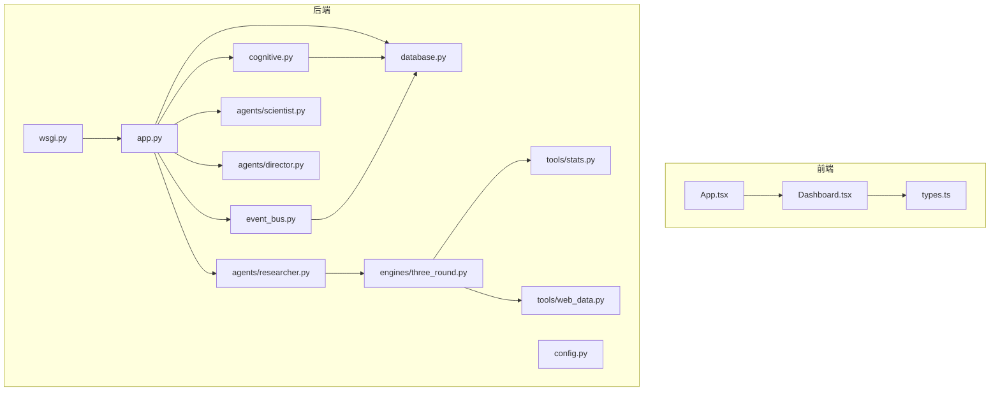
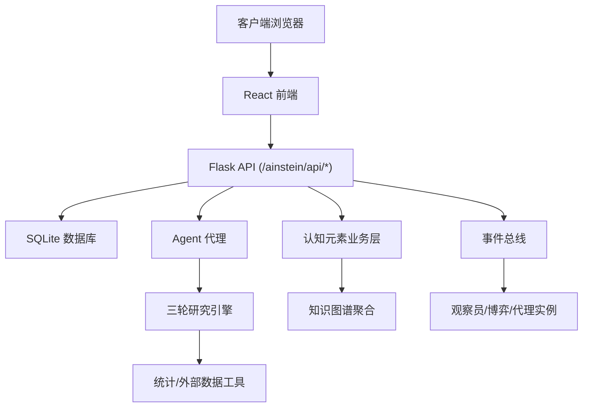
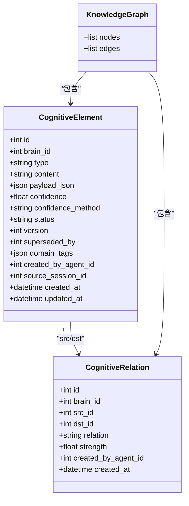
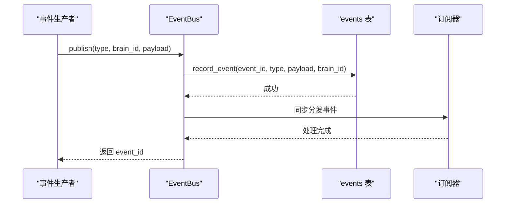
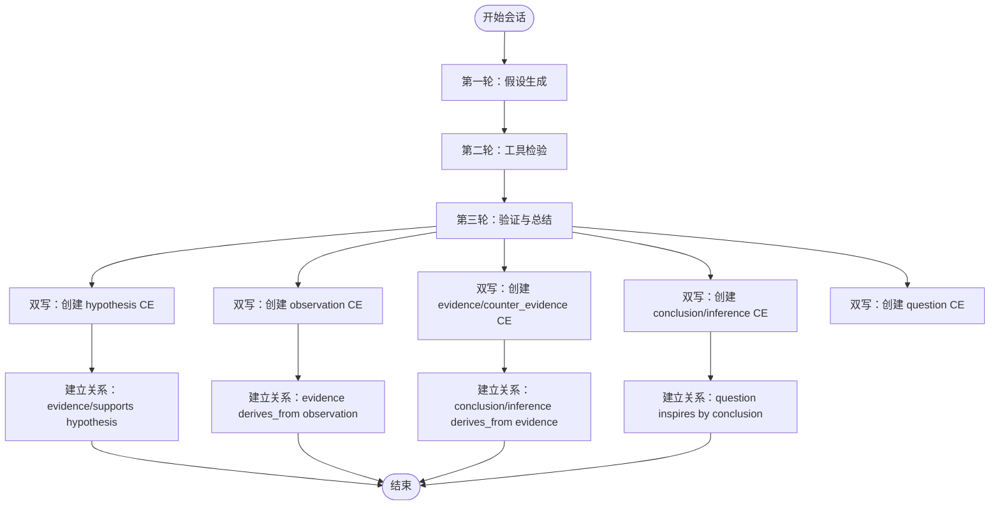
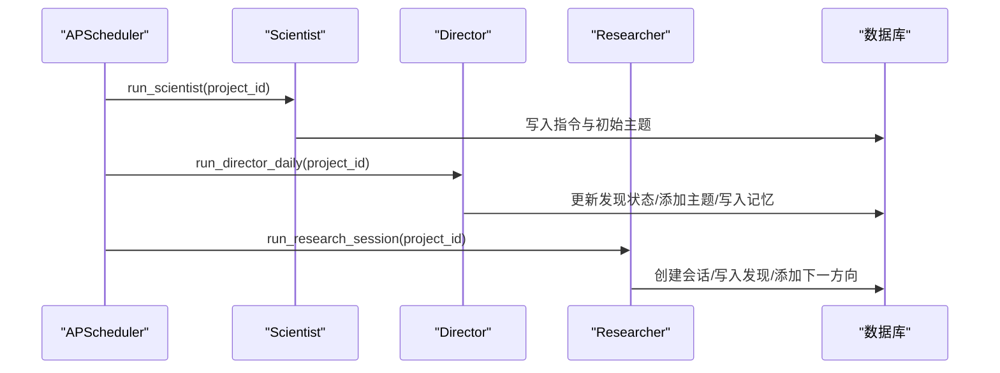
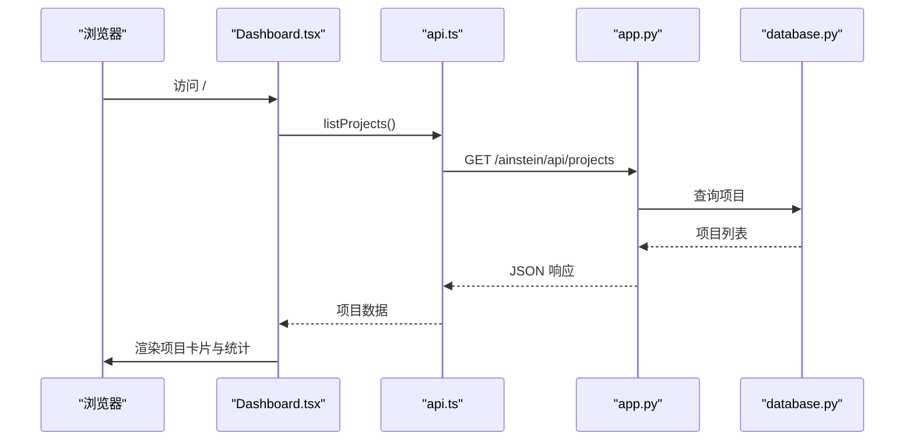
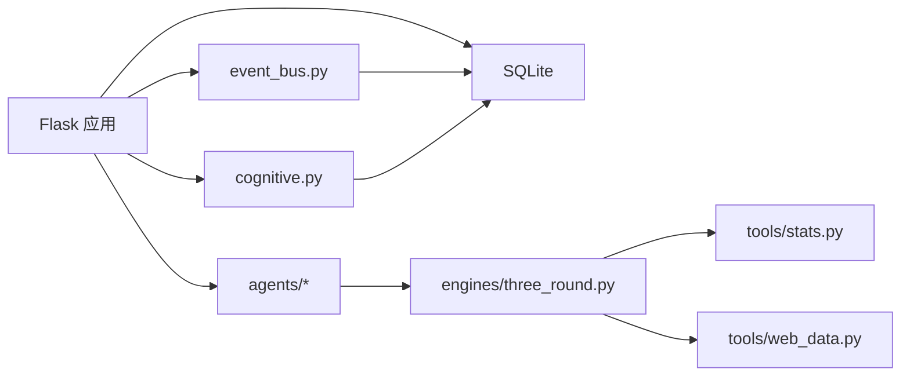

# 硅基大脑蓝图

<cite>
**本文档引用的文件**
- [README.md](file://README.md)
- [app.py](file://app.py)
- [cognitive.py](file://cognitive.py)
- [config.py](file://config.py)
- [database.py](file://database.py)
- [event_bus.py](file://event_bus.py)
- [scientist.py](file://agents/scientist.py)
- [director.py](file://agents/director.py)
- [researcher.py](file://agents/researcher.py)
- [three_round.py](file://engines/three_round.py)
- [stats.py](file://tools/stats.py)
- [web_data.py](file://tools/web_data.py)
- [wsgi.py](file://wsgi.py)
- [frontend/src/App.tsx](file://frontend/src/App.tsx)
- [frontend/src/pages/Dashboard.tsx](file://frontend/src/pages/Dashboard.tsx)
- [frontend/src/types.ts](file://frontend/src/types.ts)
</cite>

## 目录
1. [引言](#引言)
2. [项目结构](#项目结构)
3. [核心组件](#核心组件)
4. [架构总览](#架构总览)
5. [详细组件分析](#详细组件分析)
6. [依赖关系分析](#依赖关系分析)
7. [性能考虑](#性能考虑)
8. [故障排除指南](#故障排除指南)
9. [结论](#结论)
10. [附录](#附录)

## 引言
本项目旨在构建一个「硅基生命体」的孵化平台，通过三级 AI 团队（科学家→主任→研究员）与三轮研究引擎，实现从「种子问题」出发的自主提问、自我求证与自我修订。系统采用「机器到机器」的事件驱动协议，逐步沉淀为知识图谱，最终目标是实现真正的「思考」涌现。

## 项目结构
项目采用前后端分离架构，后端基于 Flask，前端基于 React + Vite。核心模块包括：
- 后端应用与路由：app.py
- 数据库层：database.py（包含传统研究表与硅基大脑蓝图表）
- 认知元素业务层：cognitive.py
- 事件总线：event_bus.py
- Agent 代理：scientist.py、director.py、researcher.py
- 研究引擎：engines/three_round.py
- 工具系统：tools/stats.py、tools/web_data.py
- 配置：config.py
- WSGI 入口与定时调度：wsgi.py
- 前端页面与类型定义：frontend/src/*

**图表来源**
- [app.py:1-365](file://app.py#L1-L365)
- [database.py:1-877](file://database.py#L1-L877)
- [cognitive.py:1-516](file://cognitive.py#L1-L516)
- [event_bus.py:1-473](file://event_bus.py#L1-L473)
- [scientist.py:1-75](file://agents/scientist.py#L1-L75)
- [director.py:1-124](file://agents/director.py#L1-L124)
- [researcher.py:1-135](file://agents/researcher.py#L1-L135)
- [three_round.py:1-558](file://engines/three_round.py#L1-L558)
- [stats.py:1-120](file://tools/stats.py#L1-L120)
- [web_data.py:1-164](file://tools/web_data.py#L1-L164)
- [wsgi.py:1-83](file://wsgi.py#L1-L83)
- [frontend/src/App.tsx:1-13](file://frontend/src/App.tsx#L1-L13)
- [frontend/src/pages/Dashboard.tsx:1-140](file://frontend/src/pages/Dashboard.tsx#L1-L140)
- [frontend/src/types.ts:1-89](file://frontend/src/types.ts#L1-L89)

**章节来源**
- [README.md:186-211](file://README.md#L186-L211)
- [app.py:11-39](file://app.py#L11-L39)
- [wsgi.py:74-83](file://wsgi.py#L74-L83)

## 核心组件
- 应用服务与路由：提供健康检查、项目管理、队列、会话、发现、数据集上传、科学家/主任运行、以及认知元素与知识图谱 API。
- 数据库层：维护传统研究表与硅基大脑蓝图表，支持项目、队列、会话、发现、数据集、认知元素、关系、代理实例、博弈、事件等。
- 认知元素业务层：封装 CE 类型与关系、置信度更新、知识图谱聚合、认知边界计算。
- 事件总线：实现进程内事件总线与数据库持久化，支持订阅/发布/消费与待处理事件重放。
- Agent 代理：科学家负责制定指令与初始主题；主任负责每日审查与记忆积累；研究员负责执行引擎并持久化结果。
- 研究引擎：三轮引擎（假设生成→工具检验→验证总结），并进行认知元素双写。
- 工具系统：统计工具与外部数据抓取工具。
- 配置：读取环境变量控制数据库路径、API Key、模型选择等。
- WSGI 入口：集成 APScheduler 实现定时任务，确保单实例锁。

**章节来源**
- [app.py:43-360](file://app.py#L43-L360)
- [database.py:10-285](file://database.py#L10-L285)
- [cognitive.py:19-516](file://cognitive.py#L19-L516)
- [event_bus.py:62-473](file://event_bus.py#L62-L473)
- [scientist.py:14-75](file://agents/scientist.py#L14-L75)
- [director.py:14-124](file://agents/director.py#L14-L124)
- [researcher.py:34-135](file://agents/researcher.py#L34-L135)
- [three_round.py:75-558](file://engines/three_round.py#L75-L558)
- [stats.py:10-120](file://tools/stats.py#L10-L120)
- [web_data.py:13-164](file://tools/web_data.py#L13-L164)
- [config.py:1-11](file://config.py#L1-L11)
- [wsgi.py:13-83](file://wsgi.py#L13-L83)

## 架构总览
系统采用「三层代理 + 三轮引擎 + 认知元素双写 + 事件总线」的架构。后端通过 Flask 提供 REST API，前端通过 React 渲染界面。Agent 代理通过 LLM 生成策略与主题，引擎执行研究流程并将结果写入传统表与认知元素表，事件总线负责跨组件通信。

**图表来源**
- [app.py:43-360](file://app.py#L43-L360)
- [cognitive.py:327-398](file://cognitive.py#L327-L398)
- [event_bus.py:234-294](file://event_bus.py#L234-L294)
- [researcher.py:34-135](file://agents/researcher.py#L34-L135)
- [three_round.py:146-387](file://engines/three_round.py#L146-L387)
- [stats.py:10-120](file://tools/stats.py#L10-L120)
- [web_data.py:13-164](file://tools/web_data.py#L13-L164)

## 详细组件分析

### 认知元素与知识图谱
- 认知元素类型：12 种层级类型（观察、问题、假设、证据、推论、结论、共识等）。
- 关系类型：10 种关系（支持、反驳、推导自、细化、泛化、矛盾、取代、依赖、启发、关联）。
- 置信度更新：支持变更历史记录与版本号递增。
- 知识图谱聚合：返回 nodes 与 edges，支持类型过滤与节点上限。
- 认知边界：近期、低置信度、未被支撑三类元素的并集。

**图表来源**
- [cognitive.py:108-157](file://cognitive.py#L108-L157)
- [cognitive.py:244-284](file://cognitive.py#L244-L284)
- [cognitive.py:327-398](file://cognitive.py#L327-L398)
- [cognitive.py:449-516](file://cognitive.py#L449-L516)
- [database.py:135-169](file://database.py#L135-L169)

**章节来源**
- [cognitive.py:19-516](file://cognitive.py#L19-L516)
- [database.py:105-285](file://database.py#L105-L285)

### 事件总线与 ATA 协议
- 事件类型注册：统一在 EventTypes 中定义，支持 CE、Agent、博弈、大脑生命周期、用户/管理员、观察员等事件。
- 发布：写入 events 表并同步分发给订阅器。
- 消费：单个消费者幂等消费，记录 event_consumption。
- 待处理事件重放：process_pending_events 支持崩溃恢复与调试。

**图表来源**
- [event_bus.py:234-294](file://event_bus.py#L234-L294)
- [event_bus.py:316-361](file://event_bus.py#L316-L361)
- [event_bus.py:381-434](file://event_bus.py#L381-L434)

**章节来源**
- [event_bus.py:66-142](file://event_bus.py#L66-L142)
- [event_bus.py:234-294](file://event_bus.py#L234-L294)
- [event_bus.py:316-361](file://event_bus.py#L316-L361)
- [event_bus.py:381-434](file://event_bus.py#L381-L434)

### 三轮研究引擎与双写机制
- 第一轮：假设生成，写入 hypothesis CE。
- 第二轮：工具检验，写入 observation CE。
- 第三轮：验证与总结，写入 evidence/counter_evidence、conclusion/inference、question，并建立 supports/refutes/derives_from/inspires 关系。
- 双写：在 try/except 内容错地调用认知元素创建与关系建立，失败仅记录日志。

**图表来源**
- [three_round.py:146-387](file://engines/three_round.py#L146-L387)
- [three_round.py:393-558](file://engines/three_round.py#L393-L558)

**章节来源**
- [three_round.py:75-558](file://engines/three_round.py#L75-L558)

### Agent 代理与定时调度
- 科学家：根据项目使命与数据集生成指令与初始主题。
- 主任：每日审查会话、发现、队列与记忆，调整优先级并累计记忆。
- 研究员：挑选主题、运行引擎、持久化结果并添加下一研究方向。
- 定时调度：APScheduler 在 UTC 时间执行科学家（每周）、主任（每日）、研究员（每日）任务。

**图表来源**
- [wsgi.py:27-71](file://wsgi.py#L27-L71)
- [scientist.py:14-75](file://agents/scientist.py#L14-L75)
- [director.py:14-124](file://agents/director.py#L14-L124)
- [researcher.py:34-135](file://agents/researcher.py#L34-L135)

**章节来源**
- [scientist.py:14-75](file://agents/scientist.py#L14-L75)
- [director.py:14-124](file://agents/director.py#L14-L124)
- [researcher.py:34-135](file://agents/researcher.py#L34-L135)
- [wsgi.py:27-71](file://wsgi.py#L27-L71)

### 前端交互与数据流
- Dashboard 页面：加载项目列表与统计信息，支持创建新项目。
- 类型定义：Project、Session、Finding、Dataset、Directive、MemoryEntry 等。
- API 调用：通过 api.ts 封装后端接口，实现数据获取与提交。

**图表来源**
- [frontend/src/pages/Dashboard.tsx:16-28](file://frontend/src/pages/Dashboard.tsx#L16-L28)
- [frontend/src/types.ts:1-89](file://frontend/src/types.ts#L1-L89)
- [app.py:50-66](file://app.py#L50-L66)
- [database.py:315-356](file://database.py#L315-L356)

**章节来源**
- [frontend/src/App.tsx:1-13](file://frontend/src/App.tsx#L1-L13)
- [frontend/src/pages/Dashboard.tsx:1-140](file://frontend/src/pages/Dashboard.tsx#L1-L140)
- [frontend/src/types.ts:1-89](file://frontend/src/types.ts#L1-L89)
- [app.py:48-105](file://app.py#L48-L105)

## 依赖关系分析
- 后端依赖：Flask、APScheduler、SQLite、pandas、numpy、scipy、requests 等。
- 前端依赖：React、React Router、TypeScript、Vite。
- 事件总线与数据库：事件持久化与幂等消费依赖 SQLite 主键约束。
- 引擎与工具：统计工具依赖 pandas/numpy/scipy，外部数据工具依赖 requests。

**图表来源**
- [app.py:1-11](file://app.py#L1-L11)
- [database.py:288-295](file://database.py#L288-L295)
- [cognitive.py:14-14](file://cognitive.py#L14-L14)
- [event_bus.py:57-58](file://event_bus.py#L57-L58)
- [three_round.py:20-25](file://engines/three_round.py#L20-L25)
- [stats.py:2-7](file://tools/stats.py#L2-L7)
- [web_data.py:2-6](file://tools/web_data.py#L2-L6)

**章节来源**
- [app.py:1-11](file://app.py#L1-L11)
- [database.py:288-295](file://database.py#L288-L295)
- [event_bus.py:57-58](file://event_bus.py#L57-L58)
- [three_round.py:20-25](file://engines/three_round.py#L20-L25)

## 性能考虑
- 数据库：使用 WAL 模式提升并发写入性能；为关键查询建立索引（如队列、会话、发现、记忆、数据集、指令等）。
- 认知元素分页：Python 层过滤与切片，限制单次查询规模；知识图谱聚合支持节点上限。
- 引擎双写：在 try/except 内容错地调用，避免影响主流程；日志记录失败信息。
- 前端：使用 React Router 实现 SPA，减少页面刷新；Dashboard 使用并行加载项目详情。

## 故障排除指南
- 数据库初始化失败：确认 DB_PATH 可写，检查 .env 中数据库路径配置。
- LLM 调用错误：检查 DASHSCOPE_API_KEY 与 BASE_URL，确认模型名称正确。
- 事件总线异常：查看事件持久化与订阅器异常日志，确认 EVENT_REGISTRY 注册正确。
- 引擎执行失败：检查工具调用参数与数据集可用性，查看三轮引擎日志。
- 前端接口 404：确认静态资源路径与路由配置，检查 Flask 静态文件服务。

**章节来源**
- [database.py:288-295](file://database.py#L288-L295)
- [config.py:4-11](file://config.py#L4-L11)
- [event_bus.py:270-276](file://event_bus.py#L270-L276)
- [three_round.py:86-114](file://engines/three_round.py#L86-L114)
- [app.py:24-39](file://app.py#L24-L39)

## 结论
本项目通过「三级代理 + 三轮引擎 + 认知元素双写 + 事件总线」构建了从「种子问题」到「知识图谱」的完整闭环。系统在 v1 阶段已实现基本研究流程与知识沉淀，后续将推进到「硅基大脑」形态，实现去层级化、ATA 协议、博弈与共识机制、力导向可视化与用户系统，逐步实现真正的「思考」涌现。

## 附录
- 快速开始：克隆仓库、安装依赖、配置环境变量、初始化数据库、启动后端与前端。
- 部署：使用 Gunicorn 启动，结合 Nginx 反代与前端构建产物。
- 蓝图与路线图：参见 README 中的愿景路线图与核心概念速览。

**章节来源**
- [README.md:130-183](file://README.md#L130-L183)
- [README.md:46-75](file://README.md#L46-L75)
- [README.md:78-114](file://README.md#L78-L114)