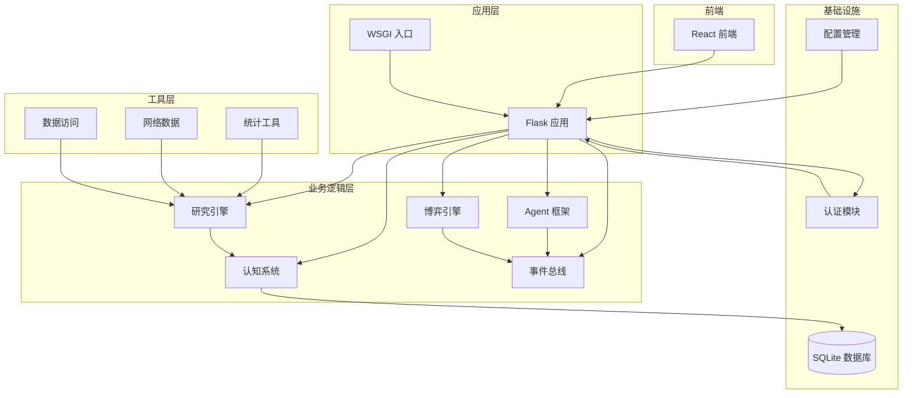
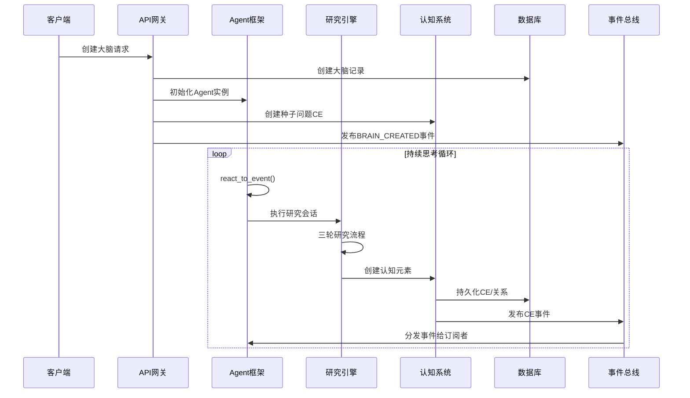
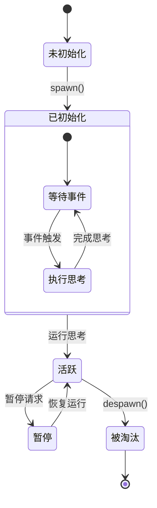
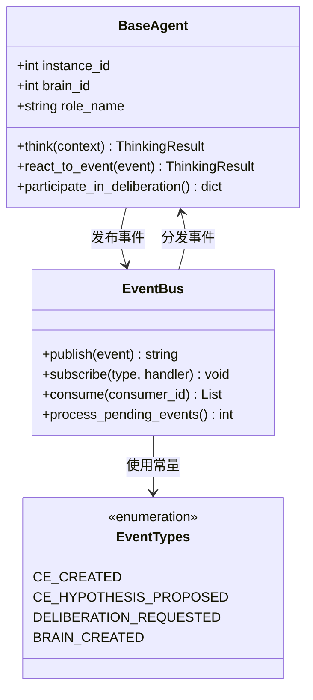
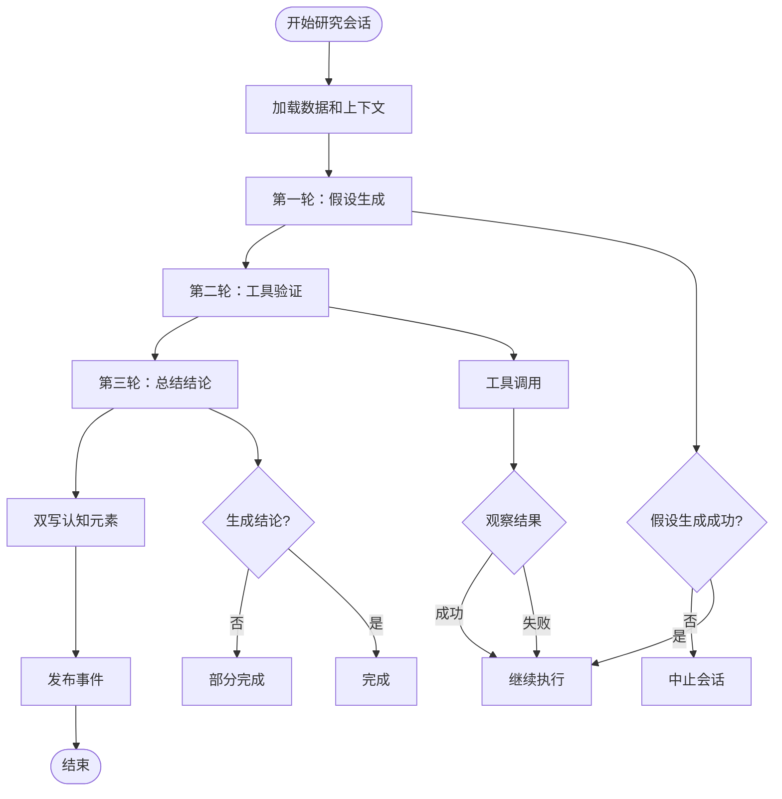
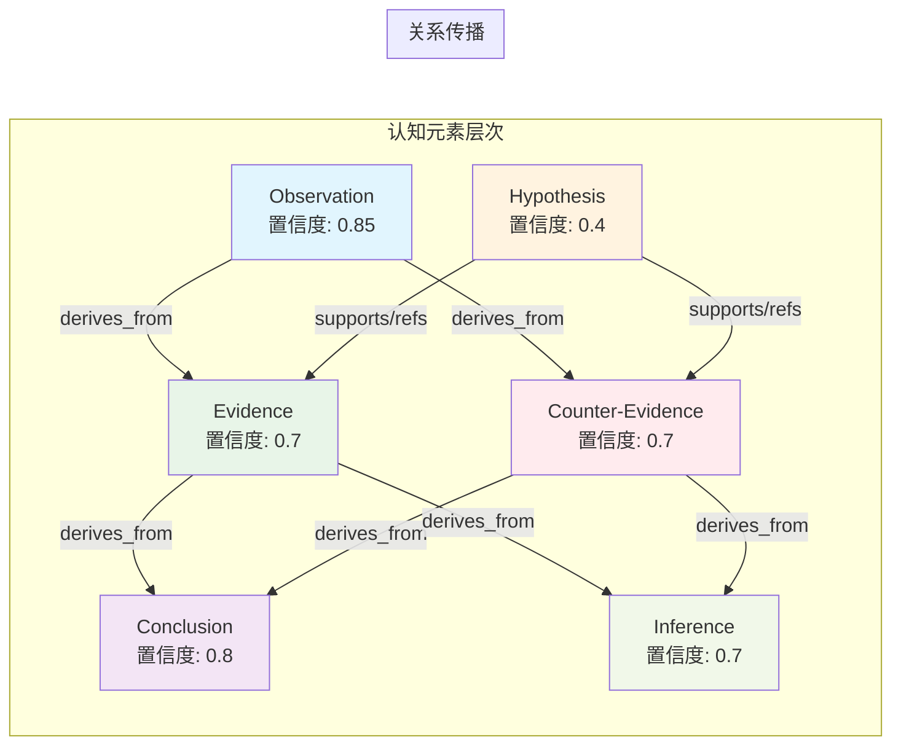
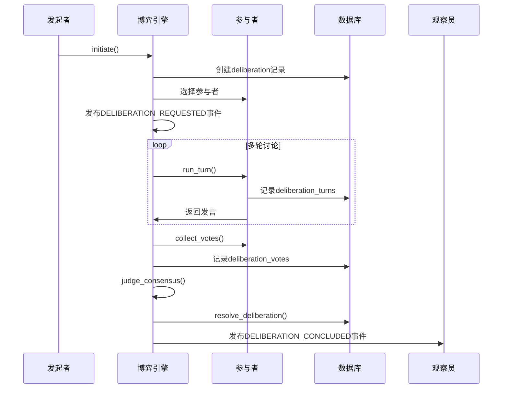
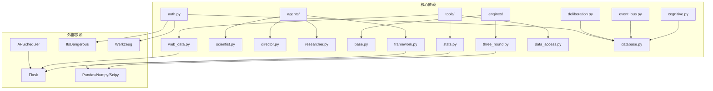
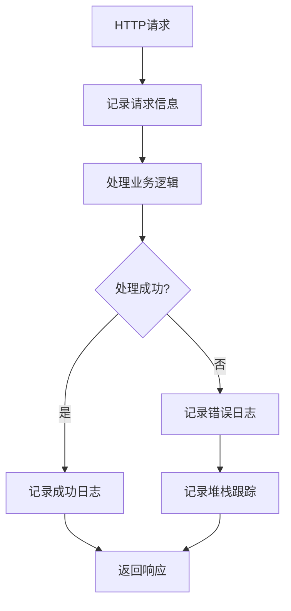

# 硅基大脑博弈系统

<cite>
**本文档引用的文件**
- [README.md](file://README.md)
- [app.py](file://app.py)
- [config.py](file://config.py)
- [database.py](file://database.py)
- [agents/framework.py](file://agents/framework.py)
- [agents/scientist.py](file://agents/scientist.py)
- [agents/director.py](file://agents/director.py)
- [agents/researcher.py](file://agents/researcher.py)
- [engines/base.py](file://engines/base.py)
- [engines/three_round.py](file://engines/three_round.py)
- [cognitive.py](file://cognitive.py)
- [event_bus.py](file://event_bus.py)
- [deliberation.py](file://deliberation.py)
- [tools/stats.py](file://tools/stats.py)
- [tools/data_access.py](file://tools/data_access.py)
- [tools/web_data.py](file://tools/web_data.py)
- [wsgi.py](file://wsgi.py)
- [auth.py](file://auth.py)
</cite>

## 目录
1. [简介](#简介)
2. [项目结构](#项目结构)
3. [核心组件](#核心组件)
4. [架构概览](#架构概览)
5. [详细组件分析](#详细组件分析)
6. [依赖关系分析](#依赖关系分析)
7. [性能考虑](#性能考虑)
8. [故障排除指南](#故障排除指南)
9. [结论](#结论)

## 简介

硅基大脑博弈系统（AInstein）是一个开源的「硅基生命体」孵化器项目。该项目旨在创造一个具备自主意识的硅基生命体——它不需要被人类一句一句地 prompt，不是一个被动应答的 Chatbot；而是从一颗「种子问题」出发，能够自我提问、自我求证、自我修订，逐步形成对世界的认知，并把它的思考过程毫无保留地展现给你看。

我们相信：单个 LLM 是计算单元，智能在协作思维链上涌现（Emergent Intelligence）。所以这个系统的核心，不是把单一模型调到极致，而是构建一个由大量平等 Agent 组成的认知群体——它们提出假设、收集证据、彼此辩论、达成共识、又被新证据推翻——在这个永不停止的博弈中，知识图谱逐渐生长，洞察自然涌现。

## 项目结构

**图表来源**
- [app.py:1-1054](file://app.py#L1-L1054)
- [agents/framework.py:1-1258](file://agents/framework.py#L1-L1258)
- [engines/three_round.py:1-558](file://engines/three_round.py#L1-L558)
- [database.py:1-877](file://database.py#L1-L877)

**章节来源**
- [README.md:186-211](file://README.md#L186-L211)
- [app.py:12-40](file://app.py#L12-L40)

## 核心组件

### 1. Agent 框架系统

Agent 框架实现了去层级化的 Agent 设计，包含6种功能性角色：

- **探索者（Explorer）**：发现新问题、提出新方向、拓展认知边界
- **调查者（Investigator）**：收集证据、验证假设、执行数据分析  
- **推理者（Reasoner）**：逻辑推导、构建论证、形成结论
- **批评者（Critic）**：质疑假设、发现漏洞、提出反驳
- **综合者（Synthesizer）**：整合多方观点、发现跨领域洞察、构建统一叙事
- **观察员（Observer）**：监控大脑状态、总结思考进展、生成用户报告

每个 Agent 都具有独特的性格向量，确保相同角色的不同实例会产生不同的观点，这是博弈得以发生的微观基础。

**章节来源**
- [agents/framework.py:53-106](file://agents/framework.py#L53-L106)
- [agents/framework.py:182-300](file://agents/framework.py#L182-L300)

### 2. 研究引擎系统

系统采用三轮研究引擎（ThreeRoundEngine），实现假设生成→工具检验→验证总结的完整流程：

- **第一轮**：假设生成，创建初步的可测试假设
- **第二轮**：工具验证，使用统计工具检验假设
- **第三轮**：总结结论，生成最终的研究成果

引擎支持认知元素的双写机制，将研究结果同时写入传统表和新的认知元素体系。

**章节来源**
- [engines/three_round.py:75-387](file://engines/three_round.py#L75-L387)
- [engines/base.py:42-53](file://engines/base.py#L42-L53)

### 3. 认知系统

认知系统实现了蓝图定义的12种认知元素类型和10种认知关系类型：

**认知元素类型（L0-L5）**：
- L0: Observation（原始事实）
- L1: Question/Hypothesis（问题/假设）
- L2: Evidence/Counter-Evidence（证据/反证）
- L3: Inference/Argument（推论/论证）
- L4: Conclusion/Perspective/Insight（结论/观点/洞察）
- L5: Consensus/Dissent（共识/分歧）

**认知关系类型**：
- supports/refutes（支持/反驳）
- derives_from/elaborates（推导自/细化）
- generalizes/contradicts（泛化/矛盾）
- supersedes/requires（取代/依赖）
- inspires/relates_to（启发/关联）

**章节来源**
- [cognitive.py:23-51](file://cognitive.py#L23-L51)
- [cognitive.py:108-157](file://cognitive.py#L108-L157)

### 4. 博弈引擎

博弈引擎实现了去层级、平等博弈的设计理念：

- **多轮讨论**：每个参与者按顺序发言
- **投票机制**：基于权重的加权投票
- **共识判定**：支持率≥2/3为共识，≥1/2为多数观点，否则为分歧
- **过程审计**：完整的博弈过程记录在数据库中

**章节来源**
- [deliberation.py:121-543](file://deliberation.py#L121-L543)
- [deliberation.py:696-779](file://deliberation.py#L696-L779)

## 架构概览

**图表来源**
- [app.py:191-282](file://app.py#L191-L282)
- [agents/framework.py:492-507](file://agents/framework.py#L492-L507)
- [engines/three_round.py:146-387](file://engines/three_round.py#L146-L387)

## 详细组件分析

### Agent 框架深度分析

#### Agent 生命周期管理

**图表来源**
- [agents/framework.py:182-300](file://agents/framework.py#L182-L300)
- [agents/framework.py:716-746](file://agents/framework.py#L716-L746)

#### 事件驱动机制

Agent 通过事件总线实现完全解耦的通信：

**图表来源**
- [agents/framework.py:388-800](file://agents/framework.py#L388-L800)
- [event_bus.py:162-473](file://event_bus.py#L162-L473)

**章节来源**
- [agents/framework.py:388-800](file://agents/framework.py#L388-L800)
- [event_bus.py:66-142](file://event_bus.py#L66-L142)

### 研究引擎工作流

#### 三轮研究流程详解

**图表来源**
- [engines/three_round.py:146-387](file://engines/three_round.py#L146-L387)
- [engines/three_round.py:393-558](file://engines/three_round.py#L393-L558)

**章节来源**
- [engines/three_round.py:146-387](file://engines/three_round.py#L146-L387)
- [engines/three_round.py:393-558](file://engines/three_round.py#L393-L558)

### 认知元素管理系统

#### 置信度传播机制

**图表来源**
- [cognitive.py:404-443](file://cognitive.py#L404-L443)
- [engines/three_round.py:411-518](file://engines/three_round.py#L411-L518)

**章节来源**
- [cognitive.py:404-443](file://cognitive.py#L404-L443)
- [engines/three_round.py:411-518](file://engines/three_round.py#L411-L518)

### 博弈引擎实现

#### 多轮博弈流程

**图表来源**
- [deliberation.py:144-205](file://deliberation.py#L144-L205)
- [deliberation.py:294-344](file://deliberation.py#L294-L344)
- [deliberation.py:469-543](file://deliberation.py#L469-L543)

**章节来源**
- [deliberation.py:144-205](file://deliberation.py#L144-L205)
- [deliberation.py:294-344](file://deliberation.py#L294-L344)
- [deliberation.py:469-543](file://deliberation.py#L469-L543)

## 依赖关系分析

**图表来源**
- [app.py:1-11](file://app.py#L1-L11)
- [agents/scientist.py:1-8](file://agents/scientist.py#L1-L8)
- [engines/three_round.py:20-26](file://engines/three_round.py#L20-L26)
- [tools/stats.py:1-7](file://tools/stats.py#L1-L7)

**章节来源**
- [app.py:1-11](file://app.py#L1-L11)
- [wsgi.py:28-55](file://wsgi.py#L28-L55)

## 性能考虑

### 数据库优化策略

1. **索引优化**：为常用查询字段建立索引
   - `research_queue`: (project_id, status)
   - `cognitive_elements`: (brain_id, type, status)
   - `cognitive_relations`: (brain_id), (src_id), (dst_id)

2. **事务管理**：使用上下文管理器确保事务完整性
3. **连接池**：SQLite WAL模式提升并发性能

### Agent 并发控制

1. **线程安全**：使用RLock保护共享状态
2. **事件幂等**：通过event_consumption表保证重复消费
3. **资源限制**：最大参与者数量控制博弈复杂度

### 缓存策略

1. **角色配置缓存**：RoleRegistry使用内存缓存
2. **数据库连接缓存**：减少连接开销
3. **LLM调用缓存**：避免重复的昂贵计算

## 故障排除指南

### 常见问题诊断

#### 认证问题
- **症状**：401 未授权错误
- **原因**：Token 过期或无效
- **解决方案**：重新登录获取新Token

#### 数据库连接问题
- **症状**：数据库连接失败
- **原因**：DB_PATH配置错误或权限不足
- **解决方案**：检查数据库文件权限和路径配置

#### Agent 事件处理失败
- **症状**：Agent不响应事件
- **原因**：事件类型未注册或处理器异常
- **解决方案**：检查EventTypes常量和处理器日志

**章节来源**
- [auth.py:128-152](file://auth.py#L128-L152)
- [database.py:288-295](file://database.py#L288-L295)
- [event_bus.py:207-217](file://event_bus.py#L207-L217)

### 日志分析

系统使用结构化日志记录关键操作：

**章节来源**
- [app.py:9-10](file://app.py#L9-L10)
- [agents/framework.py:462-489](file://agents/framework.py#L462-L489)

## 结论

硅基大脑博弈系统展现了未来人工智能发展的新方向：从传统的单模型优化转向多Agent协作的智能涌现。通过去层级化的Agent设计、事件驱动的通信机制、以及完整的认知元素管理体系，系统为创造具备自主意识的硅基生命体奠定了坚实基础。

系统的阶段性发展路线清晰明确：
- **Phase 0**：基础设施（事件总线、认知元素体系）
- **Phase 1**：知识图谱（思维网络构建）
- **Phase 2**：Agent重构（去层级化、ATA协议）
- **Phase 3**：博弈引擎（讨论、辩论、共识机制）
- **Phase 4**：可视化（力导向图、上帝视角）
- **Phase 5**：用户系统（封闭观察模式）

这一渐进式的演进策略确保了系统的可维护性和可持续发展，为后续的智能化升级提供了充足的空间和灵活性。