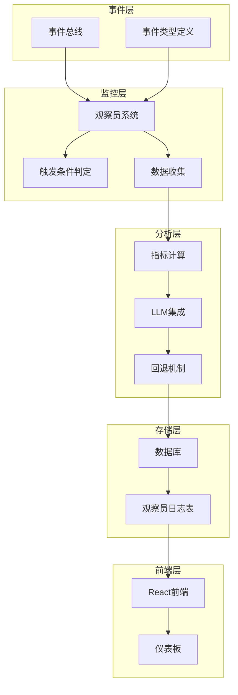
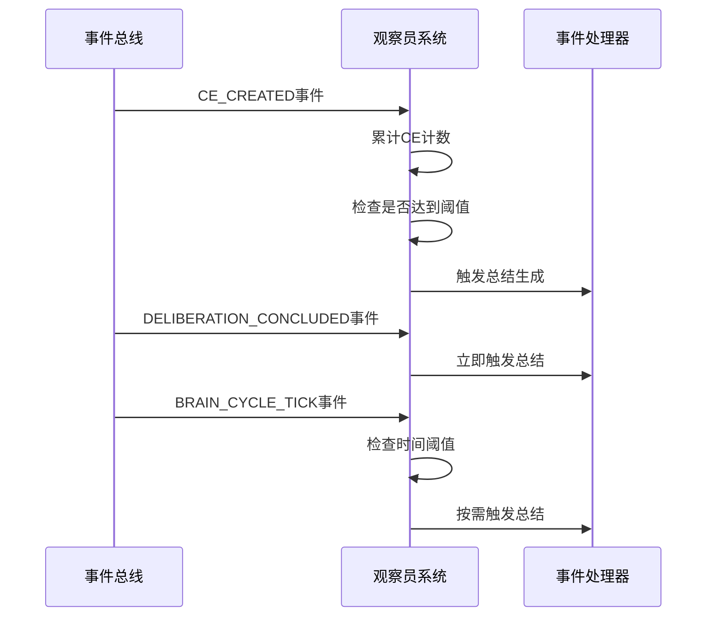
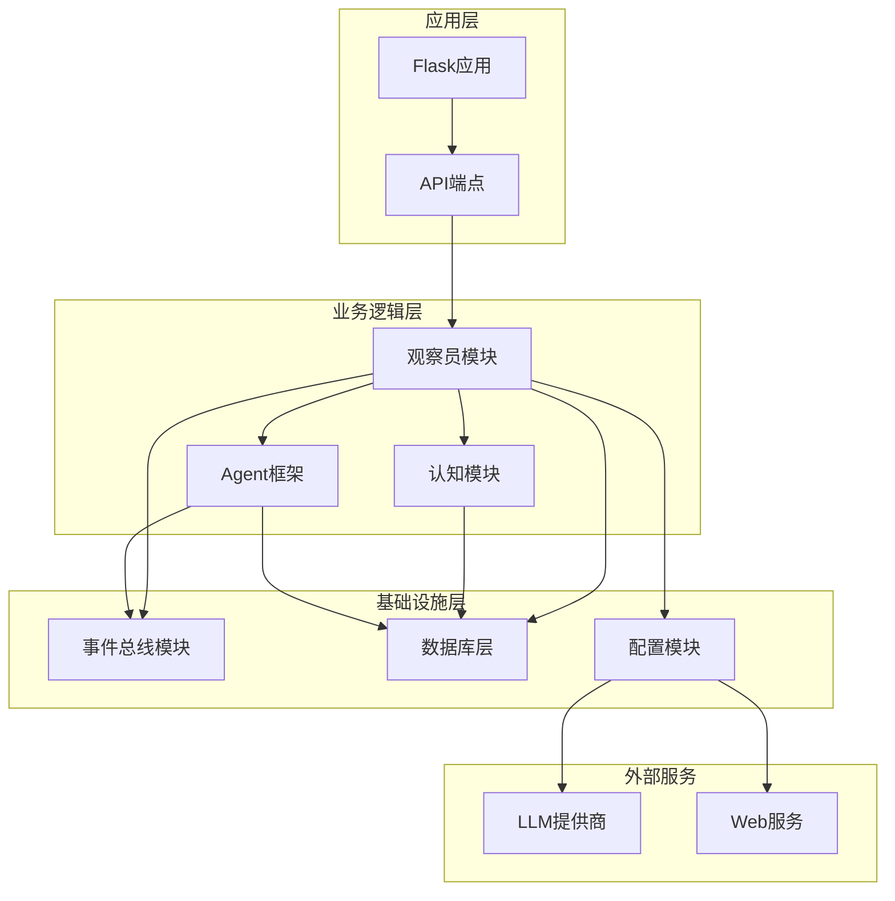
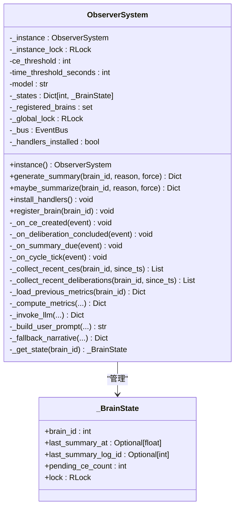
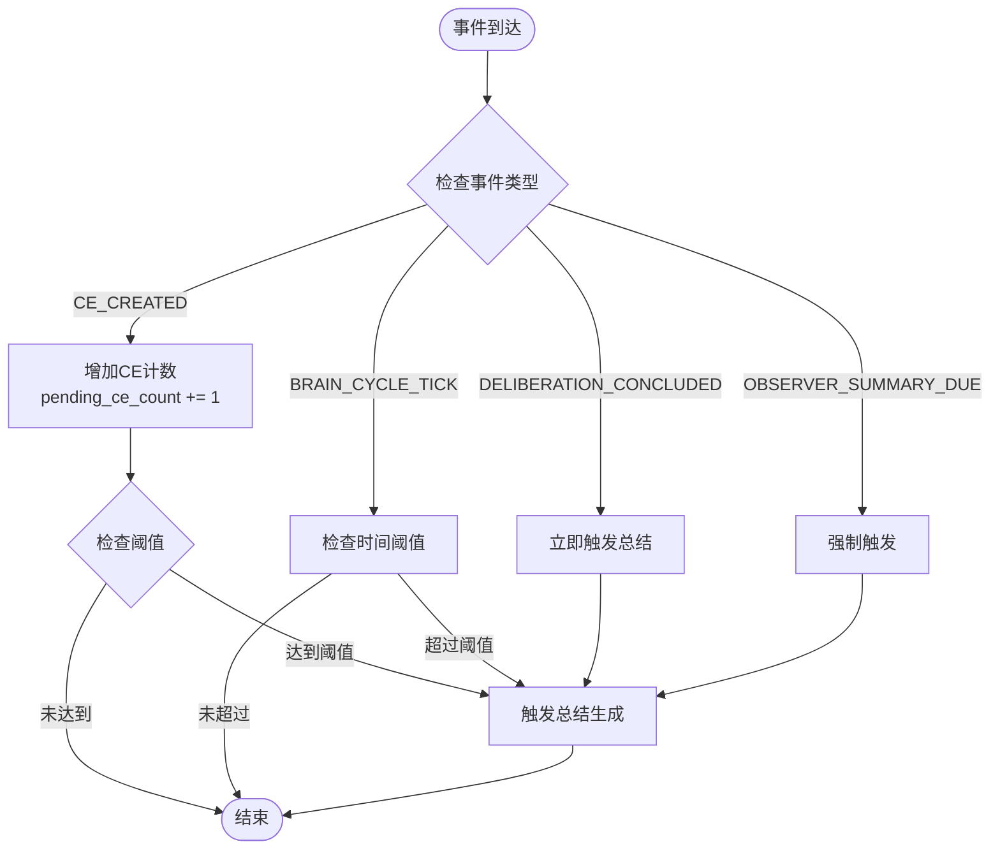
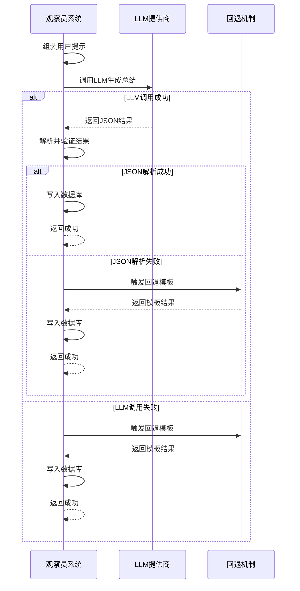
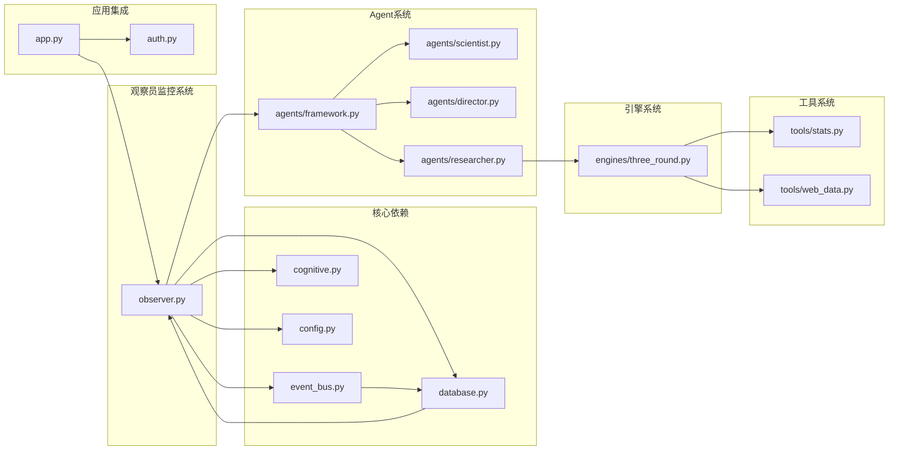

# 观察员监控系统

<cite>
**本文档引用的文件**
- [README.md](file://README.md)
- [app.py](file://app.py)
- [observer.py](file://observer.py)
- [cognitive.py](file://cognitive.py)
- [config.py](file://config.py)
- [database.py](file://database.py)
- [event_bus.py](file://event_bus.py)
- [auth.py](file://auth.py)
- [agents/framework.py](file://agents/framework.py)
- [agents/scientist.py](file://agents/scientist.py)
- [agents/director.py](file://agents/director.py)
- [agents/researcher.py](file://agents/researcher.py)
- [engines/three_round.py](file://engines/three_round.py)
- [tools/stats.py](file://tools/stats.py)
- [tools/web_data.py](file://tools/web_data.py)
- [wsgi.py](file://wsgi.py)
</cite>

## 目录
1. [项目概述](#项目概述)
2. [系统架构](#系统架构)
3. [核心组件](#核心组件)
4. [架构概览](#架构概览)
5. [详细组件分析](#详细组件分析)
6. [依赖关系分析](#依赖关系分析)
7. [性能考虑](#性能考虑)
8. [故障排除指南](#故障排除指南)
9. [结论](#结论)

## 项目概述

观察员监控系统是AInstein项目中的一个关键组件，负责监控和总结硅基大脑的思考动态。该系统实现了"上帝视角"的观察员角色，能够：

- 监听认知元素增长、博弈结束、定时事件等触发信号
- 收集自上次总结以来的所有新增CE/已结束的博弈
- 计算量化指标并生成可读性强的"上帝视角"叙事报告
- 将结构化结果写入observer_logs表供前端渲染

系统采用事件驱动架构，通过订阅多种事件类型来触发总结生成，确保监控的实时性和准确性。

## 系统架构

观察员监控系统采用分层架构设计，主要分为以下几个层次：

**图表来源**
- [observer.py:136-273](file://observer.py#L136-L273)
- [event_bus.py:162-294](file://event_bus.py#L162-L294)
- [database.py:262-284](file://database.py#L262-L284)

## 核心组件

### 观察员系统（ObserverSystem）

观察员系统是整个监控系统的核心，采用单例模式设计，负责维护各个大脑的运行时状态并生成总结报告。

**主要特性：**
- **单例模式**：确保全局唯一实例，避免重复监控
- **多触发源**：支持CE数阈值、博弈结束、定时兜底、显式手动调用等多种触发方式
- **状态管理**：维护每个大脑的自上次总结以来的状态计数
- **容错机制**：LLM失败时自动回退到极简模板叙事

**关键配置：**
- CE阈值触发：默认10个新增认知元素
- 时间阈值：默认1小时兜底触发
- 最小摘要间隔：默认30秒，防止刷屏
- 最近博弈窗口：默认24小时

**章节来源**
- [observer.py:136-173](file://observer.py#L136-L173)
- [observer.py:60-75](file://observer.py#L60-L75)

### 事件总线集成

观察员系统通过事件总线接收各种触发信号，包括：

**图表来源**
- [observer.py:341-435](file://observer.py#L341-L435)
- [event_bus.py:66-142](file://event_bus.py#L66-L142)

**章节来源**
- [observer.py:331-379](file://observer.py#L331-L379)
- [event_bus.py:198-227](file://event_bus.py#L198-L227)

### 数据收集与指标计算

系统能够收集多种类型的数据并计算相应的指标：

**数据收集范围：**
- 新增认知元素（最多200条）
- 最近窗口内已结束的博弈（最多20条）
- 上一条summary的指标数据
- 大脑历史总CE数

**指标计算内容：**
- 新增CE数量
- CE类型分布
- 平均置信度及其变化
- 认知边界大小
- 博弈数量及共识率
- 大脑历史总CE数

**章节来源**
- [observer.py:440-622](file://observer.py#L440-L622)
- [observer.py:537-622](file://observer.py#L537-L622)

## 架构概览

观察员监控系统在整个AInstein生态系统中的位置如下：

**图表来源**
- [app.py:12-46](file://app.py#L12-L46)
- [observer.py:47-51](file://observer.py#L47-L51)
- [config.py:1-11](file://config.py#L1-L11)

## 详细组件分析

### 观察员系统类结构

**图表来源**
- [observer.py:136-173](file://observer.py#L136-L173)
- [observer.py:121-130](file://observer.py#L121-L130)

**章节来源**
- [observer.py:136-800](file://observer.py#L136-L800)

### 事件处理机制

观察员系统通过订阅多种事件类型来实现智能触发：

**图表来源**
- [observer.py:278-326](file://observer.py#L278-L326)
- [observer.py:381-435](file://observer.py#L381-L435)

**章节来源**
- [observer.py:278-435](file://observer.py#L278-L435)

### LLM集成与回退机制

系统采用两层保障机制确保总结生成的可靠性：

**图表来源**
- [observer.py:627-696](file://observer.py#L627-L696)
- [observer.py:749-794](file://observer.py#L749-L794)

**章节来源**
- [observer.py:627-794](file://observer.py#L627-L794)

## 依赖关系分析

观察员监控系统与整个AInstein项目的依赖关系如下：

**图表来源**
- [observer.py:47-51](file://observer.py#L47-L51)
- [app.py:5-8](file://app.py#L5-L8)
- [engines/three_round.py:20-26](file://engines/three_round.py#L20-L26)

**章节来源**
- [observer.py:47-51](file://observer.py#L47-L51)
- [app.py:5-8](file://app.py#L5-L8)

## 性能考虑

观察员监控系统在设计时充分考虑了性能优化：

### 内存管理
- 使用线程锁确保并发安全
- 采用单例模式避免重复实例
- 内存中维护大脑状态，减少数据库查询

### 数据处理优化
- 限制数据收集数量（CE最多200条，博弈最多20条）
- 使用索引优化数据库查询
- 按需加载数据，避免全量扫描

### 触发机制优化
- 多种触发源并存，提高响应速度
- 时间阈值兜底，确保不会遗漏
- 最小间隔限制，防止过度触发

## 故障排除指南

### 常见问题及解决方案

**问题1：观察员总结不触发**
- 检查事件总线是否正常工作
- 验证触发条件配置是否合理
- 确认大脑注册状态

**问题2：LLM调用失败**
- 检查API密钥配置
- 验证网络连接
- 查看回退机制是否正常工作

**问题3：数据库写入失败**
- 检查数据库连接
- 验证表结构完整性
- 查看事务处理日志

**章节来源**
- [observer.py:254-273](file://observer.py#L254-L273)
- [observer.py:669-671](file://observer.py#L669-L671)

### 监控指标

系统提供了多个监控指标来帮助诊断问题：

- **事件处理延迟**：从事件发生到总结生成的时间
- **LLM调用成功率**：成功调用与总调用次数的比例
- **数据库写入延迟**：总结写入数据库的响应时间
- **内存使用情况**：观察员系统的内存占用

## 结论

观察员监控系统作为AInstein项目的重要组成部分，通过事件驱动的方式实现了对硅基大脑思考过程的全面监控。系统的设计体现了以下特点：

1. **事件驱动架构**：通过订阅多种事件类型实现智能触发
2. **容错机制**：LLM失败时的回退机制确保系统稳定性
3. **可扩展性**：模块化设计便于功能扩展和维护
4. **性能优化**：多层优化确保系统在高负载下的稳定性

该系统为AInstein项目提供了强大的监控和总结能力，为后续的硅基大脑发展奠定了坚实的基础。通过持续的优化和扩展，观察员监控系统将继续在机器自主思考的道路上发挥重要作用。