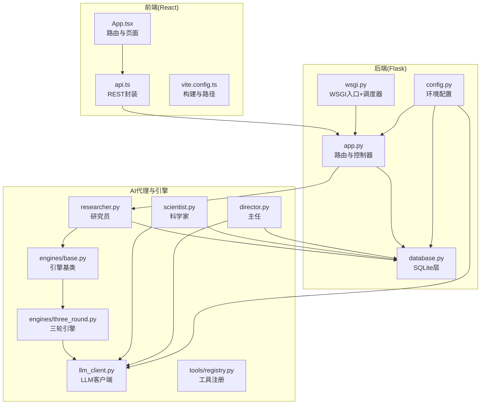
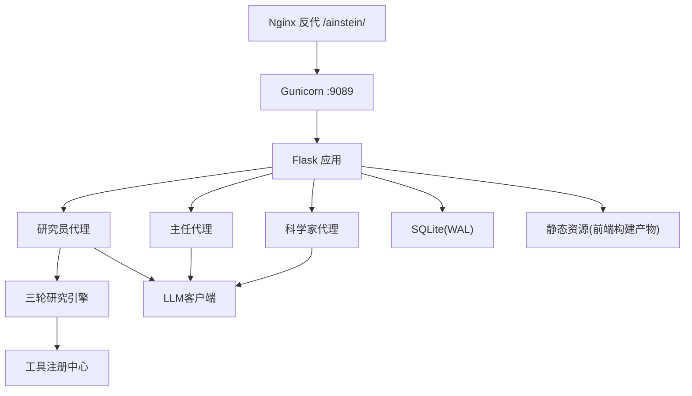
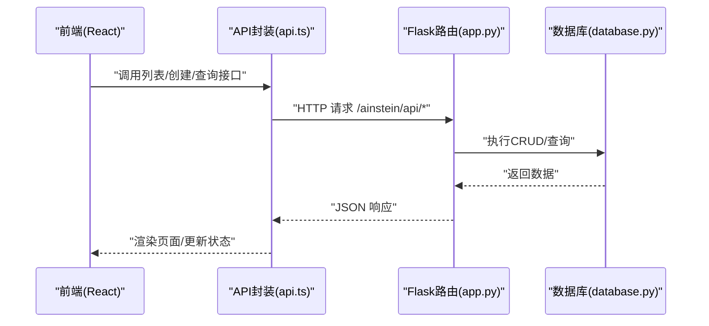
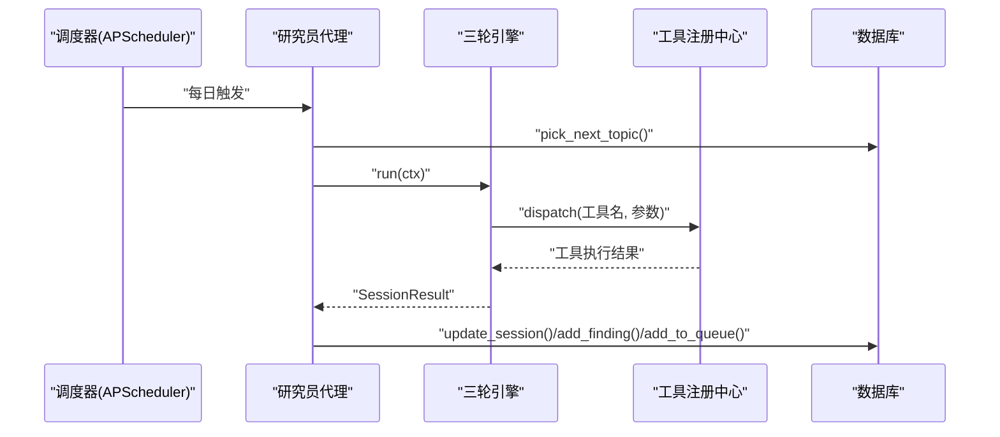
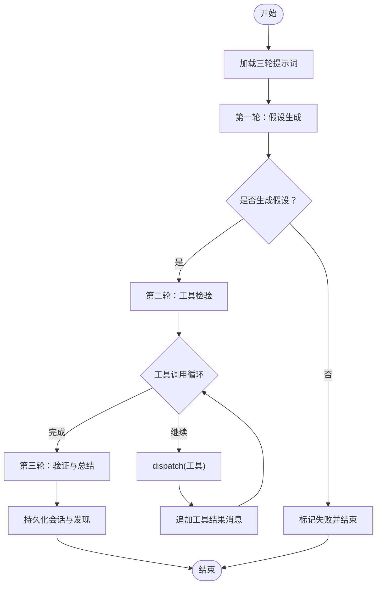
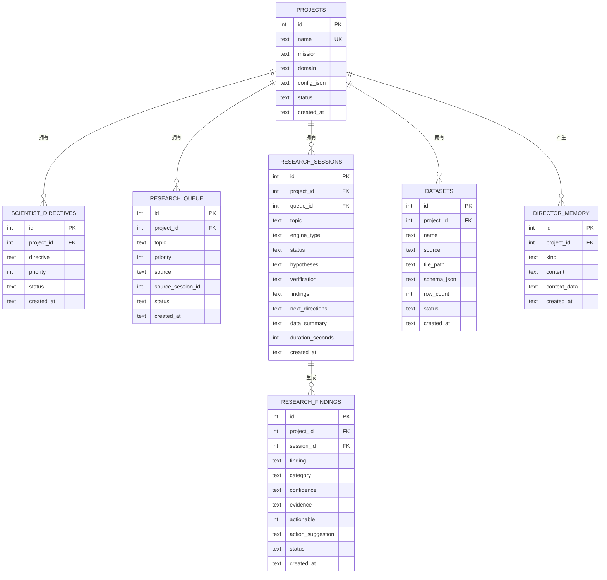
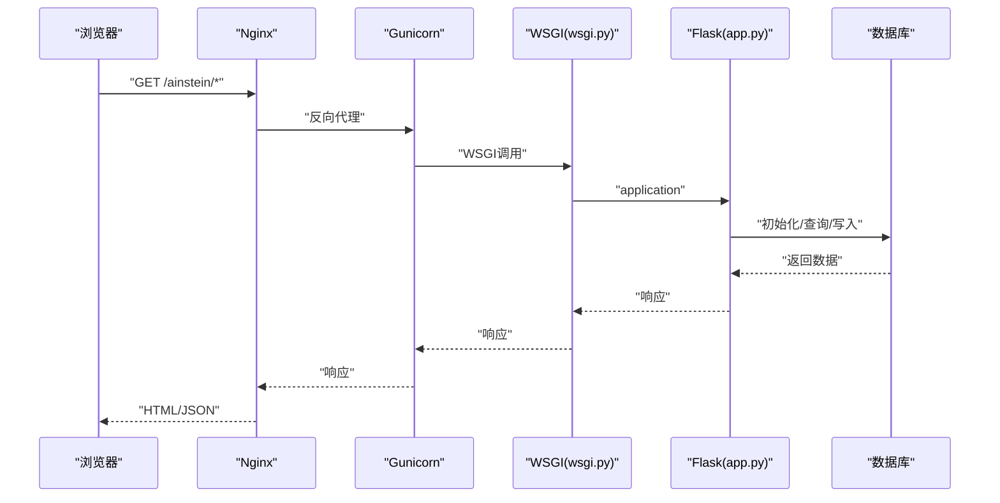
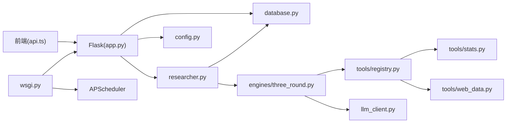

# 系统架构

<cite>
**本文引用的文件**
- [应用入口与路由](file://app.py)
- [WSGI与调度器](file://wsgi.py)
- [全局配置](file://config.py)
- [数据库层与Schema](file://database.py)
- [科学家代理](file://agents/scientist.py)
- [主任代理](file://agents/director.py)
- [研究员代理](file://agents/researcher.py)
- [LLM客户端](file://agents/llm_client.py)
- [引擎基类](file://engines/base.py)
- [三轮研究引擎](file://engines/three_round.py)
- [工具注册中心](file://tools/registry.py)
- [前端应用入口](file://frontend/src/App.tsx)
- [前端API封装](file://frontend/src/api.ts)
- [前端Vite配置](file://frontend/vite.config.ts)
- [前端package.json](file://frontend/package.json)
- [项目说明与架构图](file://README.md)
</cite>

## 目录
1. [引言](#引言)
2. [项目结构](#项目结构)
3. [核心组件](#核心组件)
4. [架构总览](#架构总览)
5. [详细组件分析](#详细组件分析)
6. [依赖关系分析](#依赖关系分析)
7. [性能考量](#性能考量)
8. [故障排查指南](#故障排查指南)
9. [结论](#结论)
10. [附录](#附录)

## 引言
本文件面向开发者与运维人员，系统化阐述AInstein的整体架构设计，覆盖分层架构、组件关系、数据流、前后端交互、AI代理体系、研究引擎设计、数据库模型以及WSGI部署架构。目标是帮助读者快速理解并高效扩展该深度研究平台。

## 项目结构
AInstein采用清晰的分层组织：前端React应用、后端Flask服务、调度与定时任务、AI代理与引擎、工具与数据访问、SQLite持久化。前端构建产物由Flask静态资源服务，生产环境通过WSGI在Gunicorn上承载，并由Nginx反向代理统一入口。

**图表来源**
- [应用入口与路由:1-182](file://app.py#L1-L182)
- [WSGI与调度器:1-83](file://wsgi.py#L1-L83)
- [全局配置:1-11](file://config.py#L1-L11)
- [数据库层与Schema:1-344](file://database.py#L1-L344)
- [科学家代理:1-75](file://agents/scientist.py#L1-L75)
- [主任代理:1-124](file://agents/director.py#L1-L124)
- [研究员代理:1-114](file://agents/researcher.py#L1-L114)
- [LLM客户端:1-114](file://agents/llm_client.py#L1-L114)
- [引擎基类:1-49](file://engines/base.py#L1-L49)
- [三轮研究引擎:1-179](file://engines/three_round.py#L1-L179)
- [工具注册中心:1-181](file://tools/registry.py#L1-L181)
- [前端应用入口:1-13](file://frontend/src/App.tsx#L1-L13)
- [前端API封装:1-45](file://frontend/src/api.ts#L1-L45)
- [前端Vite配置:1-12](file://frontend/vite.config.ts#L1-L12)

**章节来源**
- [项目说明与架构图:71-83](file://README.md#L71-L83)

## 核心组件
- 分层架构
  - 表现层：React单页应用，路由与页面组件，API封装统一调用后端。
  - 控制层：Flask应用，负责路由、请求解析、响应序列化、静态资源托管。
  - 业务层：AI代理（科学家/主任/研究员）、研究引擎（三轮流程）、工具注册与调度。
  - 数据层：SQLite数据库，提供CRUD与索引，支持WAL模式提升并发写入性能。
- 前后端分离
  - 前端通过REST接口与后端通信，接口前缀统一为/ainstein/api。
  - 前端构建产物放置于Flask静态目录，支持SPA回退到index.html。
- AI代理系统
  - 科学家：制定战略指令与初始主题，沉淀发现分类与策略记忆。
  - 主任：每日复盘，评审发现、调整队列、累积记忆、生成简报。
  - 研究员：从队列取主题，驱动研究引擎，产出发现与后续方向。
- 研究引擎
  - 三轮研究流程：假设生成→工具检验→验证总结，支持工具链动态调用与结果聚合。
- 数据库
  - 以项目为中心的实体关系：项目、指令、队列、会话、发现、记忆、数据集。
  - 关键索引覆盖查询热点，保障队列、会话、发现、记忆、数据集的检索效率。
- WSGI部署
  - Gunicorn承载Flask应用，WSGI入口同时初始化数据库与APScheduler。
  - 调度器按UTC时间周期触发科学家/主任/研究员任务，带互斥锁避免多实例竞争。

**章节来源**
- [应用入口与路由:1-182](file://app.py#L1-L182)
- [WSGI与调度器:1-83](file://wsgi.py#L1-L83)
- [数据库层与Schema:1-344](file://database.py#L1-L344)
- [科学家代理:1-75](file://agents/scientist.py#L1-L75)
- [主任代理:1-124](file://agents/director.py#L1-L124)
- [研究员代理:1-114](file://agents/researcher.py#L1-L114)
- [三轮研究引擎:1-179](file://engines/three_round.py#L1-L179)
- [引擎基类:1-49](file://engines/base.py#L1-L49)
- [工具注册中心:1-181](file://tools/registry.py#L1-L181)
- [LLM客户端:1-114](file://agents/llm_client.py#L1-L114)
- [前端应用入口:1-13](file://frontend/src/App.tsx#L1-L13)
- [前端API封装:1-45](file://frontend/src/api.ts#L1-L45)
- [前端Vite配置:1-12](file://frontend/vite.config.ts#L1-L12)

## 架构总览
AInstein采用“前端React + 后端Flask + SQLite + LLM”的轻量级全栈架构。前端通过REST API与后端交互，后端提供统一的资源接口与内部调度能力。AI代理围绕研究生命周期协作，研究引擎以三轮流程驱动工具链执行，最终沉淀到数据库形成知识闭环。

**图表来源**
- [项目说明与架构图:71-83](file://README.md#L71-L83)
- [应用入口与路由:1-182](file://app.py#L1-L182)
- [WSGI与调度器:1-83](file://wsgi.py#L1-L83)
- [科学家代理:1-75](file://agents/scientist.py#L1-L75)
- [主任代理:1-124](file://agents/director.py#L1-L124)
- [研究员代理:1-114](file://agents/researcher.py#L1-L114)
- [三轮研究引擎:1-179](file://engines/three_round.py#L1-L179)
- [工具注册中心:1-181](file://tools/registry.py#L1-L181)
- [LLM客户端:1-114](file://agents/llm_client.py#L1-L114)
- [数据库层与Schema:1-344](file://database.py#L1-L344)

## 详细组件分析

### 前后端交互与路由设计
- 前端
  - 使用React Router进行SPA路由，页面包含仪表盘与项目详情。
  - API封装统一前缀/ainstein/api，便于后端静态资源映射与反向代理。
  - 构建时设置base为/ainstein/，确保静态资源路径正确。
- 后端
  - Flask应用提供健康检查、项目管理、队列、会话、发现、数据集、代理执行等接口。
  - 静态资源托管：/ainstein/与/ainstein/assets/分别指向构建产物与静态资源。
  - SPA回退：未匹配到具体文件时回退至index.html，保证路由刷新可用。
- 数据流
  - 前端发起REST请求，后端解析参数、调用数据库层与代理层，返回JSON响应。

**图表来源**
- [前端API封装:1-45](file://frontend/src/api.ts#L1-L45)
- [应用入口与路由:1-182](file://app.py#L1-L182)
- [数据库层与Schema:1-344](file://database.py#L1-L344)

**章节来源**
- [前端应用入口:1-13](file://frontend/src/App.tsx#L1-L13)
- [前端API封装:1-45](file://frontend/src/api.ts#L1-L45)
- [前端Vite配置:1-12](file://frontend/vite.config.ts#L1-L12)
- [应用入口与路由:24-38](file://app.py#L24-L38)

### AI代理系统：科学家、研究员、主任
- 科学家
  - 输入：项目使命、领域、数据集摘要。
  - 输出：战略指令、初始主题、发现分类、策略记忆。
  - 写入：指令表、队列表、记忆表。
- 主任
  - 输入：近期会话、开放发现、队列、记忆。
  - 输出：发现评审动作、新增主题、记忆条目、简报。
  - 写入：发现状态变更、队列、记忆表。
- 研究员
  - 输入：项目上下文、指令、最近发现、数据集摘要。
  - 流程：取队列主题→创建会话→运行引擎→持久化结果→推进队列。
  - 写入：会话表、发现表、队列表。

**图表来源**
- [WSGI与调度器:27-71](file://wsgi.py#L27-L71)
- [研究员代理:14-114](file://agents/researcher.py#L14-L114)
- [三轮研究引擎:28-179](file://engines/three_round.py#L28-L179)
- [工具注册中心:24-43](file://tools/registry.py#L24-L43)
- [数据库层与Schema:214-228](file://database.py#L214-L228)

**章节来源**
- [科学家代理:14-75](file://agents/scientist.py#L14-L75)
- [主任代理:14-124](file://agents/director.py#L14-L124)
- [研究员代理:14-114](file://agents/researcher.py#L14-L114)

### 研究引擎：三轮研究流程
- 设计理念
  - 假设生成：基于指令与上下文生成可验证的假设集合。
  - 工具检验：按顺序调用统计/数据工具进行验证，支持多次迭代与对话式交互。
  - 验证总结：综合证据生成发现、建议与后续方向。
- 关键点
  - 引擎抽象：定义engine_type与run接口，便于扩展其他引擎。
  - 工具调度：通过工具注册中心动态派发，支持数据集加载与参数校验。
  - 结果持久化：将假设、验证过程、发现、后续方向写入数据库。

**图表来源**
- [三轮研究引擎:28-179](file://engines/three_round.py#L28-L179)
- [引擎基类:26-49](file://engines/base.py#L26-L49)
- [工具注册中心:24-43](file://tools/registry.py#L24-L43)

**章节来源**
- [三轮研究引擎:28-179](file://engines/three_round.py#L28-L179)
- [引擎基类:11-49](file://engines/base.py#L11-L49)
- [工具注册中心:1-181](file://tools/registry.py#L1-L181)

### 数据库架构：SQLite设计、表关系与数据模型
- Schema要点
  - 项目表：存储项目元信息与配置。
  - 指令表：科学家下发的战略指令，支持优先级与状态。
  - 队列表：待处理的研究主题，支持优先级、来源与状态。
  - 会话表：一次研究会话的完整记录，包含引擎类型、状态、中间结果与耗时。
  - 发现表：研究产出的发现，支持分类、置信度、证据与行动建议。
  - 记忆表：主任累积的策略与简报等上下文记忆。
  - 数据集表：项目上传的数据文件，记录文件路径、模式与行数。
- 索引
  - 针对队列、会话、发现、记忆、数据集的关键字段建立索引，优化查询性能。
- 事务与一致性
  - 使用上下文管理器封装连接，开启WAL与外键约束，自动提交/回滚，保障一致性。

**图表来源**
- [数据库层与Schema:10-98](file://database.py#L10-L98)

**章节来源**
- [数据库层与Schema:10-344](file://database.py#L10-L344)

### WSGI部署架构：Gunicorn、Nginx与调度器
- 部署拓扑
  - Nginx反向代理/ainstein/，转发到本机Gunicorn进程。
  - Gunicorn承载Flask应用，使用多工作进程与超时配置。
- WSGI入口
  - 初始化数据库，尝试获取调度器互斥锁，仅持有锁的工作进程启动APScheduler。
  - 调度器按UTC时间周期触发科学家、主任、研究员任务，避免多实例重复执行。
- 生产建议
  - 使用systemd管理Gunicorn进程，结合Nginx统一入口与静态资源缓存。
  - 前端构建产物置于Flask静态目录，便于Nginx直接服务静态资源。

**图表来源**
- [项目说明与架构图:71-83](file://README.md#L71-L83)
- [WSGI与调度器:74-82](file://wsgi.py#L74-L82)
- [应用入口与路由:11-38](file://app.py#L11-L38)

**章节来源**
- [WSGI与调度器:1-83](file://wsgi.py#L1-L83)
- [应用入口与路由:11-38](file://app.py#L11-L38)
- [项目说明与架构图:61-69](file://README.md#L61-L69)

## 依赖关系分析
- 组件耦合
  - 后端路由依赖数据库层与代理层；代理层依赖引擎与工具；引擎依赖LLM客户端与工具注册中心。
  - 前端仅依赖后端REST接口，通过API封装解耦具体路由细节。
- 外部依赖
  - LLM客户端基于DashScope（兼容Anthropic协议），通过环境变量配置。
  - 调度器使用APScheduler，带互斥锁避免多实例竞争。
- 循环依赖
  - 通过模块导入延迟与函数内导入规避循环依赖风险。

**图表来源**
- [前端API封装:1-45](file://frontend/src/api.ts#L1-L45)
- [应用入口与路由:1-182](file://app.py#L1-L182)
- [数据库层与Schema:1-344](file://database.py#L1-L344)
- [研究员代理:1-114](file://agents/researcher.py#L1-L114)
- [三轮研究引擎:1-179](file://engines/three_round.py#L1-L179)
- [工具注册中心:1-181](file://tools/registry.py#L1-L181)
- [LLM客户端:1-114](file://agents/llm_client.py#L1-L114)
- [WSGI与调度器:1-83](file://wsgi.py#L1-L83)
- [全局配置:1-11](file://config.py#L1-L11)

**章节来源**
- [前端API封装:1-45](file://frontend/src/api.ts#L1-L45)
- [应用入口与路由:1-182](file://app.py#L1-L182)
- [WSGI与调度器:1-83](file://wsgi.py#L1-L83)

## 性能考量
- 数据库
  - WAL模式提升写入吞吐；外键约束保障一致性；关键字段建立索引降低查询成本。
- 引擎与工具
  - 限制工具调用轮次上限，避免长对话导致超时；合理拆分工具调用，减少单次LLM负载。
- 前后端
  - 前端按需加载与分页查询，后端接口支持过滤与限制数量，减轻网络与数据库压力。
- 部署
  - Gunicorn多进程与超时配置平衡并发与稳定性；Nginx缓存静态资源，降低后端压力。

## 故障排查指南
- 健康检查
  - 访问/ainstein/api/health确认后端存活。
- 数据库初始化
  - 首次启动或迁移后，确保数据库初始化成功，检查日志中初始化路径。
- LLM调用
  - 检查环境变量中的API Key与Base URL；关注JSON提取失败的日志，定位提示词与响应格式问题。
- 调度器
  - 查看调度器启动日志，确认互斥锁获取状态；核对UTC时间与期望是否一致。
- 前端静态资源
  - 确认Vite构建产物位于Flask静态目录；检查base路径与Nginx反代配置。

**章节来源**
- [应用入口与路由:43-45](file://app.py#L43-L45)
- [WSGI与调度器:74-82](file://wsgi.py#L74-L82)
- [LLM客户端:24-44](file://agents/llm_client.py#L24-L44)

## 结论
AInstein以清晰的分层架构与前后端分离设计，结合三级AI代理与三轮研究引擎，形成了可扩展、可观测、可维护的研究平台。SQLite与Gunicorn/Nginx组合满足中小规模生产需求，WSGI入口与调度器确保任务稳定执行。通过本文档的架构视图与组件剖析，开发者可快速理解系统设计并开展二次开发与运维。

## 附录
- 环境变量
  - 数据库路径、数据集根目录、LLM API Key与Base URL、模型名称等均来自环境变量，便于在不同环境中灵活配置。
- 前端构建与部署
  - Vite构建产物输出至dist，base设置为/ainstein/，配合Flask静态资源服务与Nginx反代使用。

**章节来源**
- [全局配置:1-11](file://config.py#L1-L11)
- [前端Vite配置:1-12](file://frontend/vite.config.ts#L1-L12)
- [项目说明与架构图:61-69](file://README.md#L61-L69)