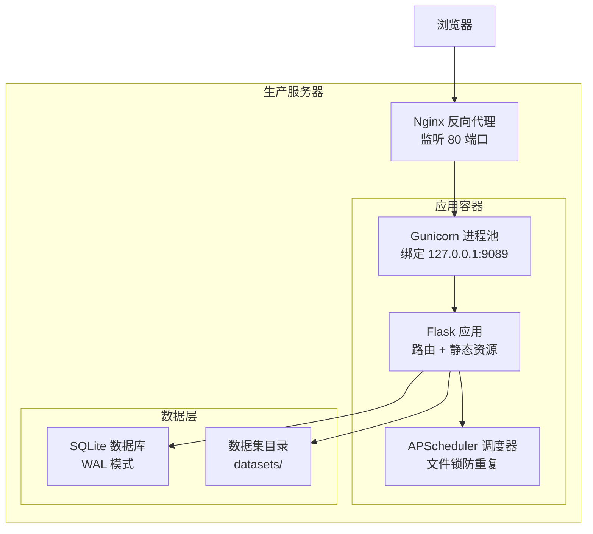
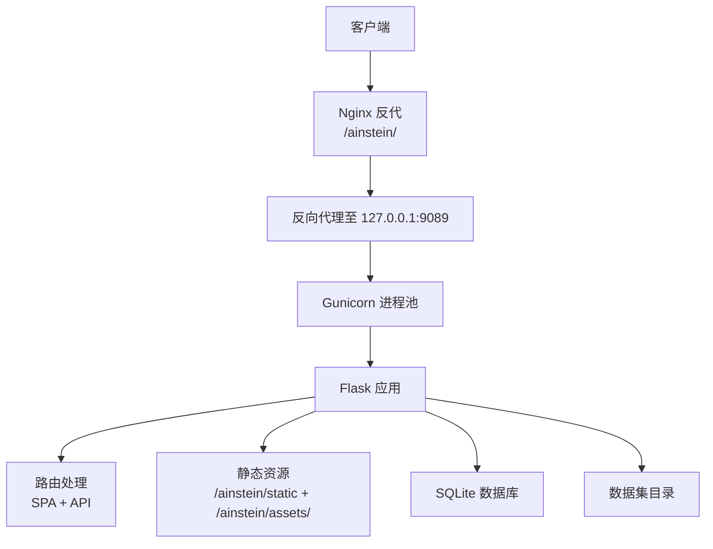
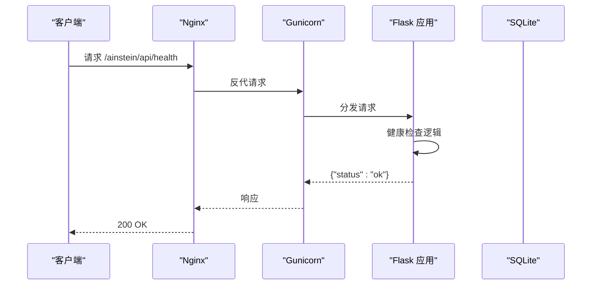
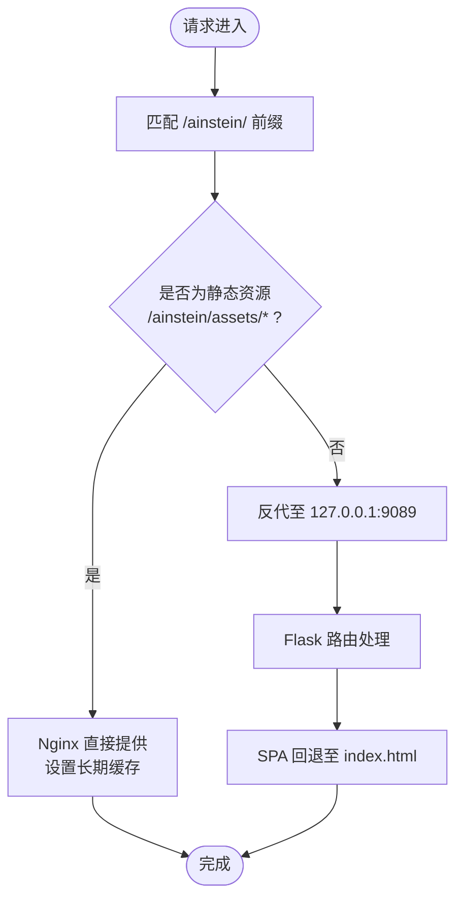
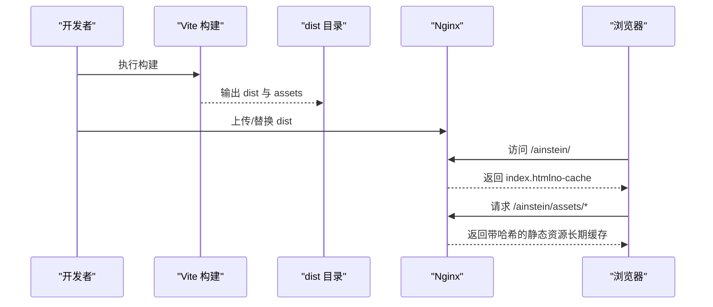
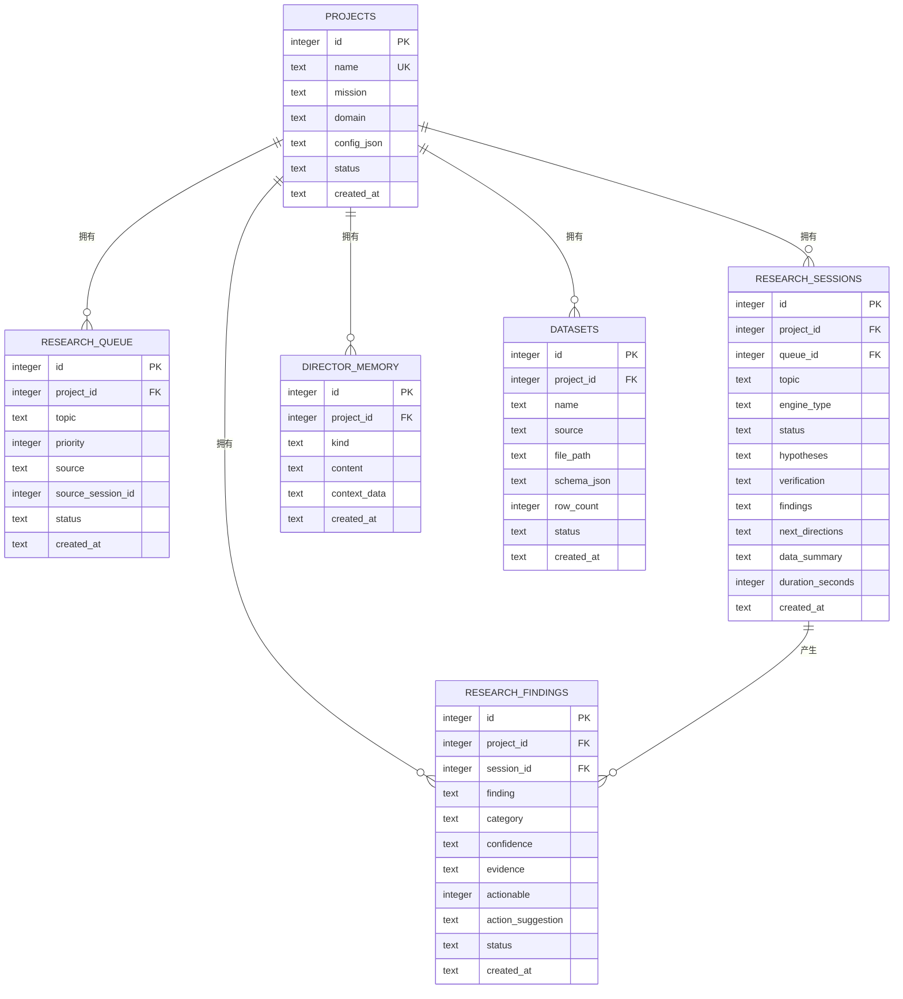
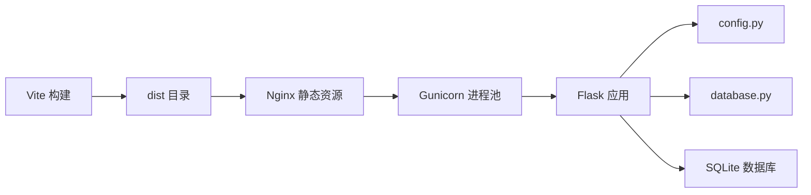

# 部署架构

<cite>
**本文引用的文件**
- [app.py](file://app.py)
- [wsgi.py](file://wsgi.py)
- [config.py](file://config.py)
- [database.py](file://database.py)
- [vite.config.ts](file://frontend/vite.config.ts)
- [package.json](file://frontend/package.json)
- [ops-manual.md](file://docs/ops-manual.md)
- [README.md](file://README.md)
</cite>

## 目录
1. [简介](#简介)
2. [项目结构](#项目结构)
3. [核心组件](#核心组件)
4. [架构总览](#架构总览)
5. [详细组件分析](#详细组件分析)
6. [依赖关系分析](#依赖关系分析)
7. [性能考量](#性能考量)
8. [故障排查指南](#故障排查指南)
9. [结论](#结论)
10. [附录](#附录)

## 简介
本文件面向生产环境部署，系统化阐述从代码到生产的完整部署流程与架构设计，重点覆盖：
- WSGI 应用服务器（Flask + Gunicorn）的进程管理与健康检查
- Nginx 反向代理与静态资源服务策略
- 前端构建与缓存策略（Vite + CDN 友好命名）
- 环境配置管理（生产环境变量、日志、安全）
- 部署架构图与配置示例，帮助快速落地与维护

## 项目结构
项目采用“后端 Flask + 前端 Vite”的双层结构，后端通过 WSGI 入口暴露 API，并内嵌静态资源；前端构建产物直接由 Nginx 提供，形成清晰的前后端分离部署边界。

图表来源
- [README.md:71-83](file://README.md#L71-L83)
- [ops-manual.md:37-47](file://docs/ops-manual.md#L37-L47)
- [ops-manual.md:445-450](file://docs/ops-manual.md#L445-L450)

章节来源
- [README.md:94-124](file://README.md#L94-L124)
- [ops-manual.md:12-35](file://docs/ops-manual.md#L12-L35)

## 核心组件
- WSGI 入口与调度器：WSGI 应用入口负责初始化数据库、启动调度器并导出可被 Gunicorn 加载的应用对象。
- Flask 应用：提供 SPA 路由、API 接口与静态资源服务。
- 前端构建：Vite 构建产物放置于 dist，由 Nginx 直接提供。
- 数据层：SQLite（WAL 模式），支持索引与事务一致性。
- 环境配置：集中于 config.py，读取环境变量，便于在 systemd 中注入。

章节来源
- [wsgi.py:1-83](file://wsgi.py#L1-L83)
- [app.py:11-39](file://app.py#L11-L39)
- [config.py:1-11](file://config.py#L1-L11)
- [database.py:101-123](file://database.py#L101-L123)

## 架构总览
生产部署采用“Nginx → Gunicorn → Flask → SQLite”的经典三层架构，前端静态资源由 Nginx 直接提供，后端通过反向代理统一入口，既保证了静态资源的高效分发，也隔离了后端进程与公网的直接接触。

图表来源
- [README.md:71-83](file://README.md#L71-L83)
- [ops-manual.md:37-47](file://docs/ops-manual.md#L37-L47)
- [app.py:24-38](file://app.py#L24-L38)

## 详细组件分析

### WSGI 应用服务器（Flask + Gunicorn）
- 进程与绑定
  - Gunicorn 在本地回环地址绑定端口，避免公网直连，提升安全性。
  - 生产启动命令包含工作进程数、超时时间等参数，便于控制并发与响应时长。
- 调度器与锁
  - 启动时尝试获取文件锁，确保同一主机上仅有一个调度器实例运行，防止重复执行定时任务。
  - 调度器基于 APScheduler，按 UTC 时间配置每日/每周任务。
- 健康检查
  - 提供 /ainstein/api/health 接口，便于外部探针进行健康检查。

图表来源
- [app.py:43-45](file://app.py#L43-L45)
- [ops-manual.md:201-208](file://docs/ops-manual.md#L201-L208)

章节来源
- [README.md:61-67](file://README.md#L61-L67)
- [ops-manual.md:39-40](file://docs/ops-manual.md#L39-L40)
- [wsgi.py:74-83](file://wsgi.py#L74-L83)

### Nginx 反向代理与静态资源服务
- 路由与路径
  - Nginx 将 /ainstein/ 前缀的请求反代至本地 Gunicorn。
  - 静态资源通过 Flask 的 static 目录与 /ainstein/assets/ 路径提供。
- 缓存策略
  - 对 /ainstein/assets/ 下的静态资源设置长期缓存与 immutable 标记，提升缓存命中率。
  - 前端入口 index.html 设置 no-cache，确保前端版本更新即时生效。
- 重载与校验
  - 支持在线重载 Nginx 配置，无需重启服务。

图表来源
- [ops-manual.md:445-450](file://docs/ops-manual.md#L445-L450)
- [app.py:24-38](file://app.py#L24-L38)
- [vite.config.ts:6](file://frontend/vite.config.ts#L6)

章节来源
- [ops-manual.md:441-452](file://docs/ops-manual.md#L441-L452)
- [app.py:29-31](file://app.py#L29-L31)

### 前端构建与部署流程（Vite）
- 构建产物
  - Vite 构建输出到 dist，子目录 assets 存放带内容哈希的静态资源，确保缓存失效与版本区分。
- 基础路径
  - Vite 配置基础路径为 /ainstein/，与后端路由前缀保持一致，避免资源路径错配。
- 部署与更新
  - 构建完成后直接替换 dist 目录即可，无需重启后端服务，Nginx 即刻生效。
- 缓存与刷新
  - index.html 设置 no-cache，assets 通过哈希命名实现强缓存与自动刷新。

图表来源
- [vite.config.ts:6](file://frontend/vite.config.ts#L6)
- [ops-manual.md:175-185](file://docs/ops-manual.md#L175-L185)

章节来源
- [vite.config.ts:1-12](file://frontend/vite.config.ts#L1-L12)
- [package.json:6-10](file://frontend/package.json#L6-L10)
- [ops-manual.md:165-195](file://docs/ops-manual.md#L165-L195)

### 数据库与数据集（SQLite + 数据集目录）
- 数据库
  - 使用 SQLite 并启用 WAL 模式，提高并发读写能力；开启外键约束，保证数据一致性。
  - 提供索引以优化常见查询（队列、会话、发现、记忆、数据集）。
- 数据集
  - 用户上传的 CSV/JSON 文件保存在项目级目录下，便于后续分析与检索。
- 备份与清理
  - 提供备份与恢复脚本，以及定期清理过期会话与无效记录的建议。

图表来源
- [database.py:10-98](file://database.py#L10-L98)

章节来源
- [database.py:101-123](file://database.py#L101-L123)
- [ops-manual.md:100-163](file://docs/ops-manual.md#L100-L163)

### 环境配置管理（生产环境变量、日志、安全）
- 环境变量
  - 通过 config.py 读取数据库路径、数据集目录、LLM API Key 与模型名称等，便于 systemd 注入。
- 日志
  - Flask 应用内置日志格式；systemd 通过 journalctl 进行集中采集与过滤。
- 安全
  - Gunicorn 仅监听本地回环地址，Nginx 对外暴露；静态资源设置长期缓存；API Key 存储在受控文件中并设置严格权限。
  - 防火墙建议：仅开放 80（HTTP），关闭 9089（Gunicorn）对外访问。

章节来源
- [config.py:1-11](file://config.py#L1-L11)
- [ops-manual.md:71-85](file://docs/ops-manual.md#L71-L85)
- [ops-manual.md:454-481](file://docs/ops-manual.md#L454-L481)

## 依赖关系分析
- 组件耦合
  - Flask 应用依赖数据库模块与配置模块；WSGI 入口依赖 Flask 应用与数据库初始化。
  - 前端构建产物由 Nginx 直接提供，与后端解耦。
- 外部依赖
  - 后端依赖 Flask、Gunicorn、APScheduler、pandas 等；前端依赖 Vite、React、TypeScript。
- 部署耦合点
  - Nginx 与 Gunicorn 的端口绑定、Flask 基础路径与 Vite 基础路径需保持一致，避免资源路径错配。

图表来源
- [vite.config.ts:6](file://frontend/vite.config.ts#L6)
- [ops-manual.md:39-40](file://docs/ops-manual.md#L39-L40)
- [config.py:1-11](file://config.py#L1-L11)
- [database.py:101-123](file://database.py#L101-L123)

章节来源
- [README.md:85-92](file://README.md#L85-L92)
- [ops-manual.md:32-35](file://docs/ops-manual.md#L32-L35)

## 性能考量
- Gunicorn 工作进程数
  - 当前配置为 2 个工作进程，适合资源受限的廉价 ECS；可根据 CPU 核心数调整（建议 2×CPU+1）。
- SQLite 优化
  - 已启用 WAL 模式与外键约束；可进一步通过缓存大小与同步策略优化。
- Nginx 缓存
  - 静态资源设置长期缓存与 immutable 标记，显著降低带宽与延迟。
- 前端缓存
  - index.html no-cache 确保版本更新即时生效；assets 哈希命名实现强缓存与自动刷新。

章节来源
- [ops-manual.md:409-423](file://docs/ops-manual.md#L409-L423)
- [database.py:113-114](file://database.py#L113-L114)
- [ops-manual.md:441-452](file://docs/ops-manual.md#L441-L452)

## 故障排查指南
- 服务无法启动
  - 检查 systemd 日志与端口占用；确认虚拟环境与依赖安装正确。
- LLM 调用失败
  - 校验 API Key 是否注入；手动调用 LLM 客户端验证；关注配额与速率限制。
- 调度器不执行
  - 检查调度器日志与锁文件；若锁失效，删除锁文件并重启服务；必要时手动触发。
- 前端 404
  - 确认 dist 目录存在且包含 index.html 与 assets；检查 Nginx 配置；重新构建并重载 Nginx。
- 数据集上传失败
  - 检查文件存在与权限；手动解析验证编码与列类型；修正后重试。

章节来源
- [ops-manual.md:249-367](file://docs/ops-manual.md#L249-L367)

## 结论
本部署方案以 Nginx + Gunicorn + Flask + SQLite 为核心，结合 Vite 的前端构建与 CDN 友好命名策略，实现了高可用、易维护的生产环境。通过文件锁保障调度器唯一性、严格的缓存策略与最小暴露面的安全设计，满足中小规模场景下的稳定运行需求。对于未来扩展，可考虑数据库迁移与分布式调度方案。

## 附录
- 部署要点清单
  - 后端：systemd 服务、Gunicorn 工作进程数、健康检查接口
  - 前端：Vite 基础路径与构建产物、Nginx 缓存配置
  - 数据：SQLite WAL 模式、索引、备份与清理策略
  - 安全：Gunicorn 仅本地监听、API Key 权限、防火墙规则