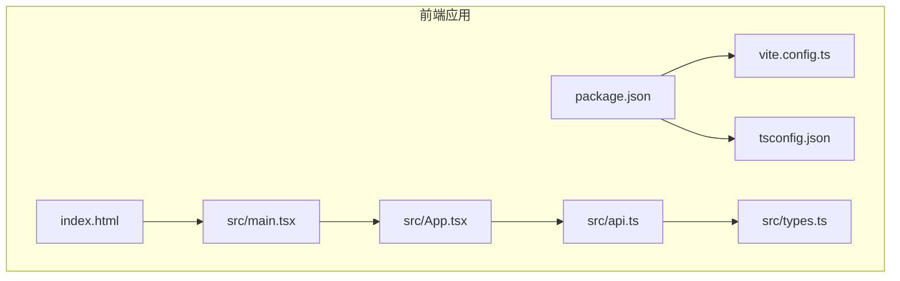
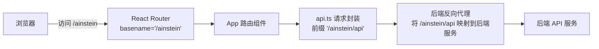
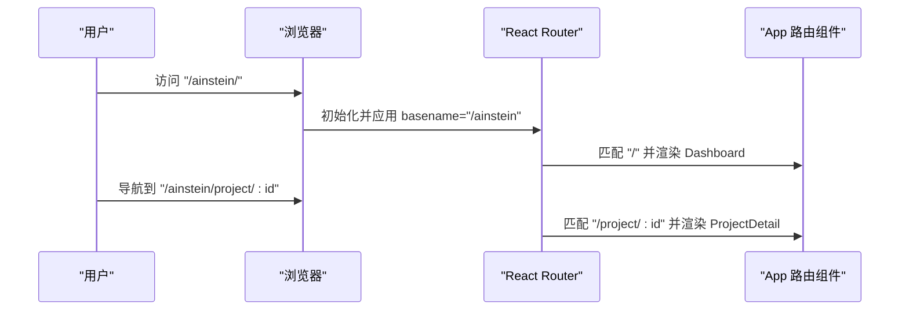
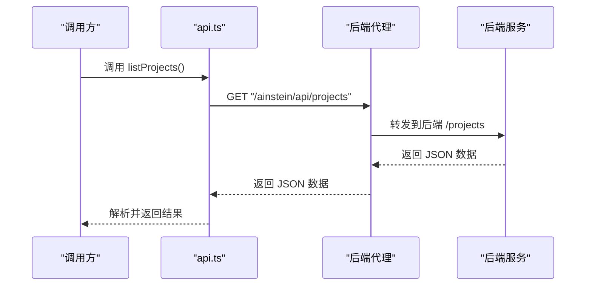
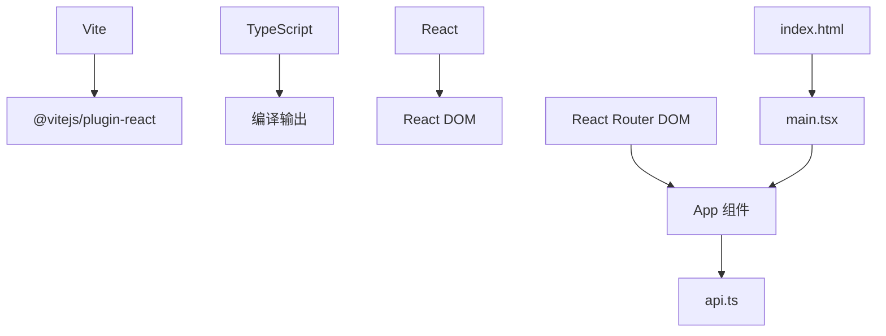

# 前端构建部署

<cite>
**本文引用的文件**
- [vite.config.ts](file://frontend/vite.config.ts)
- [package.json](file://frontend/package.json)
- [tsconfig.json](file://frontend/tsconfig.json)
- [index.html](file://frontend/index.html)
- [main.tsx](file://frontend/src/main.tsx)
- [App.tsx](file://frontend/src/App.tsx)
- [api.ts](file://frontend/src/api.ts)
- [types.ts](file://frontend/src/types.ts)
</cite>

## 目录
1. [简介](#简介)
2. [项目结构](#项目结构)
3. [核心组件](#核心组件)
4. [架构总览](#架构总览)
5. [详细组件分析](#详细组件分析)
6. [依赖分析](#依赖分析)
7. [性能考虑](#性能考虑)
8. [故障排查指南](#故障排查指南)
9. [结论](#结论)
10. [附录](#附录)

## 简介
本指南面向前端应用的构建与部署，围绕当前仓库中 Vite 配置展开，覆盖打包优化、资源压缩、代码分割、静态资源部署（含 CDN 与缓存策略）、多环境配置差异（开发/测试/生产）、前端路由与 API 代理、环境变量管理、构建产物验证与发布流程，以及 Docker 中的前端构建最佳实践。为确保可追溯性，所有技术细节均对应到实际源码文件。

## 项目结构
前端工程位于 frontend 目录，采用 Vite + React + TypeScript 技术栈，使用 React Router 进行前端路由，通过相对路径前缀“/ainstein”实现子路径部署。

**图表来源**
- [vite.config.ts:1-12](file://frontend/vite.config.ts#L1-L12)
- [package.json:1-24](file://frontend/package.json#L1-L24)
- [tsconfig.json:1-20](file://frontend/tsconfig.json#L1-L20)
- [index.html:1-22](file://frontend/index.html#L1-L22)
- [main.tsx:1-13](file://frontend/src/main.tsx#L1-L13)
- [App.tsx:1-13](file://frontend/src/App.tsx#L1-L13)
- [api.ts:1-45](file://frontend/src/api.ts#L1-L45)
- [types.ts:1-89](file://frontend/src/types.ts#L1-L89)

**章节来源**
- [vite.config.ts:1-12](file://frontend/vite.config.ts#L1-L12)
- [package.json:1-24](file://frontend/package.json#L1-L24)
- [tsconfig.json:1-20](file://frontend/tsconfig.json#L1-L20)
- [index.html:1-22](file://frontend/index.html#L1-L22)
- [main.tsx:1-13](file://frontend/src/main.tsx#L1-L13)
- [App.tsx:1-13](file://frontend/src/App.tsx#L1-L13)
- [api.ts:1-45](file://frontend/src/api.ts#L1-L45)
- [types.ts:1-89](file://frontend/src/types.ts#L1-L89)

## 核心组件
- 构建工具链：Vite 作为开发服务器与打包器，TypeScript 提供类型检查与编译输出。
- 路由与入口：React Router 在主入口设置 basename 为“/ainstein”，页面路由定义在 App 组件中。
- API 客户端：统一以“/ainstein/api”为前缀发起请求，便于后端反向代理转发。
- 类型系统：集中定义项目数据模型，保证前后端交互一致性。

**章节来源**
- [vite.config.ts:1-12](file://frontend/vite.config.ts#L1-L12)
- [package.json:1-24](file://frontend/package.json#L1-L24)
- [tsconfig.json:1-20](file://frontend/tsconfig.json#L1-L20)
- [main.tsx:1-13](file://frontend/src/main.tsx#L1-L13)
- [App.tsx:1-13](file://frontend/src/App.tsx#L1-L13)
- [api.ts:1-45](file://frontend/src/api.ts#L1-L45)
- [types.ts:1-89](file://frontend/src/types.ts#L1-L89)

## 架构总览
下图展示从浏览器到后端服务的请求路径，强调子路径部署与 API 前缀的一致性。

**图表来源**
- [main.tsx:8](file://frontend/src/main.tsx#L8)
- [App.tsx:1-13](file://frontend/src/App.tsx#L1-L13)
- [api.ts:1](file://frontend/src/api.ts#L1)

**章节来源**
- [main.tsx:8](file://frontend/src/main.tsx#L8)
- [App.tsx:1-13](file://frontend/src/App.tsx#L1-L13)
- [api.ts:1-45](file://frontend/src/api.ts#L1-L45)

## 详细组件分析

### Vite 构建配置
- 插件与基础路径：启用 React 插件；设置 base 为“/ainstein”，用于子路径部署。
- 输出目录：构建产物输出至 dist，静态资源置于 assets 子目录。
- 开发与预览：脚本包含 dev、build、preview，分别对应开发服务器、类型检查+打包、本地预览。

建议扩展点（基于现有配置的增强方向）：
- 生产模式下的压缩与分包：可通过 Vite 的 rollupOptions 自定义最小化策略与动态导入拆分。
- 静态资源处理：配置 assetFileNames 控制资源命名规则，利于 CDN 缓存。
- 环境变量：结合 define.define 平台注入，区分开发/测试/生产行为。

**章节来源**
- [vite.config.ts:1-12](file://frontend/vite.config.ts#L1-L12)
- [package.json:6-10](file://frontend/package.json#L6-L10)

### TypeScript 编译配置
- 模块解析：bundler 模式适配现代打包器，避免传统 node 解析差异。
- JSX 与严格模式：开启 react-jsx 与严格选项，提升类型安全。
- 无 emit：仅进行类型检查，实际打包由 Vite 执行。

**章节来源**
- [tsconfig.json:1-20](file://frontend/tsconfig.json#L1-L20)

### 前端路由与入口
- 入口设置：在 main.tsx 中通过 basename 指定“/ainstein”，确保路由与部署路径一致。
- 页面路由：App.tsx 定义根路径与项目详情页路由，支持参数化路径。

**图表来源**
- [main.tsx:8](file://frontend/src/main.tsx#L8)
- [App.tsx:7-10](file://frontend/src/App.tsx#L7-L10)

**章节来源**
- [main.tsx:1-13](file://frontend/src/main.tsx#L1-L13)
- [App.tsx:1-13](file://frontend/src/App.tsx#L1-L13)

### API 代理与请求封装
- 基础路径：统一以“/ainstein/api”作为前缀，便于后端反向代理映射。
- 错误处理：当响应非 OK 时抛出错误，便于上层捕获与提示。
- 参数化查询：支持查询字符串拼接，满足分页与筛选需求。
- 文件上传：使用 FormData 支持文件上传场景。

**图表来源**
- [api.ts:1-45](file://frontend/src/api.ts#L1-L45)

**章节来源**
- [api.ts:1-45](file://frontend/src/api.ts#L1-L45)

### 类型系统
- 项目、会话、发现、数据集、指令、记忆等实体类型集中定义，便于接口契约约束与 IDE 提示。

**章节来源**
- [types.ts:1-89](file://frontend/src/types.ts#L1-L89)

### 构建产物与部署
- 产物位置：dist 目录，静态资源位于 assets。
- 部署方式：由于设置了 base 为“/ainstein”，需在 Web 服务器或反向代理中将 /ainstein 路径指向该目录。
- CDN 与缓存：建议对 dist 下的静态资源启用长期缓存（如按内容指纹命名），对 index.html 设置较短缓存或不缓存。

**章节来源**
- [vite.config.ts:8-10](file://frontend/vite.config.ts#L8-L10)

### 多环境配置差异
- 开发环境：使用 Vite 开发服务器，热更新与快速启动。
- 测试环境：可复用开发配置，必要时引入只读环境变量与受限功能开关。
- 生产环境：启用压缩、分包与缓存策略，确保资源体积与加载性能最优。

注：当前仓库未提供独立的环境配置文件，建议通过 Vite define.define 注入环境变量或在 CI 中传参控制。

**章节来源**
- [vite.config.ts:1-12](file://frontend/vite.config.ts#L1-L12)
- [package.json:6-10](file://frontend/package.json#L6-L10)

### Docker 中的前端构建最佳实践
- 分离构建与运行阶段：使用多阶段构建，减少最终镜像体积。
- 缓存优化：利用包管理器缓存与构建缓存，缩短重复构建时间。
- 最小化运行时：仅复制 dist 目录到 Nginx/Apache 镜像，避免携带源码与开发依赖。
- 反向代理：在容器内运行 Nginx/Apache，将 /ainstein 路由指向 dist 目录。

[本节为通用实践建议，不直接分析具体文件，故不附加章节来源]

## 依赖分析
- 构建与类型：Vite、@vitejs/plugin-react、TypeScript。
- 运行时：React、React DOM、React Router DOM。
- 项目入口与模板：index.html 引入模块入口脚本，main.tsx 作为渲染入口。

**图表来源**
- [package.json:11-22](file://frontend/package.json#L11-L22)
- [index.html:19](file://frontend/index.html#L19)
- [main.tsx:1-13](file://frontend/src/main.tsx#L1-L13)
- [App.tsx:1-13](file://frontend/src/App.tsx#L1-L13)
- [api.ts:1-45](file://frontend/src/api.ts#L1-L45)

**章节来源**
- [package.json:1-24](file://frontend/package.json#L1-L24)
- [index.html:1-22](file://frontend/index.html#L1-L22)
- [main.tsx:1-13](file://frontend/src/main.tsx#L1-L13)
- [App.tsx:1-13](file://frontend/src/App.tsx#L1-L13)
- [api.ts:1-45](file://frontend/src/api.ts#L1-L45)

## 性能考虑
- 代码分割：利用动态导入实现按需加载，降低首屏体积。
- 资源压缩：生产构建启用压缩与 Tree Shaking，移除未使用代码。
- 缓存策略：静态资源按内容指纹命名，HTML 不缓存或短期缓存。
- 资源预加载：对关键资源使用 preload/prefetch 提升加载优先级。
- 图片与字体：使用现代格式（WebP/AVIF）与合适的尺寸，避免过度压缩影响体验。

[本节提供通用指导，不直接分析具体文件，故不附加章节来源]

## 故障排查指南
- 路由 404 或白屏：确认浏览器路由与 basename 一致，且服务器将 /ainstein 路由指向 dist 目录。
- API 请求失败：检查 api.ts 中的前缀是否与后端反向代理一致，关注网络面板与状态码。
- 开发服务器无法访问：确认端口占用与防火墙设置，尝试更换端口或关闭冲突进程。
- 构建报错：检查 TypeScript 配置与依赖版本兼容性，清理 node_modules 后重装依赖。

**章节来源**
- [main.tsx:8](file://frontend/src/main.tsx#L8)
- [api.ts:1-45](file://frontend/src/api.ts#L1-L45)
- [vite.config.ts:1-12](file://frontend/vite.config.ts#L1-L12)

## 结论
本指南基于现有 Vite 配置与前端代码，给出了从构建、路由、API 到部署与 Docker 最佳实践的完整路径。建议在现有基础上进一步完善多环境配置、CDN 缓存策略与自动化发布流程，以获得更稳定的交付质量与更好的用户体验。

## 附录
- 构建产物验证清单
  - dist 目录存在且包含 index.html 与 assets 子目录
  - 关键页面可正常访问，路由跳转无 404
  - API 请求返回符合预期的数据结构
  - 资源加载速度与缓存命中情况满足性能目标
- 发布流程建议
  - 本地构建与预检
  - 上传至 CDN 或静态托管
  - 更新反向代理规则，指向新版本
  - 回滚预案与健康检查

[本节为通用流程建议，不直接分析具体文件，故不附加章节来源]