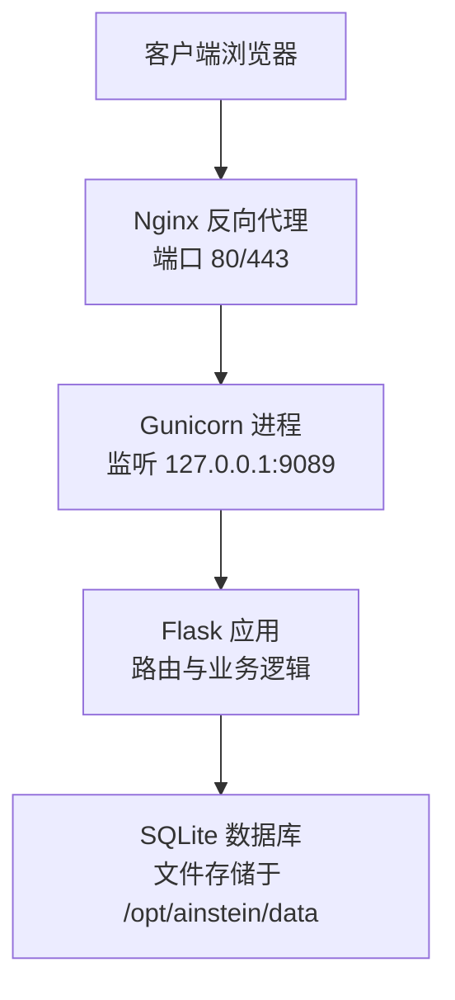
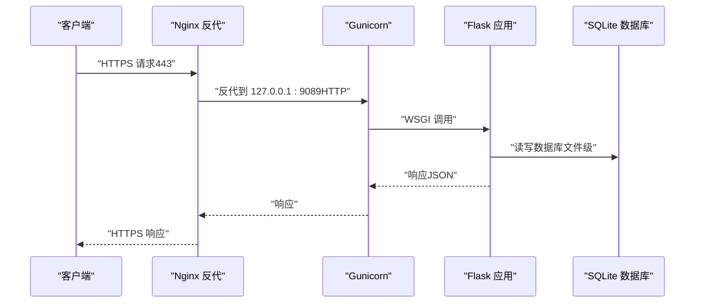
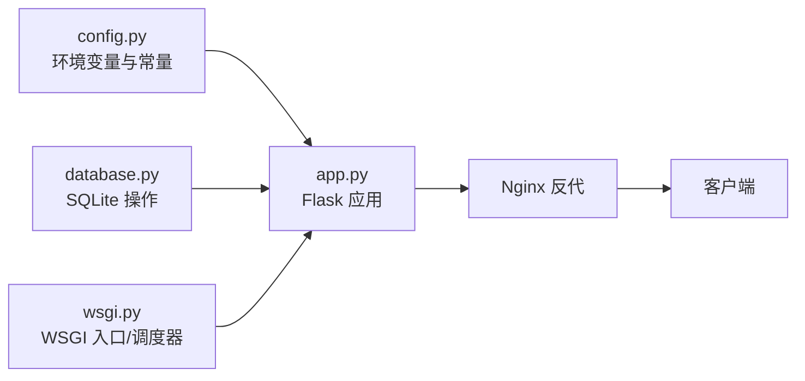

# 安全配置

<cite>
**本文引用的文件**
- [app.py](file://app.py)
- [config.py](file://config.py)
- [wsgi.py](file://wsgi.py)
- [database.py](file://database.py)
- [frontend/src/api.ts](file://frontend/src/api.ts)
- [frontend/vite.config.ts](file://frontend/vite.config.ts)
- [frontend/package.json](file://frontend/package.json)
- [docs/ops-manual.md](file://docs/ops-manual.md)
</cite>

## 目录
1. [简介](#简介)
2. [项目结构](#项目结构)
3. [核心组件](#核心组件)
4. [架构总览](#架构总览)
5. [详细组件分析](#详细组件分析)
6. [依赖关系分析](#依赖关系分析)
7. [性能考虑](#性能考虑)
8. [故障排查指南](#故障排查指南)
9. [结论](#结论)
10. [附录](#附录)

## 简介
本指南面向系统管理员与运维工程师，围绕当前代码库的实际部署与运行方式，提供一套可落地的系统安全配置方案。重点覆盖以下方面：
- HTTPS 与反向代理：基于现有 Nginx 反代与本地 Gunicorn 的部署形态，给出 SSL/TLS 证书申请、配置与自动续期建议。
- API 安全：认证授权、CORS、速率限制等策略设计与实施要点。
- 防火墙与端口管理：结合现有端口映射与反代模式，明确开放策略与访问控制建议。
- 数据加密与密钥管理：数据库文件保护、敏感环境变量与 API Key 管理。
- 安全审计与日志监控：日志采集、关键事件记录与告警联动。
- 常见威胁防护与应急响应：DDoS、暴力破解、XSS/CSRF、敏感信息泄露等场景的缓解与处置流程。

## 项目结构
从安全视角审视，系统由三层组成：
- 前端层：React 应用，构建产物由 Nginx 提供静态服务。
- 反向代理层：Nginx 将外部请求转发至本地 Gunicorn。
- 应用层：Flask 应用通过 WSGI 运行，SQLite 存储业务数据。

图表来源
- [docs/ops-manual.md:37-47](file://docs/ops-manual.md#L37-L47)
- [docs/ops-manual.md:12-35](file://docs/ops-manual.md#L12-L35)
- [app.py:11](file://app.py#L11)
- [wsgi.py:82](file://wsgi.py#L82)

章节来源
- [docs/ops-manual.md:12-47](file://docs/ops-manual.md#L12-L47)
- [frontend/vite.config.ts:4-11](file://frontend/vite.config.ts#L4-L11)
- [app.py:11](file://app.py#L11)
- [wsgi.py:82](file://wsgi.py#L82)

## 核心组件
- 应用入口与路由：Flask 应用负责所有 API 路由与静态资源分发。
- WSGI 与调度：WSGI 入口启动调度器，使用文件锁确保单实例运行。
- 数据层：SQLite 数据库存储项目、会话、发现、数据集等实体。
- 前端接口：前端通过统一的 /ainstein/api 前缀调用后端接口。

章节来源
- [app.py:15-182](file://app.py#L15-L182)
- [wsgi.py:13-83](file://wsgi.py#L13-L83)
- [database.py:101-344](file://database.py#L101-L344)
- [frontend/src/api.ts:1-45](file://frontend/src/api.ts#L1-L45)

## 架构总览
下图展示从客户端到应用层的关键交互路径，并标注安全关注点：

图表来源
- [docs/ops-manual.md:37-47](file://docs/ops-manual.md#L37-L47)
- [wsgi.py:82](file://wsgi.py#L82)
- [app.py:15-182](file://app.py#L15-L182)
- [database.py:101-123](file://database.py#L101-L123)

## 详细组件分析

### HTTPS 与 SSL/TLS 配置
- 当前部署形态：Nginx 对外提供 80/443 端口，内部将请求转发至 127.0.0.1:9089（HTTP）。因此，证书应在 Nginx 层面完成安装与续期。
- 证书申请与安装建议：
  - 使用 Let’s Encrypt（acme-tiny 或 certbot）自动化申请与续期。
  - 将证书与私钥放置在受控目录，权限设置为仅允许 Nginx 用户读取。
  - 在 Nginx 中启用 TLS 1.2+，禁用过时协议与弱密码套件。
- 自动续期：
  - 使用 cron 定时任务执行续期脚本，失败邮件通知。
  - 证书更新后自动重载 Nginx，避免中断服务。
- 附加建议：
  - 强制 HSTS（严格传输安全），设置合理 max-age 并包含子域名。
  - 启用 OCSP Stapling，降低证书验证延迟与隐私泄露风险。

章节来源
- [docs/ops-manual.md:37-47](file://docs/ops-manual.md#L37-L47)

### API 安全：认证授权、CORS 与速率限制
- 认证授权现状：当前未实现任何认证或授权机制，所有 API 均可匿名访问。
- 建议实施顺序（渐进式加固）：
  1) CORS：仅允许受信源访问，限定方法与头字段；生产环境禁止通配符。
  2) 速率限制：对 /ainstein/api 下的公共接口按 IP 限流，区分健康检查与写操作。
  3) 认证授权：引入最小权限原则的令牌体系（如 JWT），对写操作与敏感查询进行鉴权。
  4) 会话与 CSRF：若引入表单提交，需启用 CSRF Token 与 SameSite Cookie。
- 接口暴露面：
  - 健康检查：/ainstein/api/health（建议开放）
  - 写操作：/ainstein/api/projects（POST）、/ainstein/api/projects/<pid>/queue（POST）、/ainstein/api/projects/<pid>/datasets/upload（POST）等
  - 读操作：/ainstein/api/projects、/ainstein/api/projects/<pid>、/ainstein/api/projects/<pid>/sessions、/ainstein/api/projects/<pid>/findings 等

章节来源
- [app.py:43-177](file://app.py#L43-L177)
- [frontend/src/api.ts:9-44](file://frontend/src/api.ts#L9-L44)

### 防火墙与端口管理
- 现状端口：
  - 80（HTTP）：Nginx 对外监听，用于证书验证与静态资源。
  - 443（HTTPS）：Nginx 对外监听，承载加密流量。
  - 9089：仅绑定 127.0.0.1，仅被 Nginx 反代访问。
- 建议：
  - 仅放行 80/443 至公网；内网仅允许回环访问 9089。
  - 使用 iptables/nftables 或云厂商安全组，拒绝其他入站端口。
  - 对 SSH 端口（默认 22）采用非标准端口与密钥认证，限制来源 IP。

章节来源
- [docs/ops-manual.md:37-47](file://docs/ops-manual.md#L37-L47)

### 网络隔离与边界控制
- 边界建议：
  - 将 Nginx 放置于公网 DMZ 区域，应用与数据库置于内网。
  - 通过安全组/ACL 限制数据库访问来源，仅允许应用所在主机访问。
- 隔离策略：
  - 不同租户或项目的数据尽量物理隔离（独立数据库或命名空间）。
  - 对外部 API 调用（如 LLM 服务）使用专用出口与代理，便于审计与限速。

章节来源
- [config.py:4-11](file://config.py#L4-L11)

### 数据加密与密钥管理
- 静态数据保护：
  - SQLite 数据库文件位于 /opt/ainstein/data/，需确保文件系统级加密（如 LUKS）与最小权限访问。
  - 定期备份并加密存储，备份介质与密钥分离保管。
- 传输数据保护：
  - 仅通过 HTTPS 流量访问，禁止明文传输。
- 密钥与敏感信息：
  - API Key 与基础 URL 通过环境变量注入，避免硬编码。
  - 使用密钥管理服务（KMS）或配置中心，定期轮换密钥。
  - 前端不暴露后端密钥，后端不将密钥返回给前端。

章节来源
- [config.py:4-11](file://config.py#L4-L11)
- [docs/ops-manual.md:12-35](file://docs/ops-manual.md#L12-L35)

### 安全审计、日志监控与入侵检测
- 日志采集：
  - 启用 Nginx 访问/错误日志，Flask 应用日志输出到 stdout/err，由 systemd/journald 统一收集。
  - 关键事件：认证失败、异常状态码、敏感接口访问、数据库异常。
- 监控与告警：
  - 对异常登录尝试、高频请求、4xx/5xx 比例异常建立阈值告警。
  - 结合 SIEM（如 ELK/Graylog）进行集中分析与关联规则。
- 入侵检测：
  - Web 应用防火墙（WAF）拦截常见攻击（SQL 注入、XSS、CC 攻击）。
  - 对上传接口（/ainstein/api/projects/<pid>/datasets/upload）进行内容扫描与大小限制。

章节来源
- [docs/ops-manual.md:71-85](file://docs/ops-manual.md#L71-L85)
- [app.py:8-9](file://app.py#L8-L9)

### 常见威胁防护与应急响应
- 威胁类型与缓解：
  - DDoS：CDN/云防护清洗，Nginx 层限速与连接数限制。
  - 暴力破解：登录接口限速、验证码、多因子认证。
  - XSS/CSRF：CORS 严格白名单、CSRF Token、内容安全策略（CSP）。
  - 敏感信息泄露：禁止在日志中输出密钥；最小化错误堆栈信息。
- 应急响应流程：
  - 发现异常：立即隔离受影响实例，阻断来源 IP。
  - 证据保全：导出 Nginx 日志、应用日志与数据库变更记录。
  - 修复与复盘：修复漏洞、更新策略、演练与培训。

章节来源
- [app.py:123-152](file://app.py#L123-L152)
- [docs/ops-manual.md:71-85](file://docs/ops-manual.md#L71-L85)

## 依赖关系分析
- 组件耦合：
  - Flask 应用直接依赖 SQLite 数据库与配置模块。
  - WSGI 入口负责调度器与进程锁，间接影响应用可用性。
  - 前端通过固定前缀 /ainstein/api 访问后端，URL 与路由强耦合。
- 外部依赖：
  - Nginx 作为反向代理与 TLS 终结点。
  - 第三方 LLM 服务（通过配置中的 API Key 与 Base URL）。

图表来源
- [config.py:4-11](file://config.py#L4-L11)
- [app.py:15-182](file://app.py#L15-L182)
- [database.py:101-344](file://database.py#L101-L344)
- [wsgi.py:13-83](file://wsgi.py#L13-L83)

章节来源
- [config.py:4-11](file://config.py#L4-L11)
- [app.py:15-182](file://app.py#L15-L182)
- [database.py:101-344](file://database.py#L101-L344)
- [wsgi.py:13-83](file://wsgi.py#L13-L83)

## 性能考虑
- 反向代理优化：开启 gzip/HTTP/2，合理设置超时与缓冲区。
- 应用层优化：对热点查询添加索引（已有部分索引），避免 N+1 查询。
- 数据库性能：WAL 模式提升并发写入，定期 VACUUM 释放空间。
- 前端缓存：构建产物带哈希名，配合 CDN 缓存策略减少带宽。

章节来源
- [database.py:113-114](file://database.py#L113-L114)
- [database.py:92-98](file://database.py#L92-L98)
- [frontend/vite.config.ts:7-11](file://frontend/vite.config.ts#L7-L11)

## 故障排查指南
- 健康检查：
  - 访问 /ainstein/api/health 确认服务可用。
- 日志定位：
  - 使用 journald 查看最近日志与关键字过滤。
- 进程与锁：
  - 检查 Gunicorn 进程与调度锁文件，确认单实例运行。
- 数据库问题：
  - 检查数据库文件是否存在与权限是否正确，必要时重建或恢复。

章节来源
- [docs/ops-manual.md:71-98](file://docs/ops-manual.md#L71-L98)
- [app.py:43-45](file://app.py#L43-L45)
- [wsgi.py:13-24](file://wsgi.py#L13-L24)

## 结论
当前系统采用 Nginx + Gunicorn + Flask + SQLite 的轻量级部署架构，具备良好的可维护性与扩展性。为满足生产安全要求，建议优先完成以下工作：
- 在 Nginx 层完成 HTTPS 证书安装与自动续期；
- 实施 CORS、速率限制与认证授权；
- 明确防火墙与网络隔离策略；
- 加强数据库与密钥管理；
- 建立日志与监控体系，完善应急响应流程。

## 附录
- 前端构建与部署：
  - 前端构建产物输出至 dist/，由 Nginx 直接提供静态资源。
  - 构建命令与开发服务器配置见前端工程文件。

章节来源
- [frontend/vite.config.ts:4-11](file://frontend/vite.config.ts#L4-L11)
- [frontend/package.json:6-10](file://frontend/package.json#L6-L10)
- [docs/ops-manual.md:165-195](file://docs/ops-manual.md#L165-L195)