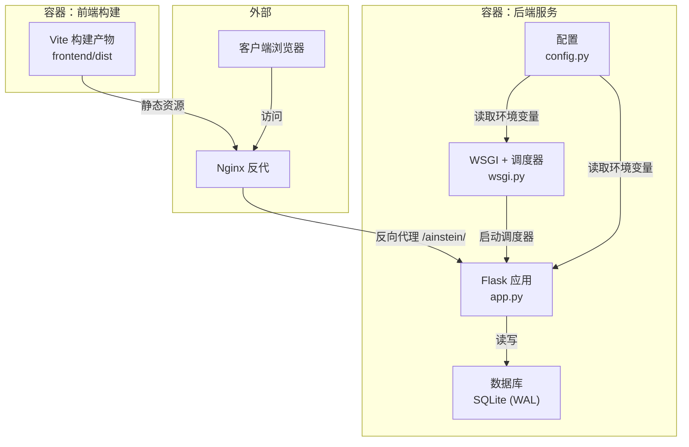
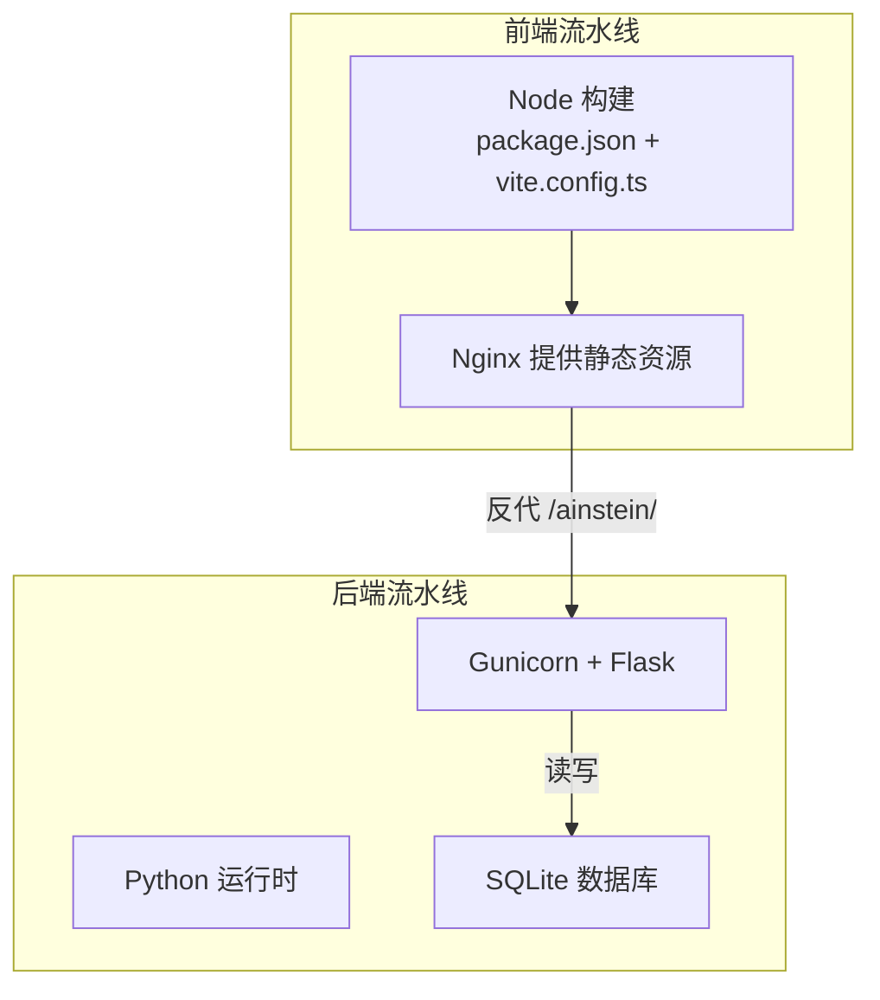
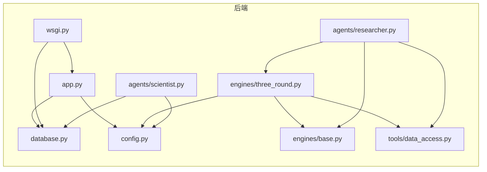

# 容器化部署

<cite>
**本文引用的文件**
- [README.md](file://README.md)
- [ops-manual.md](file://docs/ops-manual.md)
- [app.py](file://app.py)
- [wsgi.py](file://wsgi.py)
- [config.py](file://config.py)
- [database.py](file://database.py)
- [frontend/package.json](file://frontend/package.json)
- [frontend/vite.config.ts](file://frontend/vite.config.ts)
- [engines/base.py](file://engines/base.py)
- [engines/three_round.py](file://engines/three_round.py)
- [tools/data_access.py](file://tools/data_access.py)
- [agents/scientist.py](file://agents/scientist.py)
- [agents/researcher.py](file://agents/researcher.py)
</cite>

## 目录
1. [简介](#简介)
2. [项目结构](#项目结构)
3. [核心组件](#核心组件)
4. [架构总览](#架构总览)
5. [详细组件分析](#详细组件分析)
6. [依赖关系分析](#依赖关系分析)
7. [性能与资源规划](#性能与资源规划)
8. [故障排查指南](#故障排查指南)
9. [结论](#结论)
10. [附录](#附录)

## 简介
本指南面向将 AInstein 平台进行容器化部署的工程团队，覆盖 Docker 多阶段构建与安全加固、Docker Compose 服务编排与持久化、容器间通信与配置管理、Kubernetes 部署清单以及监控、日志与健康检查策略。平台采用后端 Flask + Gunicorn + SQLite + APScheduler 的组合，并通过 Nginx 提供静态资源与反向代理；前端基于 React/Vite 构建并以 /ainstein/ 路径部署。

## 项目结构
- 后端应用入口与调度：Flask 应用与 WSGI 入口，集成 APScheduler 定时任务
- 数据层：SQLite（WAL 模式），支持索引与外键约束
- 前端：React/Vite，构建产物位于 frontend/dist，Nginx 直接托管
- AI 引擎与工具：三级智能体（科学家/主任/研究员）与三轮研究引擎，结合统计与外部数据工具
- 配置与环境变量：统一从环境变量读取，便于容器注入

图表来源
- [app.py:1-182](file://app.py#L1-L182)
- [wsgi.py:1-83](file://wsgi.py#L1-L83)
- [database.py:1-344](file://database.py#L1-L344)
- [config.py:1-11](file://config.py#L1-L11)
- [frontend/vite.config.ts:1-12](file://frontend/vite.config.ts#L1-L12)

章节来源
- [README.md:71-124](file://README.md#L71-L124)
- [ops-manual.md:12-47](file://docs/ops-manual.md#L12-L47)

## 核心组件
- Flask 应用与路由：提供健康检查、项目/队列/会话/发现/数据集等 API，同时托管前端静态资源
- WSGI + 调度器：Gunicorn 入口，内置 APScheduler，按 UTC 时间表执行三级智能体任务
- 数据库层：SQLite，启用 WAL 模式与外键约束，提供项目、队列、会话、发现、记忆、数据集等表
- 配置模块：集中读取数据库路径、数据目录、LLM API Key 与模型名称等环境变量
- 前端构建：Vite 基于 /ainstein/ 基础路径构建，产物 dist 由 Nginx 直接提供

章节来源
- [app.py:1-182](file://app.py#L1-L182)
- [wsgi.py:1-83](file://wsgi.py#L1-L83)
- [database.py:1-344](file://database.py#L1-L344)
- [config.py:1-11](file://config.py#L1-L11)
- [frontend/package.json:1-24](file://frontend/package.json#L1-L24)
- [frontend/vite.config.ts:1-12](file://frontend/vite.config.ts#L1-L12)

## 架构总览
容器化部署建议采用“双镜像”策略：
- 前端镜像：基于 Node 构建 dist，再由 Nginx 镜像提供静态资源服务
- 后端镜像：基于 Python 运行时，安装依赖并通过 Gunicorn 提供服务，挂载数据卷用于数据库与数据集

图表来源
- [frontend/package.json:1-24](file://frontend/package.json#L1-L24)
- [frontend/vite.config.ts:1-12](file://frontend/vite.config.ts#L1-L12)
- [app.py:1-182](file://app.py#L1-L182)
- [wsgi.py:1-83](file://wsgi.py#L1-L83)
- [database.py:1-344](file://database.py#L1-L344)

## 详细组件分析

### Dockerfile 多阶段构建与安全优化
目标
- 将前端构建与后端运行分离，减小最终镜像体积
- 通过非 root 用户、最小依赖、只读文件系统等提升安全性
- 明确工作目录与入口命令，避免硬编码路径

建议步骤
- 阶段一：Node 基础镜像构建前端产物
  - 使用 package.json 与 vite.config.ts 中的 base 路径配置
  - 输出 dist 目录
- 阶段二：Python 基础镜像安装后端依赖并打包应用
  - 仅复制必要文件（后端源码、前端 dist、配置）
  - 使用非 root 用户运行
  - 设置只读根文件系统与最小能力
- 阶段三：Nginx 镜像提供静态资源与反代
  - 将前端 dist 作为静态目录
  - 配置 /ainstein/ 路径反代至后端服务

安全要点
- 使用只读根文件系统、丢弃不必要的 Linux capabilities
- 以非 root 用户运行进程
- 通过环境变量注入 API Key 与模型配置，避免明文写入镜像
- 限制容器资源（CPU/内存），防止资源滥用

章节来源
- [frontend/package.json:1-24](file://frontend/package.json#L1-L24)
- [frontend/vite.config.ts:1-12](file://frontend/vite.config.ts#L1-L12)
- [app.py:1-182](file://app.py#L1-L182)
- [wsgi.py:1-83](file://wsgi.py#L1-L83)
- [config.py:1-11](file://config.py#L1-L11)

### Docker Compose 服务编排、网络与卷
目标
- 将前端 Nginx、后端 Flask/Gunicorn、SQLite 数据库解耦为独立服务
- 通过命名网络隔离服务，使用命名卷持久化数据库与数据集
- 通过环境变量注入 API Key 与模型配置

建议编排
- 服务
  - nginx：暴露 80 端口，挂载前端 dist，反代至后端服务
  - backend：运行 Flask/Gunicorn，挂载数据库与数据集卷
  - volumes：持久化 /opt/ainstein/data 下的数据库与数据集
- 网络
  - 自定义桥接网络，仅 backend 与 nginx 互通
- 环境变量
  - 注入 DASHSCOPE_API_KEY、RESEARCH_MODEL、SCIENTIST_MODEL、DIRECTOR_MODEL 等
- 健康检查
  - 在 backend 上配置 HTTP 健康检查 /ainstein/api/health

章节来源
- [ops-manual.md:37-47](file://docs/ops-manual.md#L37-L47)
- [config.py:1-11](file://config.py#L1-L11)
- [app.py:43-46](file://app.py#L43-L46)

### 容器间通信、数据持久化与配置管理
- 通信
  - Nginx 通过 /ainstein/ 路径反代至后端服务（127.0.0.1:9089），避免直接暴露后端端口
- 持久化
  - 数据库：/opt/ainstein/data/ainstein.db
  - 数据集：/opt/ainstein/data/datasets/
- 配置
  - 通过环境变量注入 API Key 与模型名称
  - 前端构建基础路径为 /ainstein/，确保静态资源正确加载

章节来源
- [ops-manual.md:12-35](file://docs/ops-manual.md#L12-L35)
- [frontend/vite.config.ts:6](file://frontend/vite.config.ts#L6)
- [config.py:4-11](file://config.py#L4-L11)

### Kubernetes 部署清单（Deployment/Service/ConfigMap）
目标
- 通过 Deployment 管理后端 Pod，Service 暴露后端服务
- 通过 ConfigMap 注入环境变量（API Key、模型名称）
- 通过 PersistentVolumeClaim 持久化数据库与数据集

建议清单
- ConfigMap：包含 DASHSCOPE_API_KEY、RESEARCH_MODEL、SCIENTIST_MODEL、DIRECTOR_MODEL
- Deployment（后端）：容器内运行 Gunicorn，挂载 PVC；设置资源请求与限制
- Service（ClusterIP）：暴露 9089 端口，供 Nginx Pod 反代
- Deployment（Nginx）：挂载前端 dist，反代至后端 Service
- Service（NodePort/LoadBalancer）：暴露 80 端口给外部流量

章节来源
- [config.py:4-11](file://config.py#L4-L11)
- [ops-manual.md:37-47](file://docs/ops-manual.md#L37-L47)

### 监控、日志与健康检查
- 健康检查
  - 后端：/ainstein/api/health 返回 {"status":"ok"}
- 日志
  - 后端：标准输出记录 INFO/ERROR 级别日志
  - 前端：Nginx 访问/错误日志
- 监控
  - 建议采集容器 CPU/内存/磁盘 IO
  - 结合业务指标：会话总数、已完成会话数、队列积压

章节来源
- [app.py:43-46](file://app.py#L43-L46)
- [ops-manual.md:197-222](file://docs/ops-manual.md#L197-L222)

### 容器安全最佳实践与资源限制
- 安全
  - 非 root 用户运行
  - 只读根文件系统、最小能力
  - 通过 Secret/ConfigMap 注入敏感信息
- 资源
  - 为后端设置 requests/limits（CPU/内存）
  - 为前端 Nginx 设置合理 requests/limits
  - 限制 SQLite 文件大小与 WAL 日志增长

章节来源
- [ops-manual.md:454-481](file://docs/ops-manual.md#L454-L481)

## 依赖关系分析

图表来源
- [app.py:1-182](file://app.py#L1-L182)
- [wsgi.py:1-83](file://wsgi.py#L1-L83)
- [database.py:1-344](file://database.py#L1-L344)
- [config.py:1-11](file://config.py#L1-L11)
- [engines/base.py:1-49](file://engines/base.py#L1-L49)
- [engines/three_round.py:1-179](file://engines/three_round.py#L1-L179)
- [tools/data_access.py:1-43](file://tools/data_access.py#L1-L43)
- [agents/scientist.py:1-75](file://agents/scientist.py#L1-L75)
- [agents/researcher.py:1-114](file://agents/researcher.py#L1-L114)

## 性能与资源规划
- 后端并发：根据 CPU 核心数设置 Gunicorn worker 数量，建议 2×CPU+1，结合内存上限评估
- 数据库：SQLite 已启用 WAL 模式，建议定期清理旧会话与无效发现，控制数据库体积
- 前端缓存：Nginx 对静态资源设置长缓存，index.html 设置 no-cache，确保更新及时
- 调度器：APScheduler 通过文件锁确保单实例运行，容器中建议使用单一副本或分布式锁方案

章节来源
- [ops-manual.md:407-452](file://docs/ops-manual.md#L407-L452)
- [wsgi.py:13-81](file://wsgi.py#L13-L81)

## 故障排查指南
- 服务无法启动
  - 检查端口占用与权限，确认 /opt/ainstein 目录权限
- LLM 调用失败
  - 校验 API Key 是否注入，手动测试 LLM 客户端
- 调度器不执行
  - 检查调度器日志与锁文件，确认锁持有者进程存在
- 前端 404
  - 确认 dist 目录存在且 Nginx 配置正确
- 数据集上传失败
  - 检查文件权限与编码，确保 CSV/JSON/XLSX 解析成功

章节来源
- [ops-manual.md:249-367](file://docs/ops-manual.md#L249-L367)

## 结论
通过多阶段构建与最小化运行时，结合 Compose/Kubernetes 的服务编排与持久化策略，AInstein 可实现稳定、可扩展、可审计的容器化部署。建议在生产环境中强化安全与监控，合理规划资源配额，并建立完善的备份与回滚机制。

## 附录
- 健康检查端点：/ainstein/api/health
- 前端基础路径：/ainstein/
- 数据库路径：/opt/ainstein/data/ainstein.db
- 数据集目录：/opt/ainstein/data/datasets/