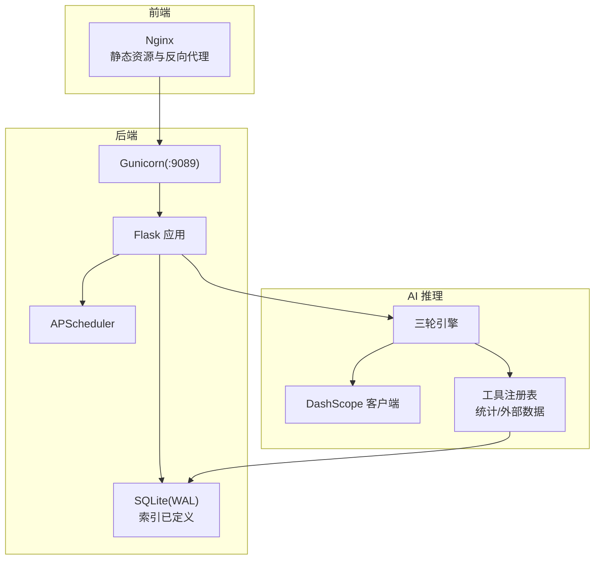
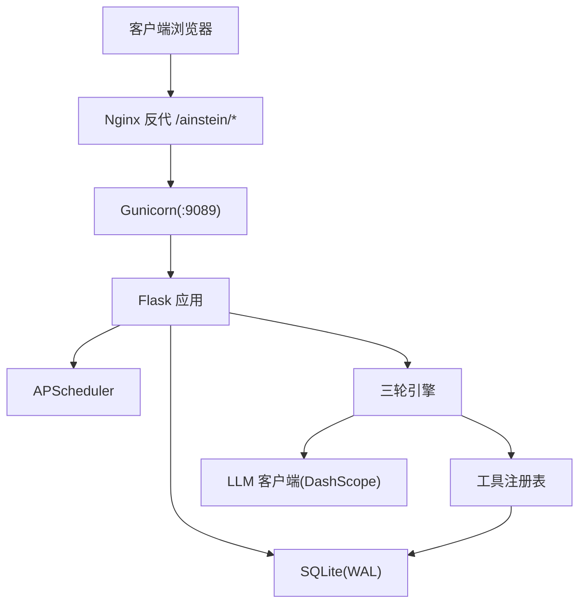
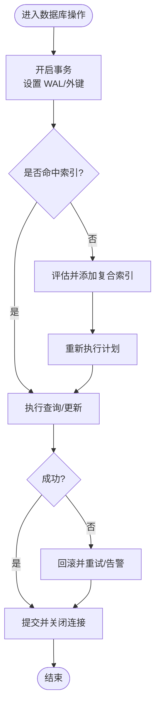
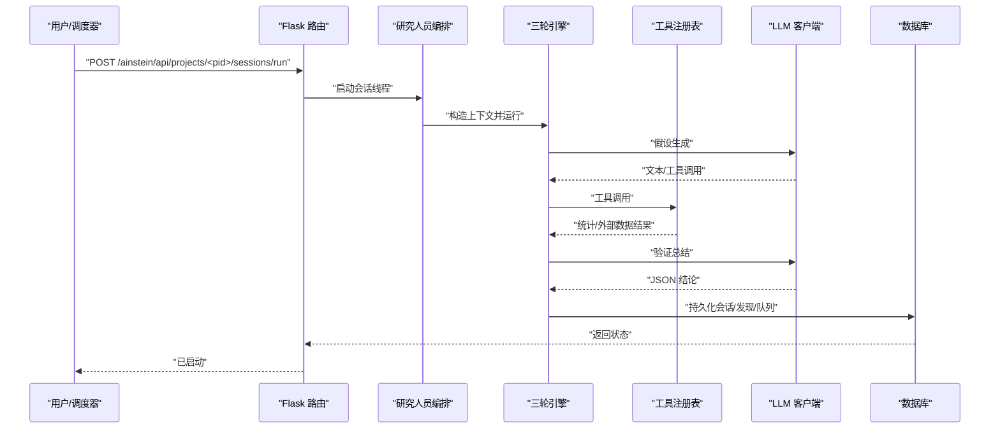
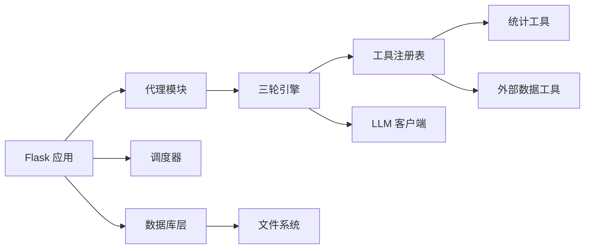

# 性能优化

<cite>
**本文引用的文件**
- [应用入口与路由](file://app.py)
- [WSGI与调度器](file://wsgi.py)
- [配置管理](file://config.py)
- [数据库层与Schema](file://database.py)
- [Flask 应用](file://app.py)
- [WSGI 入口](file://wsgi.py)
- [引擎基类](file://engines/base.py)
- [三轮引擎](file://engines/three_round.py)
- [研究人员编排](file://agents/researcher.py)
- [科学家代理](file://agents/scientist.py)
- [主任代理](file://agents/director.py)
- [LLM 客户端](file://agents/llm_client.py)
- [工具注册表](file://tools/registry.py)
- [数据访问工具](file://tools/data_access.py)
- [统计工具](file://tools/stats.py)
- [外部数据工具](file://tools/web_data.py)
- [三轮引擎提示词](file://prompts/three_round.txt)
- [项目自述](file://README.md)
</cite>

## 目录
1. [简介](#简介)
2. [项目结构](#项目结构)
3. [核心组件](#核心组件)
4. [架构总览](#架构总览)
5. [详细组件分析](#详细组件分析)
6. [依赖分析](#依赖分析)
7. [性能考虑](#性能考虑)
8. [故障排查指南](#故障排查指南)
9. [结论](#结论)
10. [附录](#附录)

## 简介
本指南聚焦于系统性能优化，结合现有代码库的实际实现，从数据库、缓存、Web 服务器、AI 推理到监控与压测等方面，给出可操作的优化建议与最佳实践。当前系统采用 Flask + Gunicorn + SQLite + APScheduler 的轻量架构，AI 推理由 DashScope（兼容 Anthropic 协议）提供，数据处理依赖 pandas/numpy/scipy。

## 项目结构
- 后端服务：Flask 应用提供 REST API；Gunicorn 作为 WSGI 服务器；APScheduler 在进程内调度任务。
- 数据层：SQLite（WAL 模式），内置若干索引；数据文件存储在磁盘。
- AI 推理：通过 LLM 客户端调用 DashScope；研究人员引擎采用“三轮”流程，结合内部统计与外部数据工具。
- 前端：React/Vite 构建产物由 Nginx 提供静态资源，后端反向代理转发 /ainstein/ 请求。

图表来源
- [应用入口与路由](file://app.py)
- [WSGI与调度器](file://wsgi.py)
- [数据库层与Schema](file://database.py)
- [LLM 客户端](file://agents/llm_client.py)
- [工具注册表](file://tools/registry.py)
- [三轮引擎](file://engines/three_round.py)

章节来源
- [项目自述](file://README.md)

## 核心组件
- 数据库层：集中初始化 Schema、建立常用索引；统一连接上下文管理，启用 WAL 与外键约束。
- Web 路由：提供项目、队列、会话、发现、数据集等 API；健康检查接口；异步启动 AI 会话线程。
- 调度器：每日/每周定时任务，避免多实例竞争，使用文件锁确保单实例运行。
- AI 引擎：三轮流程（假设→工具检验→验证总结），支持工具链调用与结果持久化。
- 工具体系：内置统计工具与外部数据抓取工具，通过注册表统一调度。
- LLM 客户端：封装 DashScope（兼容 Anthropic 协议）调用，支持工具调用与 JSON 提取。

章节来源
- [数据库层与Schema](file://database.py)
- [应用入口与路由](file://app.py)
- [WSGI与调度器](file://wsgi.py)
- [引擎基类](file://engines/base.py)
- [三轮引擎](file://engines/three_round.py)
- [研究人员编排](file://agents/researcher.py)
- [工具注册表](file://tools/registry.py)
- [LLM 客户端](file://agents/llm_client.py)

## 架构总览
系统采用“前端静态 + 后端 API + SQLite + LLM”的轻量架构。生产部署推荐 Nginx + Gunicorn，后端通过 APScheduler 执行周期性任务，AI 推理通过 LLM 客户端调用外部模型服务。

图表来源
- [项目自述](file://README.md)
- [应用入口与路由](file://app.py)
- [WSGI与调度器](file://wsgi.py)
- [数据库层与Schema](file://database.py)
- [LLM 客户端](file://agents/llm_client.py)
- [工具注册表](file://tools/registry.py)
- [三轮引擎](file://engines/three_round.py)

## 详细组件分析

### 数据库层与索引优化
- 初始化与连接
  - 使用上下文管理器统一连接生命周期，开启 WAL 模式与外键约束，减少写放大与一致性问题。
  - 事务提交/回滚与连接关闭在 finally 中保证释放。
- Schema 与索引
  - 已有针对队列、会话、发现、记忆、数据集、指令的关键字段组合索引，覆盖常见查询路径。
  - 查询优化建议
    - 优先使用复合索引进行过滤与排序，避免全表扫描。
    - 对高频条件（如 project_id、status、created_at）保持索引命中。
    - 分页查询使用 LIMIT/OFFSET 时，尽量基于主键或唯一索引排序，避免大 OFFSET。
- 写入优化
  - 批量插入/更新时合并 SQL，减少往返次数。
  - 控制 JSON 字段大小，必要时拆分表或压缩存储。

图表来源
- [数据库层与Schema](file://database.py)

章节来源
- [数据库层与Schema](file://database.py)

### Web 服务器性能调优（Gunicorn + Nginx）
- 进程与线程
  - 生产建议：多进程（worker）+ 适度线程（取决于阻塞型 I/O）。当前示例使用多进程启动，注意共享状态与锁。
- 超时与并发
  - 合理设置超时时间，避免长请求占用 worker；对 AI 推理类请求建议异步化或后台队列。
- 静态资源
  - Nginx 提供静态资源与反向代理，减少 Python 层负担；开启 gzip/缓存头提升首屏体验。
- 日志与监控
  - 将访问日志与错误日志分离，便于定位慢请求与异常。

章节来源
- [项目自述](file://README.md)
- [应用入口与路由](file://app.py)

### AI 模型推理优化（三轮引擎 + LLM 客户端）
- 推理流程
  - 三轮引擎按阶段组织：假设生成、工具检验、验证总结；工具调用通过注册表分发。
- 批处理与并发
  - 当前会话为串行执行；若需提升吞吐，可在会话间引入队列与并发控制，但需注意 LLM 调用的速率限制与成本控制。
- 模型与提示词
  - 使用更短的提示词与工具定义，减少 token 消耗；合理设置温度与最大 token，平衡质量与速度。
- 结果解析
  - LLM 客户端具备 JSON 提取能力，建议在提示词中强调返回格式，降低解析失败率。

图表来源
- [应用入口与路由](file://app.py)
- [研究人员编排](file://agents/researcher.py)
- [三轮引擎](file://engines/three_round.py)
- [工具注册表](file://tools/registry.py)
- [LLM 客户端](file://agents/llm_client.py)
- [数据库层与Schema](file://database.py)

章节来源
- [三轮引擎](file://engines/three_round.py)
- [研究人员编排](file://agents/researcher.py)
- [LLM 客户端](file://agents/llm_client.py)
- [工具注册表](file://tools/registry.py)
- [三轮引擎提示词](file://prompts/three_round.txt)

### 缓存策略（当前未实现 Redis）
- 现状：系统未集成 Redis 或其他缓存层，热点数据主要依赖 SQLite 与文件系统。
- 建议
  - 读多写少场景：对项目统计、最近发现、指令列表等结果进行短期缓存（如 TTL=5-10 分钟）。
  - 缓存键命名：按项目维度前缀隔离；对复杂查询结果进行序列化缓存。
  - 失效策略：写操作时主动失效相关键；定期清理过期键。
  - 热点数据：对高并发的首页/仪表盘数据进行预计算与缓存。

章节来源
- [应用入口与路由](file://app.py)
- [数据库层与Schema](file://database.py)

### 外部数据与网络 I/O 优化
- 外部 API 调用
  - 设置合理的超时与重试；对失败进行降级（如返回上次结果或空结果）。
  - 合理限流，避免触发第三方速率限制。
- 数据加载
  - CSV/JSON/XLSX 文件读取时，仅读取必要列；对大文件建议分块处理或预处理。

章节来源
- [外部数据工具](file://tools/web_data.py)
- [数据访问工具](file://tools/data_access.py)

## 依赖分析
- 组件耦合
  - Flask 路由依赖数据库层与代理模块；三轮引擎依赖 LLM 客户端与工具注册表；调度器独立于业务逻辑。
- 外部依赖
  - DashScope（Anthropic 兼容）、APScheduler、Flask、Gunicorn、SQLite、pandas/numpy/scipy。
- 循环依赖
  - 当前未见循环导入；建议后续通过抽象接口进一步解耦。

图表来源
- [应用入口与路由](file://app.py)
- [WSGI与调度器](file://wsgi.py)
- [数据库层与Schema](file://database.py)
- [三轮引擎](file://engines/three_round.py)
- [工具注册表](file://tools/registry.py)
- [LLM 客户端](file://agents/llm_client.py)
- [统计工具](file://tools/stats.py)
- [外部数据工具](file://tools/web_data.py)

章节来源
- [应用入口与路由](file://app.py)
- [WSGI与调度器](file://wsgi.py)
- [数据库层与Schema](file://database.py)
- [三轮引擎](file://engines/three_round.py)
- [工具注册表](file://tools/registry.py)
- [LLM 客户端](file://agents/llm_client.py)
- [统计工具](file://tools/stats.py)
- [外部数据工具](file://tools/web_data.py)

## 性能考虑

### 数据库性能调优
- 索引优化
  - 保持现有复合索引；对新增查询路径补充索引；定期分析执行计划。
- 查询优化
  - 使用 EXPLAIN QUERY PLAN 检查慢查询；避免 SELECT *；对聚合查询使用物化视图或汇总表。
- 连接池配置
  - SQLite 默认连接池较小；生产建议使用连接池库（如 SQLAlchemy）并设置最大连接数与超时。
- WAL 与并发
  - WAL 模式提升并发读写；注意 checkpoint 触发频率与磁盘 IO。

章节来源
- [数据库层与Schema](file://database.py)

### 缓存策略
- Redis 配置
  - 最小化键空间：使用命名空间与哈希结构；设置 TTL 与淘汰策略。
  - 失效与热点：写路径主动失效；对热点键增加副本或本地缓存。
- 缓存穿透与击穿
  - 对空结果也缓存短 TTL；对热点键加互斥锁避免雪崩。

章节来源
- [应用入口与路由](file://app.py)
- [数据库层与Schema](file://database.py)

### Web 服务器性能调优
- 并发处理
  - 多进程 + 事件循环；对阻塞 I/O（如 LLM/文件）使用异步或后台线程。
- 内存管理
  - 避免大对象常驻；及时释放临时数据结构；监控内存峰值。
- CPU 优化
  - 减少不必要的字符串拼接与 JSON 序列化；使用生成器与惰性求值。

章节来源
- [项目自述](file://README.md)
- [应用入口与路由](file://app.py)

### AI 模型推理优化
- 批处理
  - 将多个会话合并为批处理请求（若 LLM 支持）；控制每批次大小与超时。
- 模型量化与硬件加速
  - 若切换到本地推理，可考虑量化与专用加速卡；当前基于云端模型，重点优化提示词与工具调用。
- 资源配额
  - 限制并发 LLM 调用，避免超限与延迟飙升。

章节来源
- [三轮引擎](file://engines/three_round.py)
- [LLM 客户端](file://agents/llm_client.py)

### 性能监控指标与瓶颈分析
- 指标建议
  - 数据库：QPS、慢查询、锁等待、WAL checkpoint 频率。
  - Web：请求延迟 P50/P95、错误率、并发连接数、队列长度。
  - AI：LLM 调用耗时、token 使用量、工具调用成功率。
  - 系统：CPU 使用率、内存占用、磁盘 IO、网络带宽。
- 瓶颈定位
  - 通过火焰图与追踪工具定位热点函数；结合数据库执行计划与 LLM 调用日志。

章节来源
- [应用入口与路由](file://app.py)
- [数据库层与Schema](file://database.py)
- [LLM 客户端](file://agents/llm_client.py)

### 容量规划
- 估算方法
  - 基于历史请求量与增长趋势，结合 LLM 成本与数据库写入量，推导 CPU/内存/存储/网络需求。
- 扩展策略
  - 读扩展：只读副本/缓存；写扩展：分库分表/异步写入。

章节来源
- [数据库层与Schema](file://database.py)
- [项目自述](file://README.md)

### 负载测试与压力测试最佳实践
- 场景设计
  - 覆盖峰值场景（大量会话并发）、长时间稳定运行、外部 API 降级。
- 工具与脚本
  - 使用压测工具模拟真实流量；记录响应时间分布与错误率。
- 关键观察
  - 数据库锁、LLM 调用超时、Gunicorn worker 阻塞、前端渲染卡顿。

章节来源
- [应用入口与路由](file://app.py)
- [WSGI与调度器](file://wsgi.py)
- [LLM 客户端](file://agents/llm_client.py)

## 故障排查指南
- 数据库连接与事务
  - 检查 WAL 是否正常；确认外键约束导致的失败；查看慢查询日志。
- LLM 调用失败
  - 核对 API Key 与 Base URL；检查网络超时与 JSON 解析失败；关注工具调用返回的错误信息。
- 调度器冲突
  - 确认文件锁是否被正确持有；避免多实例同时启动调度器。
- 前端静态资源
  - 检查 Nginx 反代路径与缓存头；确认构建产物存在。

章节来源
- [数据库层与Schema](file://database.py)
- [LLM 客户端](file://agents/llm_client.py)
- [WSGI与调度器](file://wsgi.py)
- [项目自述](file://README.md)

## 结论
本系统以轻量架构实现 AI 驱动的研究流程。性能优化应围绕数据库索引与查询、Web 服务器并发与静态资源、AI 推理的批处理与提示词优化展开。短期内建议引入缓存与连接池，长期可考虑外部缓存与数据库分片。通过完善的监控与压测，持续迭代容量与配置，保障在高并发下的稳定性与吞吐。

## 附录
- 部署与运维要点
  - Nginx 反代 /ainstein/；Gunicorn 多进程；APScheduler 单实例；SQLite WAL 模式。
- 环境变量
  - 数据库路径、数据目录、LLM API Key 与 Base URL、模型名称。

章节来源
- [项目自述](file://README.md)
- [配置管理](file://config.py)