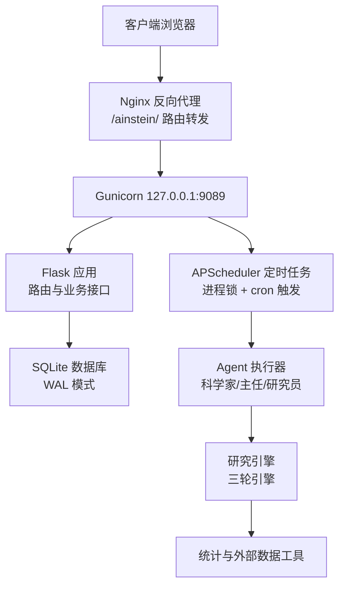
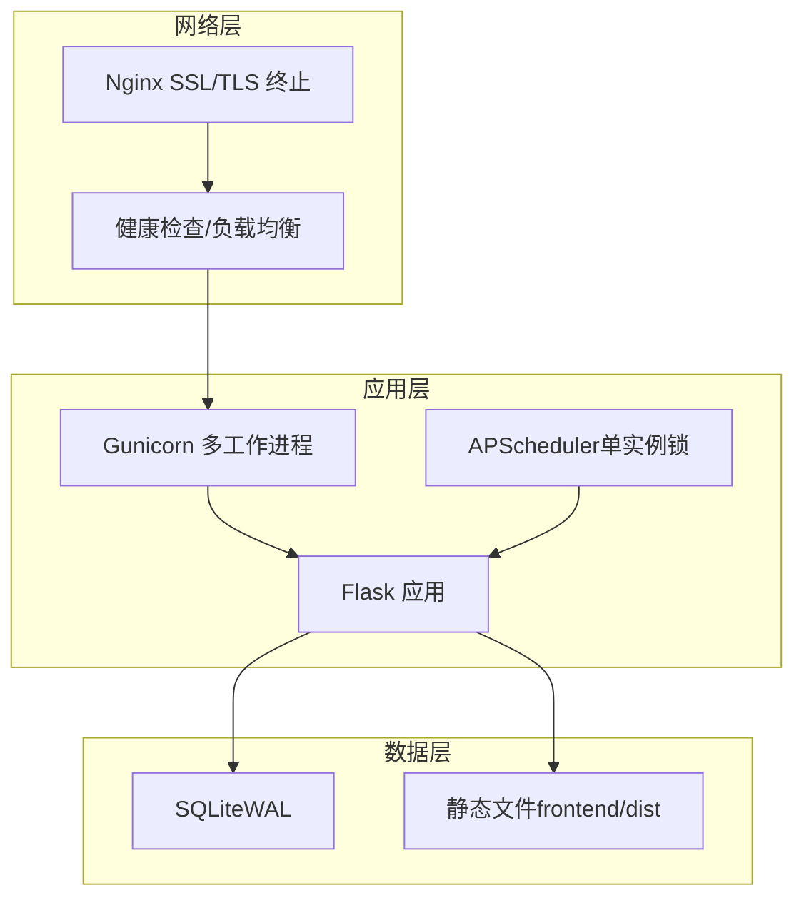
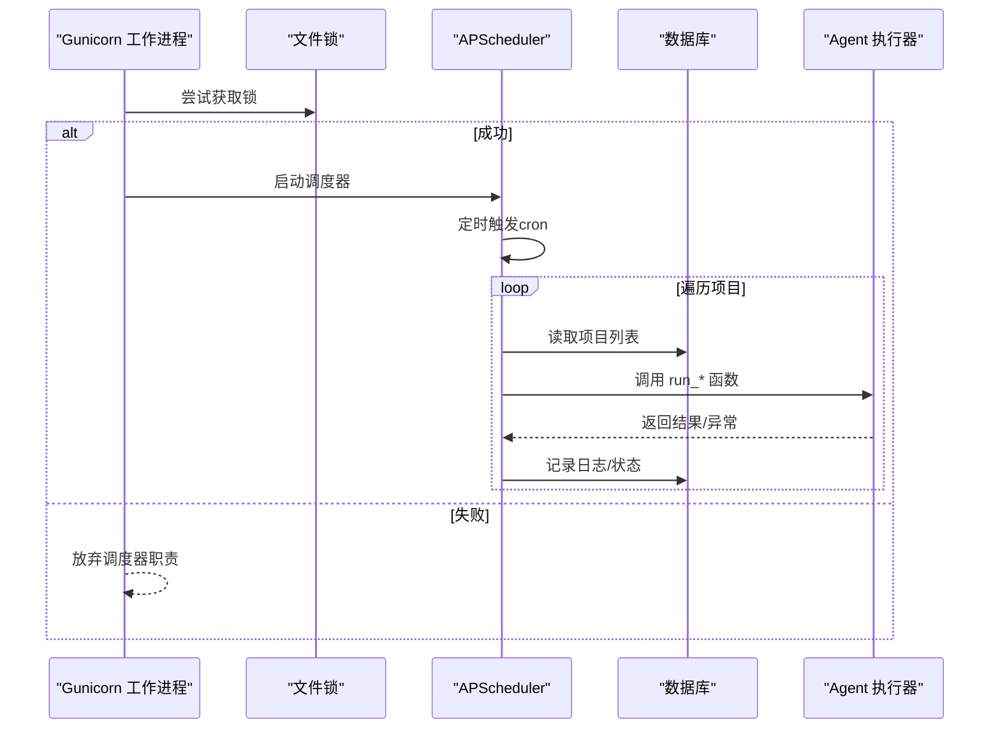
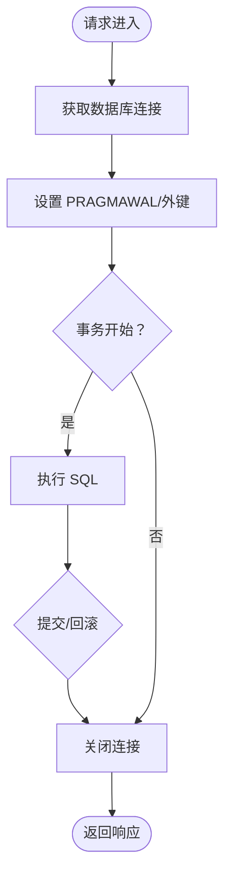
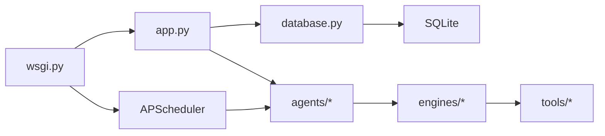

# 生产环境部署

<cite>
**本文引用的文件**
- [README.md](file://README.md)
- [docs/ops-manual.md](file://docs/ops-manual.md)
- [app.py](file://app.py)
- [wsgi.py](file://wsgi.py)
- [config.py](file://config.py)
- [database.py](file://database.py)
- [engines/three_round.py](file://engines/three_round.py)
- [agents/director.py](file://agents/director.py)
- [agents/researcher.py](file://agents/researcher.py)
- [agents/scientist.py](file://agents/scientist.py)
</cite>

## 目录
1. [简介](#简介)
2. [项目结构](#项目结构)
3. [核心组件](#核心组件)
4. [架构总览](#架构总览)
5. [详细组件分析](#详细组件分析)
6. [依赖关系分析](#依赖关系分析)
7. [性能考虑](#性能考虑)
8. [故障排查指南](#故障排查指南)
9. [结论](#结论)
10. [附录](#附录)

## 简介
本指南面向生产环境部署，围绕 WSGI 服务器（Gunicorn/uWSGI）、APScheduler 定时任务（进程锁、日志与错误处理）、数据库连接池与 SQLite 配置、静态文件与缓存策略、Nginx 反向代理（含 SSL、负载均衡与健康检查）、systemd 服务（自动启动、资源限制与监控）以及性能调优与内存管理进行系统化说明。内容基于仓库现有实现与运维手册，确保可落地、可验证。

## 项目结构
应用采用“Flask + Gunicorn + SQLite + APScheduler”的轻量级生产架构，前端构建产物位于 dist 目录并通过 Nginx 提供静态资源；后端通过 Gunicorn 暴露本地端口，由 Nginx 对外提供统一入口。

图示来源
- [README.md:71-83](file://README.md#L71-L83)
- [docs/ops-manual.md:37-47](file://docs/ops-manual.md#L37-L47)
- [wsgi.py:27-71](file://wsgi.py#L27-L71)
- [database.py:101-123](file://database.py#L101-L123)

章节来源
- [README.md:71-83](file://README.md#L71-L83)
- [docs/ops-manual.md:12-35](file://docs/ops-manual.md#L12-L35)

## 核心组件
- WSGI 入口与调度器：WSGI 入口文件负责初始化数据库、尝试获取调度器进程锁，并在成功时启动 APScheduler；同时导出 Flask 应用作为 WSGI 可用对象。
- Flask 应用：提供健康检查、项目/队列/会话/发现/数据集等 API，以及前端静态资源路由。
- 数据层：SQLite 数据库，启用 WAL 模式与外键约束；提供上下文管理的连接封装。
- Agent 与引擎：科学家生成指令与初始主题，主任每日审核与汇总，研究员按队列执行三轮引擎并产出发现与后续方向。
- 配置与环境变量：集中于配置模块，支持数据库路径、数据集目录、LLM API Key 与模型名称等。

章节来源
- [wsgi.py:1-83](file://wsgi.py#L1-L83)
- [app.py:1-182](file://app.py#L1-L182)
- [database.py:101-123](file://database.py#L101-L123)
- [agents/director.py:14-124](file://agents/director.py#L14-L124)
- [agents/researcher.py:14-114](file://agents/researcher.py#L14-L114)
- [agents/scientist.py:14-75](file://agents/scientist.py#L14-L75)
- [config.py:1-11](file://config.py#L1-L11)

## 架构总览
生产部署采用“Nginx → Gunicorn → Flask → SQLite/APScheduler/Agents”的链路。Nginx 负责 SSL、静态资源缓存与健康检查；Gunicorn 以多工作进程承载请求；Flask 提供 REST API 与 SPA 路由；SQLite 使用 WAL 模式提升并发；APScheduler 在单一工作进程内通过文件锁避免重复调度。

图示来源
- [docs/ops-manual.md:37-47](file://docs/ops-manual.md#L37-L47)
- [wsgi.py:74-83](file://wsgi.py#L74-L83)
- [app.py:11-38](file://app.py#L11-L38)
- [database.py:113-114](file://database.py#L113-L114)

## 详细组件分析

### WSGI 服务器配置（Gunicorn）
- 进程与绑定
  - 绑定地址：127.0.0.1:9089（仅本地，由 Nginx 对外暴露）
  - 工作进程数：默认 2，可根据 CPU 数调整为 2×CPU+1
  - 超时：300 秒
- 进程管理
  - systemd 管理，开机自启
  - 日志通过 journald 输出，便于集中采集与检索
- 静态文件
  - 前端构建产物位于 dist 目录，由 Nginx 直接提供，减少应用压力

章节来源
- [README.md:61-67](file://README.md#L61-L67)
- [docs/ops-manual.md:417-421](file://docs/ops-manual.md#L417-L421)
- [docs/ops-manual.md:441-452](file://docs/ops-manual.md#L441-L452)
- [app.py:11](file://app.py#L11)

### uWSGI 部署设置（替代 Gunicorn 的可选方案）
- 进程与线程
  - 建议启用多进程与线程混合模式，结合业务 I/O 特性选择合适的 worker_threads
- 传输与超时
  - 采用 HTTP/1.1 或 uwsgi 协议，设置合理的 socket-timeout 与 http-timeout
- 日志与监控
  - 启用 master 进程与日志聚合，结合外部日志系统（如 syslog/journald）统一收集
- 动态与热身
  - 配置 vacuum、reload-mercy、worker-reload-mercy 等参数，降低热更新风险

[本节为概念性说明，不直接对应具体源码文件]

### APScheduler 定时任务（生产环境配置）
- 进程锁机制
  - 通过文件锁确保同一时刻仅有一个调度器实例运行
  - 锁文件路径与持有者可通过运维手册中的命令查看与校验
- 日志配置
  - 调度器启动与异常均记录到应用日志，便于审计与告警
- 错误处理
  - 每个定时任务包裹 try/catch，失败时记录错误并继续执行其他项目
- 任务编排
  - 研究员：每日 03:30 UTC
  - 主任：每日 10:00 UTC
  - 科学家：每周一 06:00 UTC
  - 任务粒度：max_instances=1，coalesce=True，避免并发与任务堆积

图示来源
- [wsgi.py:13-25](file://wsgi.py#L13-L25)
- [wsgi.py:27-71](file://wsgi.py#L27-L71)
- [agents/director.py:14-124](file://agents/director.py#L14-L124)
- [agents/researcher.py:14-114](file://agents/researcher.py#L14-L114)
- [agents/scientist.py:14-75](file://agents/scientist.py#L14-L75)

章节来源
- [wsgi.py:13-25](file://wsgi.py#L13-L25)
- [wsgi.py:27-71](file://wsgi.py#L27-L71)
- [docs/ops-manual.md:210-222](file://docs/ops-manual.md#L210-L222)

### 数据库连接池与 SQLite 配置
- WAL 模式
  - 启用 WAL 提升并发读写能力，适合中小规模生产场景
- 外键约束
  - 开启外键约束，保证引用完整性
- 连接生命周期
  - 使用上下文管理器封装连接，自动提交/回滚与关闭，避免泄漏
- 可选优化
  - cache_size、synchronous 等 PRAGMA 参数可用于内存与持久化权衡

图示来源
- [database.py:109-123](file://database.py#L109-L123)
- [database.py:113-114](file://database.py#L113-L114)

章节来源
- [database.py:101-123](file://database.py#L101-L123)
- [docs/ops-manual.md:434-439](file://docs/ops-manual.md#L434-L439)

### 静态文件处理与缓存策略
- 前端构建产物
  - dist 目录由 Nginx 直接提供，index.html 设置 no-cache，assets 带哈希名，天然具备缓存控制
- Nginx 缓存
  - 对 /ainstein/assets/ 配置长缓存（immutable），提升静态资源命中率
- 健康检查
  - /ainstein/api/health 用于探活与负载均衡健康检查

章节来源
- [app.py:24-38](file://app.py#L24-L38)
- [docs/ops-manual.md:441-452](file://docs/ops-manual.md#L441-L452)
- [docs/ops-manual.md:199-208](file://docs/ops-manual.md#L199-L208)

### Nginx 反向代理配置（SSL、负载均衡与健康检查）
- SSL 终止
  - 建议在 Nginx 上配置 TLS 证书与安全套件，将 443 端口转发至后端 127.0.0.1:9089
- 路由与静态资源
  - /ainstein/ 前缀路由到 Flask；/ainstein/assets/ 配置长缓存
- 健康检查
  - 使用 /ainstein/api/health 作为探针端点，结合上游健康状态进行摘除
- 负载均衡
  - 当横向扩展时，将多个 Gunicorn 实例加入上游组，结合健康检查实现高可用

章节来源
- [docs/ops-manual.md:37-47](file://docs/ops-manual.md#L37-L47)
- [docs/ops-manual.md:199-208](file://docs/ops-manual.md#L199-L208)
- [docs/ops-manual.md:441-452](file://docs/ops-manual.md#L441-L452)

### systemd 服务配置（自动启动、资源限制与监控）
- 自动启动
  - 已配置开机自启，无需额外设置
- 进程与资源
  - 使用 ExecStart 指定 Gunicorn 启动参数；可结合 LimitNOFILE/LimitNPROC 等限制资源
- 日志与监控
  - 通过 journalctl 聚合日志；结合外部监控系统（如 Prometheus + Grafana）采集指标
- 健康检查
  - 结合 Nginx 健康检查与应用内部 /ainstein/api/health

章节来源
- [docs/ops-manual.md:51-65](file://docs/ops-manual.md#L51-L65)
- [docs/ops-manual.md:71-85](file://docs/ops-manual.md#L71-L85)
- [docs/ops-manual.md:199-208](file://docs/ops-manual.md#L199-L208)

### 性能调优参数与内存管理
- Gunicorn 工作进程
  - 建议按 2×CPU+1 调整；结合内存与并发峰值评估
- SQLite 内存与同步
  - cache_size、synchronous 等 PRAGMA 可根据内存与可靠性需求调整
- 前端缓存
  - 静态资源长缓存与 index.html no-cache 的组合，兼顾新鲜度与性能
- LLM 调用
  - 控制温度与 token 上限，避免长对话导致超时与内存膨胀

章节来源
- [docs/ops-manual.md:409-421](file://docs/ops-manual.md#L409-L421)
- [docs/ops-manual.md:425-439](file://docs/ops-manual.md#L425-L439)
- [engines/three_round.py:66-68](file://engines/three_round.py#L66-L68)

## 依赖关系分析
- 组件耦合
  - wsgi.py 依赖 app.py 与 database 模块；app.py 依赖 database 与前端静态目录；agents/engines/tools 彼此独立，通过数据库交互
- 外部依赖
  - Flask、Gunicorn、APScheduler、SQLite、pandas/numpy/scipy（统计工具）
- 潜在循环依赖
  - 无直接循环导入；调度器与 Agent 通过数据库间接协作

图示来源
- [wsgi.py:5](file://wsgi.py#L5)
- [app.py:5-6](file://app.py#L5-L6)
- [database.py:1-6](file://database.py#L1-L6)

章节来源
- [wsgi.py:1-83](file://wsgi.py#L1-L83)
- [app.py:1-182](file://app.py#L1-L182)
- [database.py:1-344](file://database.py#L1-L344)

## 性能考虑
- Gunicorn
  - 合理设置 worker 数与 timeout，避免慢请求拖垮整体吞吐
- SQLite
  - WAL 模式下并发读写更稳定；定期清理历史会话与无效发现，必要时执行 VACUUM
- 前端缓存
  - 静态资源长缓存，index.html no-cache，确保更新及时
- LLM 调用
  - 控制消息长度与 token 上限，避免超时与内存占用过高

章节来源
- [docs/ops-manual.md:409-421](file://docs/ops-manual.md#L409-L421)
- [docs/ops-manual.md:425-439](file://docs/ops-manual.md#L425-L439)
- [docs/ops-manual.md:441-452](file://docs/ops-manual.md#L441-L452)
- [engines/three_round.py:160-161](file://engines/three_round.py#L160-L161)

## 故障排查指南
- 服务无法启动
  - 检查端口占用、依赖安装与文件权限；通过 journalctl 查看最近日志
- LLM 调用失败
  - 校验 API Key、网络连通性与配额；手动测试 LLM 客户端
- 调度器不执行
  - 检查调度器日志与锁文件；若锁失效，删除锁文件并重启服务
- 前端 404
  - 确认 dist 目录存在且 Nginx 配置正确；重新构建并重载 Nginx
- 数据集上传失败
  - 检查文件存在性与权限；手动解析验证编码与格式

章节来源
- [docs/ops-manual.md:249-367](file://docs/ops-manual.md#L249-L367)

## 结论
本指南基于现有代码与运维手册，给出了生产环境部署的完整路径：WSGI 服务器（Gunicorn）的进程与超时配置、APScheduler 的进程锁与错误处理、SQLite 的 WAL 与外键设置、静态资源缓存策略、Nginx 的 SSL/健康检查与负载均衡、systemd 的自动启动与监控，以及性能调优与内存管理建议。按此实施可获得稳定、可观测且易维护的生产部署。

## 附录
- 环境变量与配置
  - 数据库路径、数据集目录、LLM API Key 与模型名称均通过环境变量注入
- 扩展与迁移
  - SQLite 不足时可迁移到 PostgreSQL；调度器可替换为分布式方案（如 Redis + Celery Beat）

章节来源
- [config.py:1-11](file://config.py#L1-L11)
- [docs/ops-manual.md:482-514](file://docs/ops-manual.md#L482-L514)