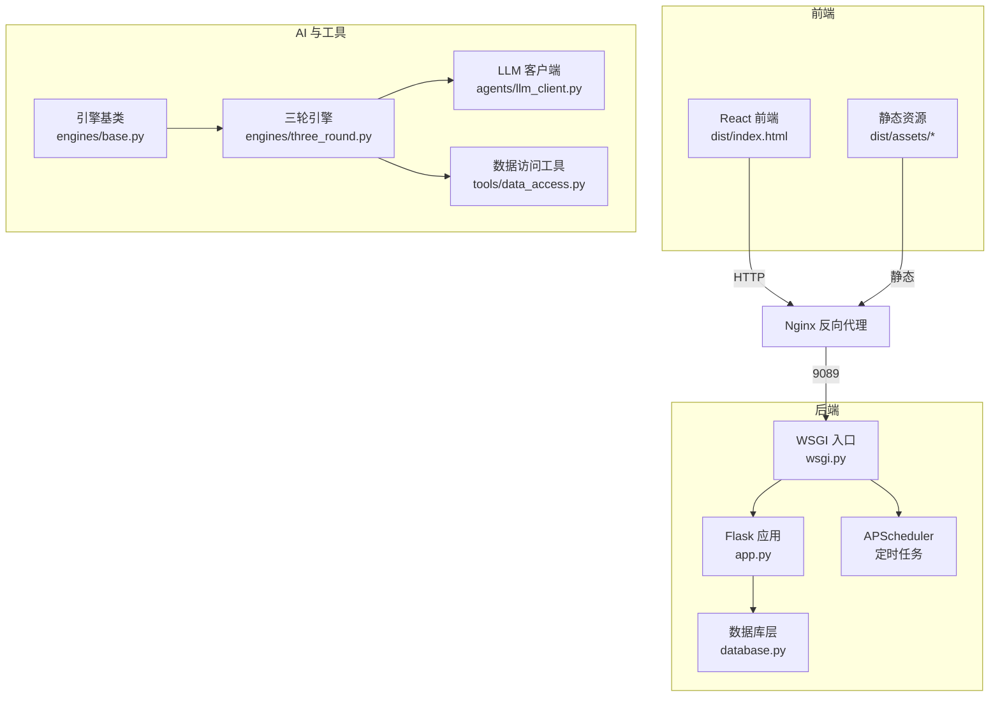
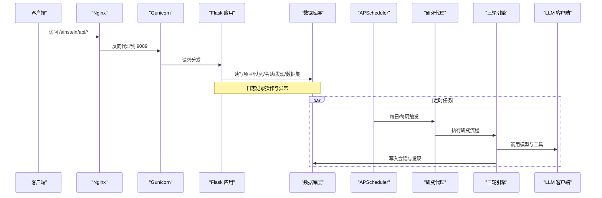
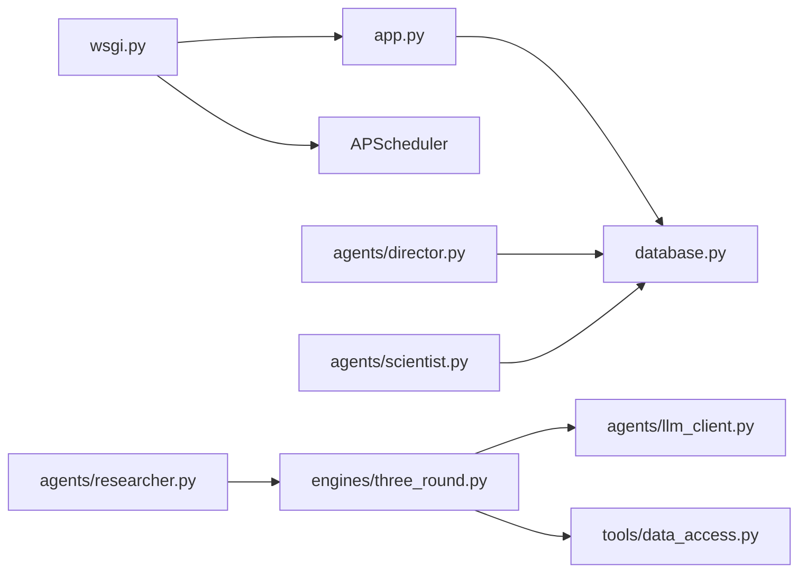
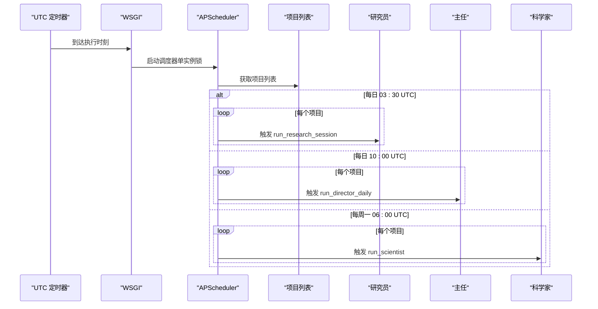
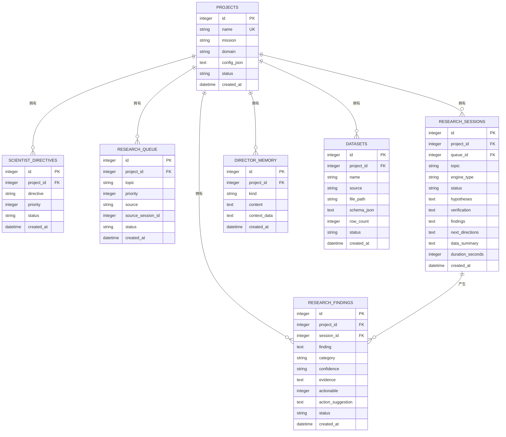

# 监控与维护

<cite>
**本文引用的文件**
- [app.py](file://app.py)
- [wsgi.py](file://wsgi.py)
- [config.py](file://config.py)
- [database.py](file://database.py)
- [docs/ops-manual.md](file://docs/ops-manual.md)
- [agents/director.py](file://agents/director.py)
- [agents/scientist.py](file://agents/scientist.py)
- [agents/researcher.py](file://agents/researcher.py)
- [engines/base.py](file://engines/base.py)
- [engines/three_round.py](file://engines/three_round.py)
- [agents/llm_client.py](file://agents/llm_client.py)
- [tools/data_access.py](file://tools/data_access.py)
</cite>

## 目录
1. [简介](#简介)
2. [项目结构](#项目结构)
3. [核心组件](#核心组件)
4. [架构总览](#架构总览)
5. [详细组件分析](#详细组件分析)
6. [依赖分析](#依赖分析)
7. [性能考虑](#性能考虑)
8. [故障排查指南](#故障排查指南)
9. [结论](#结论)
10. [附录](#附录)

## 简介
本指南面向系统运维与平台维护人员，围绕日志管理、系统监控指标、告警配置、备份恢复、定期维护任务以及故障排查工具与调试技巧，结合代码库的实际实现进行说明。内容覆盖健康检查接口、调度器状态、数据库与文件存储、LLM 调用链路、定时任务执行情况等关键运维点，并提供可操作的命令与流程。

## 项目结构
项目采用前后端分离与后端服务化架构：
- 前端为 React 应用，构建产物位于 dist/，由 Nginx 直接提供静态资源。
- 后端为 Flask 应用，通过 WSGI 入口由 Gunicorn 提供服务；WSGI 中集成 APScheduler 实现定时任务。
- 数据层基于 SQLite，支持项目、队列、会话、发现、数据集与主管记忆等实体。
- 代理与引擎模块负责研究流程编排、提示词驱动与工具调用。

图表来源
- [wsgi.py:1-83](file://wsgi.py#L1-L83)
- [app.py:1-182](file://app.py#L1-L182)
- [database.py:1-344](file://database.py#L1-L344)
- [engines/base.py:1-49](file://engines/base.py#L1-L49)
- [engines/three_round.py:1-179](file://engines/three_round.py#L1-L179)
- [agents/llm_client.py:1-114](file://agents/llm_client.py#L1-L114)
- [tools/data_access.py:1-43](file://tools/data_access.py#L1-L43)

章节来源
- [app.py:1-182](file://app.py#L1-L182)
- [wsgi.py:1-83](file://wsgi.py#L1-L83)
- [database.py:1-344](file://database.py#L1-L344)

## 核心组件
- 日志与健康检查
  - Flask 应用初始化了基础日志格式与级别；提供健康检查接口用于外部探测。
  - WSGI 中记录调度器启动与锁状态，便于运维观测。
- 数据库层
  - SQLite 初始化、索引、事务封装；提供项目、队列、会话、发现、数据集与主管记忆等 CRUD 接口。
- 定时任务
  - APScheduler 在 WSGI 中以单实例锁方式启动，按 UTC 时间表执行研究员、主任与科学家的周期性任务。
- AI 引擎与 LLM 客户端
  - 三轮引擎串联假设生成、工具验证与结论汇总；LLM 客户端封装 DashScope Anthropic 兼容接口，支持工具调用与 JSON 提取。
- 前端与静态资源
  - SPA 路由回退至 index.html；静态资源由 Nginx 提供并配置缓存头。

章节来源
- [app.py:8-46](file://app.py#L8-L46)
- [wsgi.py:27-71](file://wsgi.py#L27-L71)
- [database.py:101-123](file://database.py#L101-L123)
- [engines/three_round.py:22-179](file://engines/three_round.py#L22-L179)
- [agents/llm_client.py:24-44](file://agents/llm_client.py#L24-L44)

## 架构总览
下图展示从请求到 AI 执行再到持久化的端到端流程，以及定时任务与日志的关键节点。

图表来源
- [wsgi.py:27-71](file://wsgi.py#L27-L71)
- [agents/researcher.py:14-114](file://agents/researcher.py#L14-L114)
- [engines/three_round.py:28-179](file://engines/three_round.py#L28-L179)
- [agents/llm_client.py:24-44](file://agents/llm_client.py#L24-L44)
- [database.py:232-295](file://database.py#L232-L295)

## 详细组件分析

### 日志管理
- 日志级别与格式
  - Flask 应用初始化基础日志格式与级别，统一输出时间、级别、名称与消息体。
- 日志轮转策略
  - 当前未内置 Python RotatingFileHandler 或第三方轮转方案；建议结合系统日志服务（如 systemd-journald、rsyslog）进行轮转与归档。
- 集中式日志收集
  - 建议通过 journald 收集应用日志，结合 Nginx 访问/错误日志统一送入集中式平台（如 ELK、Loki+Promtail）。
- 关键日志位置与查看
  - 使用 systemd 单元日志查看器进行检索与过滤，支持关键词、时间段筛选。

章节来源
- [app.py:8-9](file://app.py#L8-L9)
- [docs/ops-manual.md:71-85](file://docs/ops-manual.md#L71-L85)

### 系统监控指标
- 健康检查
  - 提供 /ainstein/api/health 接口，返回服务可用状态，便于外部探活。
- 调度器状态
  - 观察调度器启动日志与调度锁持有者，确认定时任务是否按计划执行。
- 磁盘空间
  - 监控数据库文件大小、数据集目录占用与整体应用目录占用，及时清理与扩容。
- LLM 调用统计
  - LLM 客户端记录输入/输出 token 数量，可用于成本与用量估算。

章节来源
- [app.py:43-45](file://app.py#L43-L45)
- [docs/ops-manual.md:197-247](file://docs/ops-manual.md#L197-L247)
- [agents/llm_client.py:40-41](file://agents/llm_client.py#L40-L41)

### 告警配置
- 阈值设置
  - 健康检查失败、调度器长时间未执行、数据库增长过快、磁盘空间不足、LLM 调用错误率上升等。
- 通知渠道
  - 结合系统日志与外部监控平台（如 Prometheus+Alertmanager、Zabbix、飞书/钉钉机器人）进行告警推送。
- 升级策略
  - 一级告警即时处理；二级告警在限定时间内处置；三级告警纳入周报/月报追踪闭环。

[本节为通用运维建议，不直接分析具体源码文件]

### 备份与恢复
- 数据库备份
  - 支持复制 .db 文件与导出 SQL 两种方式；建议定时任务自动执行并校验完整性。
- 文件备份
  - 数据集目录定期同步或快照，确保与数据库一致。
- 灾难恢复
  - 停服、替换/还原数据库文件、重启服务；必要时从 SQL 恢复并重建索引。

章节来源
- [docs/ops-manual.md:108-134](file://docs/ops-manual.md#L108-L134)
- [database.py:101-106](file://database.py#L101-L106)

### 定期维护任务
- 系统更新与依赖升级
  - 更新后端代码、前端构建产物与依赖包，必要时重启服务。
- 性能检查
  - 调整 Gunicorn 工作进程数、SQLite PRAGMA 参数、Nginx 缓存策略。
- 清理与优化
  - 清理历史会话、无效发现，执行 VACUUM 释放空间。

章节来源
- [docs/ops-manual.md:369-421](file://docs/ops-manual.md#L369-L421)
- [docs/ops-manual.md:425-452](file://docs/ops-manual.md#L425-L452)
- [docs/ops-manual.md:150-163](file://docs/ops-manual.md#L150-L163)

### 故障排查工具与调试技巧
- 服务无法启动
  - 查看 systemd 日志、端口占用、虚拟环境依赖与文件权限。
- LLM 调用失败
  - 检查 API Key、手动测试 LLM 调用、定位认证与配额问题。
- 调度器不执行
  - 检查调度器日志与锁持有者，必要时清理锁并重启服务；可手动触发任务进行验证。
- 前端 404
  - 检查 dist 目录与 Nginx 配置，重新构建并重载 Nginx。
- 数据集上传失败
  - 检查文件存在性与权限，手动解析测试，修正编码等问题。

章节来源
- [docs/ops-manual.md:249-367](file://docs/ops-manual.md#L249-L367)

## 依赖分析
- 组件耦合
  - Flask 应用依赖数据库层；WSGI 启动调度器并持有单实例锁；研究代理通过引擎调用 LLM 客户端与工具。
- 外部依赖
  - LLM 服务（DashScope Anthropic 兼容）、APScheduler、SQLite、Pandas/NumPy/SciPy。
- 潜在循环依赖
  - 代码层未见循环导入；调度器在 WSGI 中延迟导入以避免循环。

图表来源
- [app.py:1-182](file://app.py#L1-L182)
- [wsgi.py:27-71](file://wsgi.py#L27-L71)
- [agents/researcher.py:1-114](file://agents/researcher.py#L1-L114)
- [engines/three_round.py:1-179](file://engines/three_round.py#L1-L179)
- [agents/llm_client.py:1-114](file://agents/llm_client.py#L1-L114)
- [tools/data_access.py:1-43](file://tools/data_access.py#L1-L43)
- [database.py:1-344](file://database.py#L1-L344)

## 性能考虑
- Gunicorn 工作者数量
  - 根据 CPU 核心数调整工作进程数，平衡并发与内存占用。
- SQLite 优化
  - 已启用 WAL 与外键约束；可按需调整缓存大小与同步模式。
- Nginx 缓存
  - 静态资源长期缓存，index.html 禁用缓存以保证前端更新。
- LLM 调用
  - 控制温度与最大 token，合理拆分工具调用轮次，避免超时。

章节来源
- [docs/ops-manual.md:407-452](file://docs/ops-manual.md#L407-L452)
- [database.py:113-114](file://database.py#L113-L114)

## 故障排查指南
- 健康检查
  - 使用 curl 访问 /ainstein/api/health，确认返回状态。
- 调度器验证
  - 检查最近一小时调度器启动日志与锁持有者。
- 任务执行验证
  - 查询最近会话与主任简报记录，确认流程闭环。
- 磁盘与容量
  - 监控数据库、数据集与整体目录大小，按需清理与扩容。

章节来源
- [docs/ops-manual.md:197-247](file://docs/ops-manual.md#L197-L247)

## 结论
本指南基于现有代码与运维手册，提供了日志、监控、告警、备份恢复、维护与故障排查的实践路径。建议结合系统日志与外部监控平台建立统一的可观测体系，并根据业务负载持续优化调度与数据库参数。

## 附录

### 关键流程时序图：定时任务执行

图表来源
- [wsgi.py:27-71](file://wsgi.py#L27-L71)
- [agents/researcher.py:14-114](file://agents/researcher.py#L14-L114)
- [agents/director.py:14-124](file://agents/director.py#L14-L124)
- [agents/scientist.py:14-75](file://agents/scientist.py#L14-L75)

### 数据模型图：核心实体

图表来源
- [database.py:10-98](file://database.py#L10-L98)