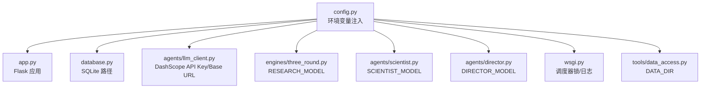
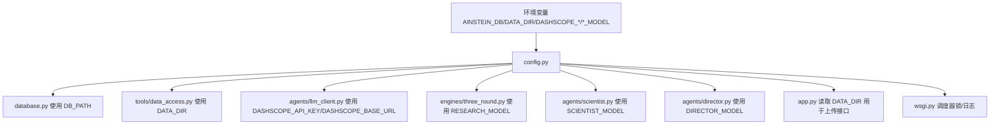
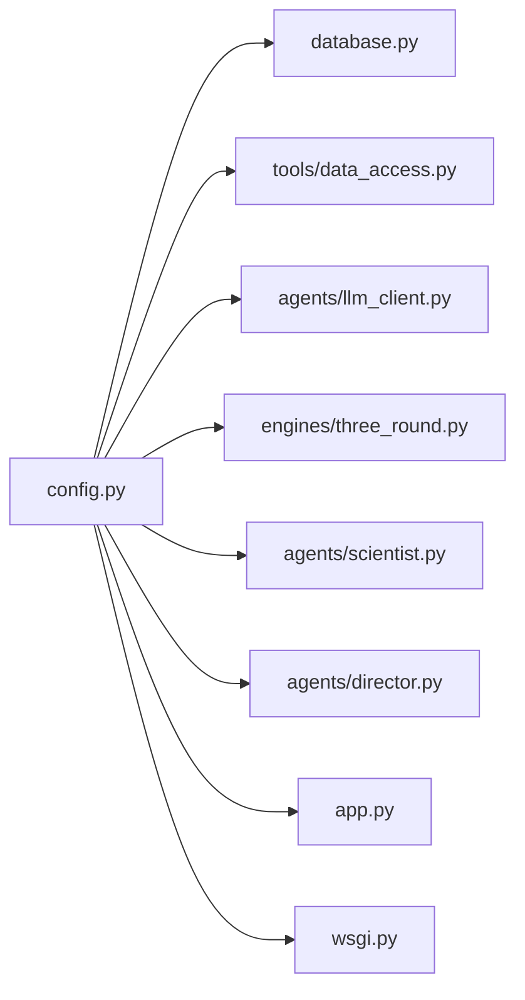

# 配置管理

<cite>
**本文引用的文件**
- [config.py](file://config.py)
- [app.py](file://app.py)
- [database.py](file://database.py)
- [wsgi.py](file://wsgi.py)
- [agents/llm_client.py](file://agents/llm_client.py)
- [agents/scientist.py](file://agents/scientist.py)
- [agents/director.py](file://agents/director.py)
- [engines/three_round.py](file://engines/three_round.py)
- [tools/data_access.py](file://tools/data_access.py)
- [README.md](file://README.md)
</cite>

## 目录
1. [简介](#简介)
2. [项目结构](#项目结构)
3. [核心组件](#核心组件)
4. [架构总览](#架构总览)
5. [详细组件分析](#详细组件分析)
6. [依赖关系分析](#依赖关系分析)
7. [性能考量](#性能考量)
8. [故障排查指南](#故障排查指南)
9. [结论](#结论)
10. [附录](#附录)

## 简介
本文件系统化梳理 AInstein 的配置管理设计与使用方法，聚焦 config.py 中的配置项、环境变量的加载与优先级、在各组件中的应用、以及在不同环境（开发/测试/生产）下的配置差异与最佳实践。同时提供配置验证、错误处理与调试建议，帮助读者快速、安全地部署与维护系统。

## 项目结构
AInstein 将配置集中于 config.py，通过环境变量注入，供应用层、数据库层、调度器与各智能体模块按需读取。整体采用“环境变量优先”的单点配置策略，确保一致性与可移植性。

图表来源
- [config.py:1-11](file://config.py#L1-L11)
- [app.py:125-125](file://app.py#L125-L125)
- [database.py:6-6](file://database.py#L6-L6)
- [agents/llm_client.py:7-7](file://agents/llm_client.py#L7-L7)
- [engines/three_round.py:9-9](file://engines/three_round.py#L9-L9)
- [agents/scientist.py:7-7](file://agents/scientist.py#L7-L7)
- [agents/director.py:7-7](file://agents/director.py#L7-L7)
- [tools/data_access.py:5-5](file://tools/data_access.py#L5-L5)
- [wsgi.py:1-1](file://wsgi.py#L1-L1)

章节来源
- [config.py:1-11](file://config.py#L1-L11)
- [app.py:125-125](file://app.py#L125-L125)
- [database.py:6-6](file://database.py#L6-L6)
- [agents/llm_client.py:7-7](file://agents/llm_client.py#L7-L7)
- [engines/three_round.py:9-9](file://engines/three_round.py#L9-L9)
- [agents/scientist.py:7-7](file://agents/scientist.py#L7-L7)
- [agents/director.py:7-7](file://agents/director.py#L7-L7)
- [tools/data_access.py:5-5](file://tools/data_access.py#L5-L5)
- [wsgi.py:1-1](file://wsgi.py#L1-L1)

## 核心组件
- 配置源与加载机制
  - 所有配置项均来自环境变量，未在代码中硬编码敏感信息。
  - 默认值在 config.py 内置，便于离线/最小化运行。
- 关键配置项
  - 数据库路径：AINSTEIN_DB
  - 数据集目录：DATA_DIR
  - LLM 客户端：DASHSCOPE_API_KEY、DASHSCOPE_BASE_URL
  - 模型参数：RESEARCH_MODEL、SCIENTIST_MODEL、DIRECTOR_MODEL

章节来源
- [config.py:4-10](file://config.py#L4-L10)

## 架构总览
下图展示配置在系统中的流向与使用位置，体现“环境变量 → config.py → 各模块”的统一注入链路。

图表来源
- [config.py:4-10](file://config.py#L4-L10)
- [database.py:6-6](file://database.py#L6-L6)
- [tools/data_access.py:5-5](file://tools/data_access.py#L5-L5)
- [agents/llm_client.py:7-7](file://agents/llm_client.py#L7-L7)
- [engines/three_round.py:9-9](file://engines/three_round.py#L9-L9)
- [agents/scientist.py:7-7](file://agents/scientist.py#L7-L7)
- [agents/director.py:7-7](file://agents/director.py#L7-L7)
- [app.py:125-125](file://app.py#L125-L125)
- [wsgi.py:1-1](file://wsgi.py#L1-L1)

## 详细组件分析

### 配置项详解与使用方式
- 数据库路径 DB_PATH
  - 作用：指定 SQLite 数据库存放路径；初始化时会确保父目录存在。
  - 读取位置：database.py 初始化数据库时使用。
  - 设置建议：生产环境建议置于持久化卷，避免容器重启丢失。
  
  章节来源
  - [config.py:4-4](file://config.py#L4-L4)
  - [database.py:101-106](file://database.py#L101-L106)

- 数据集目录 DATA_DIR
  - 作用：上传数据集的落盘目录；项目维度隔离。
  - 读取位置：app.py 上传接口与 tools/data_access.py。
  - 设置建议：与 DB_PATH 分离，便于备份与容量规划。
  
  章节来源
  - [config.py:5-5](file://config.py#L5-L5)
  - [app.py:125-125](file://app.py#L125-L125)
  - [tools/data_access.py:10-10](file://tools/data_access.py#L10-L10)

- LLM 客户端配置
  - DASHSCOPE_API_KEY：DashScope 或兼容 Anthropic 协议的 API Key。
  - DASHSCOPE_BASE_URL：服务端点地址，默认指向特定令牌计划域名。
  - 读取位置：agents/llm_client.py。
  - 设置建议：生产环境务必通过只读环境变量注入，避免明文写入仓库。
  
  章节来源
  - [config.py:6-7](file://config.py#L6-L7)
  - [agents/llm_client.py:14-21](file://agents/llm_client.py#L14-L21)

- 模型参数
  - RESEARCH_MODEL：三轮引擎使用的模型名称。
  - SCIENTIST_MODEL：科学家智能体使用的模型名称。
  - DIRECTOR_MODEL：主任智能体使用的模型名称。
  - 读取位置：engines/three_round.py、agents/scientist.py、agents/director.py。
  - 设置建议：不同环境可分别覆盖，便于灰度与对比实验。
  
  章节来源
  - [config.py:8-10](file://config.py#L8-L10)
  - [engines/three_round.py:9-9](file://engines/three_round.py#L9-L9)
  - [agents/scientist.py:7-7](file://agents/scientist.py#L7-L7)
  - [agents/director.py:7-7](file://agents/director.py#L7-L7)

### 环境变量的使用与安全性
- 加载方式
  - 所有配置项通过 os.environ.get(key, default) 获取，未提供的键使用内置默认值。
- 安全性
  - API Key 与 Base URL 仅从环境变量注入，不写入代码或版本控制。
  - README 提供了 .env 示例与导入流程，建议在部署前完成密钥注入与权限收窄。
- 最佳实践
  - 生产环境使用只读挂载或密钥管理服务注入环境变量。
  - 为不同环境准备独立的 .env 文件并进行最小权限授权。

章节来源
- [config.py:4-10](file://config.py#L4-L10)
- [README.md:40-49](file://README.md#L40-L49)

### 不同环境下的配置示例
- 开发环境
  - 特征：追求易用性，可使用较弱的默认模型；数据库与数据目录可位于工作目录。
  - 建议：保留默认 DB_PATH 与 DATA_DIR，便于快速启动；API Key 通过 .env 注入。
- 测试环境
  - 特征：与生产隔离，可使用相同模型但较小的数据集与较低并发。
  - 建议：单独设置 AINSTEIN_DB 与 DATA_DIR，避免污染生产数据。
- 生产环境
  - 特征：高可用、高安全、可审计。
  - 建议：持久化 DB_PATH 与 DATA_DIR；通过密钥管理服务注入 DASHSCOPE_*；限制 API Key 权限范围。

章节来源
- [README.md:40-67](file://README.md#L40-L67)
- [config.py:4-10](file://config.py#L4-L10)

### 配置加载顺序与优先级
- 优先级
  - 环境变量 > 内置默认值。
  - 在 Python 进程启动时，config.py 一次性读取并缓存为模块常量。
- 加载时机
  - 应用启动时，database.py 初始化数据库；wsgi.py 启动调度器；各智能体与引擎按需导入 config。
- 注意事项
  - 若未设置环境变量，系统将回退到内置默认值，可能导致行为与预期不符，应避免在生产环境依赖默认值。

章节来源
- [config.py:4-10](file://config.py#L4-L10)
- [database.py:101-106](file://database.py#L101-L106)
- [wsgi.py:74-74](file://wsgi.py#L74-L74)

### 配置验证与错误处理
- 数据库初始化失败
  - 现象：无法连接或创建数据库文件。
  - 排查：确认 AINSTEIN_DB 路径可写、父目录存在；检查权限与磁盘空间。
- LLM 调用失败
  - 现象：API Key 无效、Base URL 不可达、模型不可用。
  - 排查：核对 DASHSCOPE_API_KEY 与 DASHSCOPE_BASE_URL；确认网络连通与配额状态。
- 数据集解析失败
  - 现象：上传 CSV/JSON/XLSX 后无法解析。
  - 排查：确认文件格式与扩展名匹配；检查 DATA_DIR 权限；查看日志中的警告信息。
- 调度器冲突
  - 现象：多实例竞争导致重复执行。
  - 排查：检查文件锁路径与进程 PID；确保仅一个实例持有调度锁。

章节来源
- [database.py:101-106](file://database.py#L101-L106)
- [agents/llm_client.py:42-44](file://agents/llm_client.py#L42-L44)
- [app.py:146-149](file://app.py#L146-L149)
- [wsgi.py:13-24](file://wsgi.py#L13-L24)

### 调试指南
- 日志级别
  - 应用层与调度器均配置 INFO 级别日志，便于定位问题。
- 关键断点
  - 数据库初始化：database.py init_db。
  - LLM 调用：agents/llm_client.py call_llm。
  - 引擎运行：engines/three_round.py ThreeRoundEngine.run。
  - 调度执行：wsgi.py 调度作业与锁逻辑。
- 建议
  - 在开发阶段开启 debug 模式；生产环境保持 INFO 级别，避免泄露敏感信息。

章节来源
- [app.py:8-9](file://app.py#L8-L9)
- [wsgi.py:7-7](file://wsgi.py#L7-L7)
- [engines/three_round.py:28-28](file://engines/three_round.py#L28-L28)

## 依赖关系分析
配置在系统中的依赖关系如下：

图表来源
- [config.py:4-10](file://config.py#L4-L10)
- [database.py:6-6](file://database.py#L6-L6)
- [tools/data_access.py:5-5](file://tools/data_access.py#L5-L5)
- [agents/llm_client.py:7-7](file://agents/llm_client.py#L7-L7)
- [engines/three_round.py:9-9](file://engines/three_round.py#L9-L9)
- [agents/scientist.py:7-7](file://agents/scientist.py#L7-L7)
- [agents/director.py:7-7](file://agents/director.py#L7-L7)
- [app.py:125-125](file://app.py#L125-L125)
- [wsgi.py:1-1](file://wsgi.py#L1-L1)

章节来源
- [config.py:4-10](file://config.py#L4-L10)
- [database.py:6-6](file://database.py#L6-L6)
- [tools/data_access.py:5-5](file://tools/data_access.py#L5-L5)
- [agents/llm_client.py:7-7](file://agents/llm_client.py#L7-L7)
- [engines/three_round.py:9-9](file://engines/three_round.py#L9-L9)
- [agents/scientist.py:7-7](file://agents/scientist.py#L7-L7)
- [agents/director.py:7-7](file://agents/director.py#L7-L7)
- [app.py:125-125](file://app.py#L125-L125)
- [wsgi.py:1-1](file://wsgi.py#L1-L1)

## 性能考量
- 数据库性能
  - WAL 模式提升并发写入性能；合理设置 AINSTEIN_DB 存储介质与 IO 性能。
- LLM 调用
  - 控制 max_tokens 与 temperature，避免超长上下文导致延迟上升。
- 调度频率
  - 调度器按固定时间触发，建议结合业务负载调整任务粒度，避免资源争用。

## 故障排查指南
- 数据库
  - 症状：初始化失败或迁移报错。
  - 排查：确认 DB_PATH 可写、父目录存在；检查 SQLite 权限。
- LLM
  - 症状：调用异常或返回空内容。
  - 排查：核对 API Key 与 Base URL；检查网络与配额；查看日志中的错误堆栈。
- 数据集
  - 症状：上传成功但解析失败。
  - 排查：确认文件类型与扩展名；检查 DATA_DIR 权限；查看日志警告。
- 调度
  - 症状：重复执行或未执行。
  - 排查：检查调度锁文件与进程 PID；确保仅一个实例运行调度器。

章节来源
- [database.py:101-106](file://database.py#L101-L106)
- [agents/llm_client.py:42-44](file://agents/llm_client.py#L42-L44)
- [app.py:146-149](file://app.py#L146-L149)
- [wsgi.py:13-24](file://wsgi.py#L13-L24)

## 结论
AInstein 的配置体系以环境变量为核心，通过 config.py 统一注入，覆盖数据库、数据集、LLM 客户端与模型参数等关键要素。该设计具备良好的可移植性与安全性，建议在生产环境中严格遵循最小权限与密钥管理原则，并结合本文提供的验证、排错与最佳实践，确保系统稳定运行。

## 附录
- 快速对照表
  - AINSTEIN_DB → database.py 初始化数据库
  - DATA_DIR → app.py 上传接口与 tools/data_access.py
  - DASHSCOPE_API_KEY/DASHSCOPE_BASE_URL → agents/llm_client.py
  - RESEARCH_MODEL → engines/three_round.py
  - SCIENTIST_MODEL → agents/scientist.py
  - DIRECTOR_MODEL → agents/director.py

章节来源
- [config.py:4-10](file://config.py#L4-L10)
- [database.py:101-106](file://database.py#L101-L106)
- [tools/data_access.py:10-10](file://tools/data_access.py#L10-L10)
- [agents/llm_client.py:14-21](file://agents/llm_client.py#L14-L21)
- [engines/three_round.py:28-28](file://engines/three_round.py#L28-L28)
- [agents/scientist.py:14-14](file://agents/scientist.py#L14-L14)
- [agents/director.py:14-14](file://agents/director.py#L14-L14)