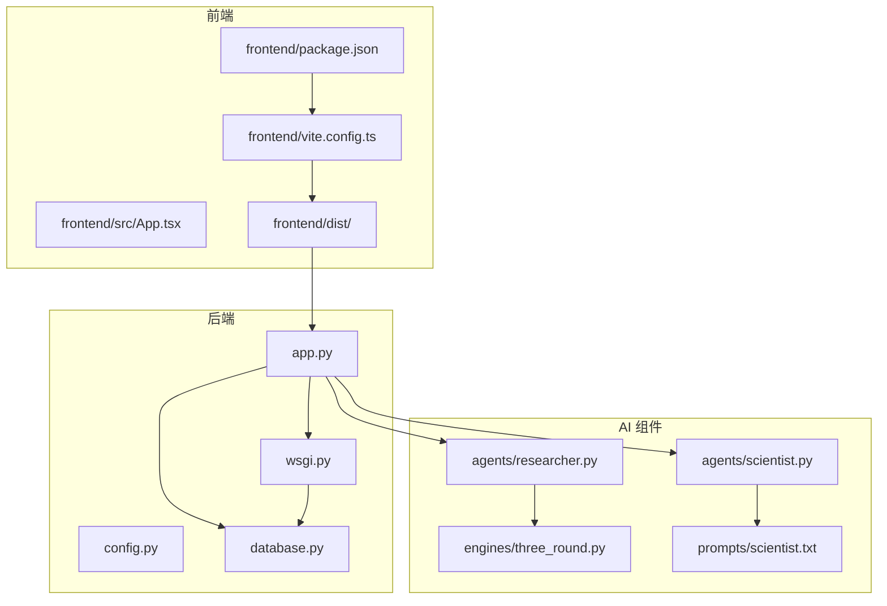
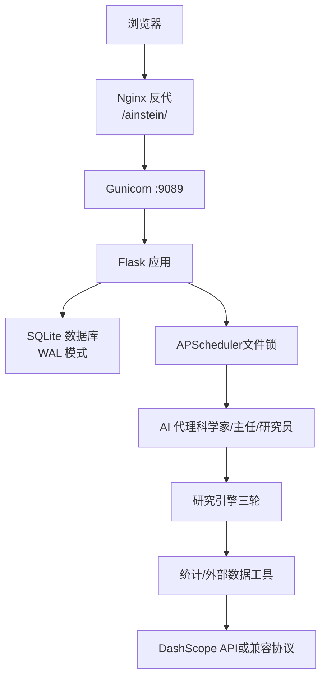
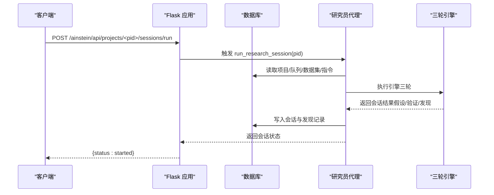
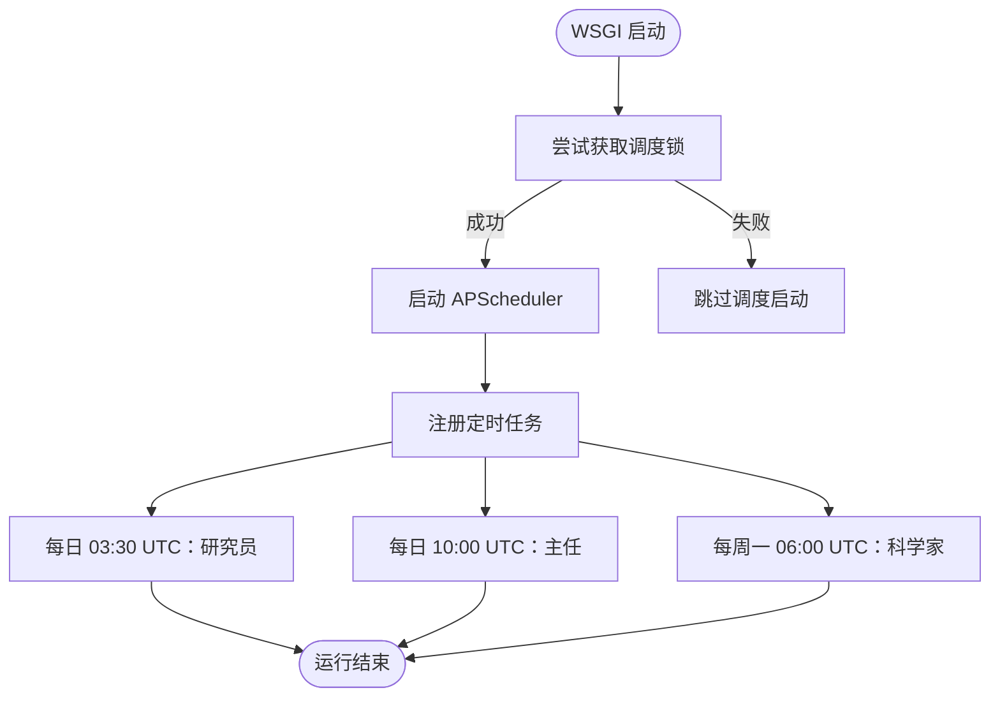
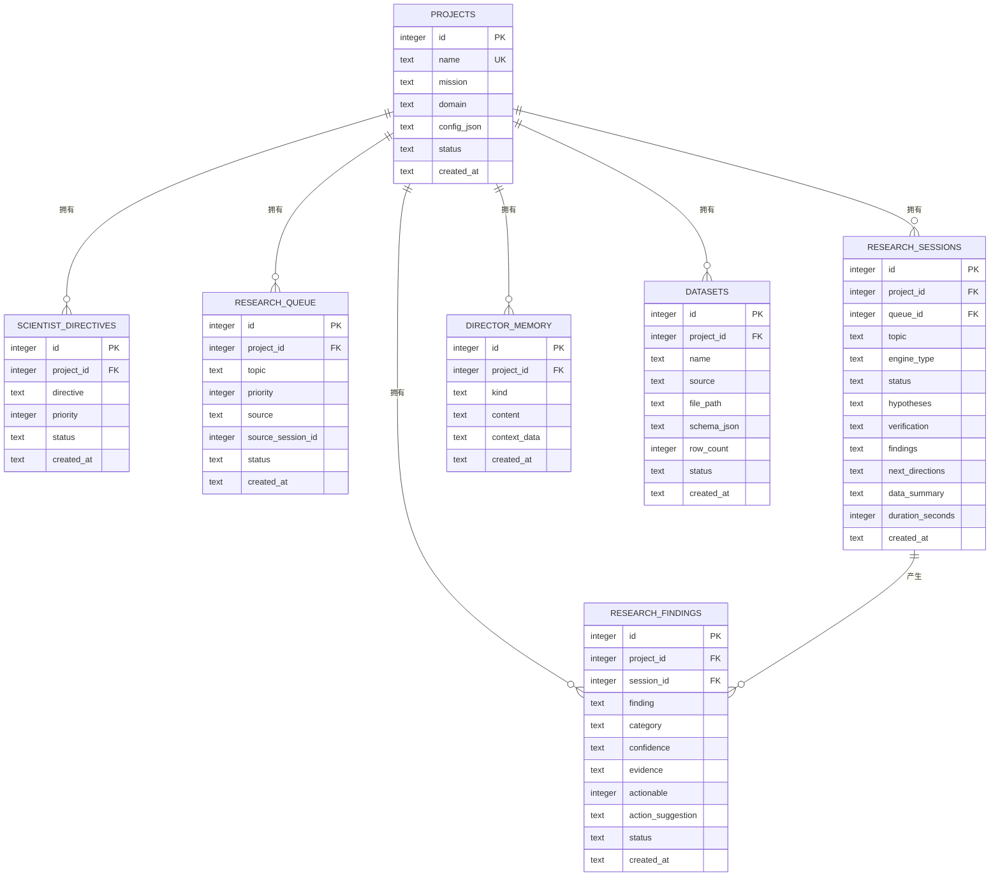
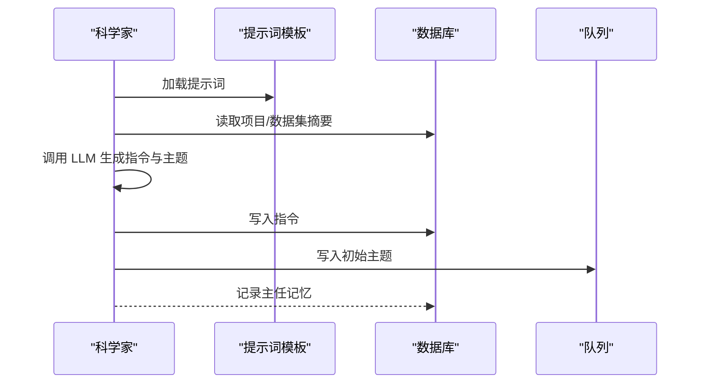
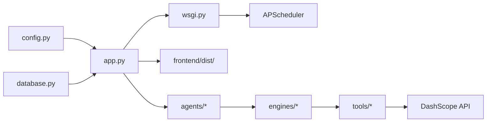

# 快速开始

<cite>
**本文引用的文件**
- [README.md](file://README.md)
- [app.py](file://app.py)
- [config.py](file://config.py)
- [database.py](file://database.py)
- [wsgi.py](file://wsgi.py)
- [frontend/package.json](file://frontend/package.json)
- [frontend/vite.config.ts](file://frontend/vite.config.ts)
- [frontend/src/App.tsx](file://frontend/src/App.tsx)
- [docs/ops-manual.md](file://docs/ops-manual.md)
- [agents/scientist.py](file://agents/scientist.py)
- [agents/researcher.py](file://agents/researcher.py)
- [engines/three_round.py](file://engines/three_round.py)
- [prompts/scientist.txt](file://prompts/scientist.txt)
</cite>

## 目录
1. [简介](#简介)
2. [项目结构](#项目结构)
3. [核心组件](#核心组件)
4. [架构总览](#架构总览)
5. [详细组件分析](#详细组件分析)
6. [依赖关系分析](#依赖关系分析)
7. [性能考虑](#性能考虑)
8. [故障排查指南](#故障排查指南)
9. [结论](#结论)
10. [附录](#附录)

## 简介
本指南面向希望快速搭建并运行 AInstein 项目的开发者，覆盖环境准备、依赖安装、前后端启动与一体化生产部署，并提供常见问题的验证与排查方法。AInstein 是一个通用 AI 深度研究平台，支持三级 AI 团队（科学家→主任→研究员）与三轮研究引擎，结合 SQLite 数据库存储与 React 前端展示。

## 项目结构
AInstein 采用前后端分离与后端服务集成的结构：
- 后端：Flask 应用，提供 REST API 并托管静态前端资源；通过 Gunicorn 在生产环境运行；内置 APScheduler 定时任务。
- 前端：React + Vite + TypeScript，构建产物位于 frontend/dist，通过 Nginx 反代提供静态资源。
- 数据层：SQLite（WAL 模式），通过 database.py 管理表结构与 CRUD。
- AI 引擎与代理：agents/ 下的 scientist、director、researcher 负责不同角色的 AI 行为；engines/ 提供研究引擎；tools/ 提供统计与外部数据工具；prompts/ 存放提示词模板。

**图示来源**
- [frontend/package.json:1-24](file://frontend/package.json#L1-L24)
- [frontend/vite.config.ts:1-12](file://frontend/vite.config.ts#L1-L12)
- [frontend/src/App.tsx:1-13](file://frontend/src/App.tsx#L1-L13)
- [app.py:1-182](file://app.py#L1-L182)
- [wsgi.py:1-83](file://wsgi.py#L1-L83)
- [config.py:1-11](file://config.py#L1-L11)
- [database.py:1-344](file://database.py#L1-L344)
- [agents/scientist.py:1-75](file://agents/scientist.py#L1-L75)
- [agents/researcher.py:1-114](file://agents/researcher.py#L1-L114)
- [engines/three_round.py:1-179](file://engines/three_round.py#L1-L179)
- [prompts/scientist.txt:1-32](file://prompts/scientist.txt#L1-L32)

**章节来源**
- [README.md:94-124](file://README.md#L94-L124)
- [frontend/package.json:1-24](file://frontend/package.json#L1-L24)
- [frontend/vite.config.ts:1-12](file://frontend/vite.config.ts#L1-L12)
- [app.py:1-182](file://app.py#L1-L182)
- [wsgi.py:1-83](file://wsgi.py#L1-L83)
- [database.py:1-344](file://database.py#L1-L344)

## 核心组件
- 配置模块：读取环境变量（数据库路径、数据集目录、DashScope API Key、模型名称等）。
- 数据库模块：定义并初始化 SQLite 表结构，提供项目、队列、会话、发现、数据集等 CRUD。
- Flask 应用：提供健康检查、项目管理、队列、会话、发现、数据集、科学家/主任调度接口；同时托管前端静态资源。
- WSGI 与定时任务：通过 Gunicorn 启动应用，APScheduler 在进程内以文件锁确保单实例调度，按 UTC 时间自动执行研究员/主任/科学家任务。
- 前端：React 路由与页面组件，Vite 构建并设置基础路径为 /ainstein/，产物用于静态托管。

**章节来源**
- [config.py:1-11](file://config.py#L1-L11)
- [database.py:1-344](file://database.py#L1-L344)
- [app.py:1-182](file://app.py#L1-L182)
- [wsgi.py:1-83](file://wsgi.py#L1-L83)
- [frontend/vite.config.ts:1-12](file://frontend/vite.config.ts#L1-L12)
- [frontend/src/App.tsx:1-13](file://frontend/src/App.tsx#L1-L13)

## 架构总览
AInstein 的运行架构如下：
- 前端通过 Nginx 反代访问 /ainstein/，静态资源来自 frontend/dist。
- Nginx 将 API 请求转发至本机 9089 端口，由 Gunicorn 托管的 Flask 应用处理。
- Flask 应用负责业务逻辑与数据库交互；WSGI 进程内启动 APScheduler，按 UTC 时间自动调度三级 AI 任务。
- LLM 调用通过 DashScope（或兼容 Anthropic 协议）API Key 完成。

**图示来源**
- [README.md:71-83](file://README.md#L71-L83)
- [docs/ops-manual.md:3-47](file://docs/ops-manual.md#L3-L47)
- [wsgi.py:1-83](file://wsgi.py#L1-L83)
- [app.py:1-182](file://app.py#L1-L182)
- [database.py:1-344](file://database.py#L1-L344)

## 详细组件分析

### 环境准备与依赖安装
- Python 3.10+：用于后端运行与依赖安装。
- Node.js 18+：用于前端构建与开发。
- DashScope API Key：用于 LLM 调用，默认模型为 kim-k2.6，可通过环境变量配置。
- 依赖安装：
  - 后端：Flask、Gunicorn、anthropic、APScheduler、pandas、scipy、numpy。
  - 前端：React、React DOM、React Router、TypeScript、Vite、@vitejs/plugin-react。

**章节来源**
- [README.md:19-23](file://README.md#L19-L23)
- [README.md:34-50](file://README.md#L34-L50)
- [README.md:52-59](file://README.md#L52-L59)
- [frontend/package.json:1-24](file://frontend/package.json#L1-L24)

### 克隆与项目初始化
- 克隆仓库并进入目录。
- 创建 Python 虚拟环境并激活。
- 安装后端依赖。
- 复制并编辑 .env 示例文件，填入 DashScope API Key。
- 初始化数据库（首次启动自动创建）。
- 启动 Flask 开发服务器（端口 9089）。

**章节来源**
- [README.md:25-50](file://README.md#L25-L50)

### 前端启动与构建
- 进入 frontend 目录，安装依赖并启动开发服务器。
- 访问 http://localhost:5173/ainstein/。
- 构建产物位于 frontend/dist，基础路径为 /ainstein/。

**章节来源**
- [README.md:52-59](file://README.md#L52-L59)
- [frontend/vite.config.ts:1-12](file://frontend/vite.config.ts#L1-L12)
- [frontend/package.json:1-24](file://frontend/package.json#L1-L24)

### 一体化生产模式部署
- 使用 Gunicorn 启动应用，工作进程数与超时可按需调整。
- 前端构建产物配合 Nginx 反代使用，详见运维手册。

**章节来源**
- [README.md:61-69](file://README.md#L61-L69)
- [docs/ops-manual.md:165-195](file://docs/ops-manual.md#L165-L195)

### API 路由与数据流
- 健康检查：/ainstein/api/health
- 项目管理：列表、创建、详情
- 队列管理：列出、添加
- 会话管理：列出、详情、手动运行一次研究会话
- 发现管理：按条件查询
- 数据集管理：列出、上传（CSV/JSON），自动解析 schema 与行数
- 科学家/主任：生成指令与初始主题、每日审核

**图示来源**
- [app.py:95-104](file://app.py#L95-L104)
- [agents/researcher.py:14-114](file://agents/researcher.py#L14-L114)
- [engines/three_round.py:28-179](file://engines/three_round.py#L28-L179)
- [database.py:232-262](file://database.py#L232-L262)

**章节来源**
- [app.py:43-177](file://app.py#L43-L177)
- [database.py:127-228](file://database.py#L127-L228)

### 定时调度与锁机制
- 调度器在 WSGI 进程内启动，使用文件锁确保单实例。
- 研究员：每日 03:30 UTC；主任：每日 10:00 UTC；科学家：每周一 06:00 UTC。
- 若锁失效，可清理锁文件并重启服务。

**图示来源**
- [wsgi.py:76-81](file://wsgi.py#L76-L81)
- [wsgi.py:27-71](file://wsgi.py#L27-L71)

**章节来源**
- [wsgi.py:1-83](file://wsgi.py#L1-L83)

### 数据库与模型
- 数据库初始化与 WAL 模式开启。
- 关键表：projects、scientist_directives、research_queue、research_sessions、research_findings、director_memory、datasets。
- 提供项目、队列、会话、发现、数据集等 CRUD 方法。

**图示来源**
- [database.py:10-98](file://database.py#L10-L98)

**章节来源**
- [database.py:101-123](file://database.py#L101-L123)
- [database.py:127-168](file://database.py#L127-L168)
- [database.py:173-187](file://database.py#L173-L187)
- [database.py:192-228](file://database.py#L192-L228)
- [database.py:232-262](file://database.py#L232-L262)
- [database.py:266-295](file://database.py#L266-L295)
- [database.py:299-319](file://database.py#L299-L319)
- [database.py:324-343](file://database.py#L324-L343)

### AI 代理与引擎
- 科学家：根据项目使命与领域生成指令与初始主题，写入指令与队列，并记录主任记忆。
- 研究员：从队列挑选主题，构造上下文，调用三轮引擎，持久化会话与发现。
- 三轮引擎：假设生成 → 工具检验 → 验证总结，支持统计工具调用与 JSON 解析。

**图示来源**
- [agents/scientist.py:14-75](file://agents/scientist.py#L14-L75)
- [prompts/scientist.txt:1-32](file://prompts/scientist.txt#L1-L32)
- [database.py:173-187](file://database.py#L173-L187)
- [database.py:192-228](file://database.py#L192-L228)
- [database.py:299-319](file://database.py#L299-L319)

**章节来源**
- [agents/scientist.py:1-75](file://agents/scientist.py#L1-L75)
- [agents/researcher.py:1-114](file://agents/researcher.py#L1-L114)
- [engines/three_round.py:1-179](file://engines/three_round.py#L1-L179)
- [prompts/scientist.txt:1-32](file://prompts/scientist.txt#L1-L32)

## 依赖关系分析
- 后端依赖：Flask（路由）、Gunicorn（WSGI）、APScheduler（定时任务）、pandas/scipy/numpy（数据处理）、anthropic（LLM 客户端）。
- 前端依赖：React 生态与 Vite 构建工具链。
- 运行时依赖：SQLite（本地存储）、DashScope API（外部 LLM）。

**图示来源**
- [config.py:1-11](file://config.py#L1-L11)
- [app.py:1-182](file://app.py#L1-L182)
- [database.py:1-344](file://database.py#L1-L344)
- [wsgi.py:1-83](file://wsgi.py#L1-L83)
- [frontend/vite.config.ts:1-12](file://frontend/vite.config.ts#L1-L12)

**章节来源**
- [README.md:85-92](file://README.md#L85-L92)
- [frontend/package.json:1-24](file://frontend/package.json#L1-L24)

## 性能考虑
- Gunicorn 工作进程数量：建议按“2 × CPU + 1”估算，结合服务器资源调整。
- SQLite 优化：已启用 WAL 模式与外键约束；可根据需要调整缓存与同步级别。
- 前端缓存：静态资源带哈希，index.html 设置 no-cache，确保更新即时生效。
- Nginx 缓存：对 /ainstein/assets/ 设置长期缓存，提升静态资源加载速度。

**章节来源**
- [docs/ops-manual.md:407-452](file://docs/ops-manual.md#L407-L452)

## 故障排查指南
- 服务无法启动
  - 检查 systemd 日志与端口占用；确认虚拟环境已激活、依赖安装正确、文件权限正常。
- LLM 调用失败
  - 检查 /etc/ainstein.env 中 API Key 是否存在；手动测试 LLM 调用；关注配额与速率限制。
- 调度器不执行
  - 检查调度器日志与锁文件；若锁失效，清理锁后重启服务；必要时手动触发。
- 前端 404 或空白页
  - 确认 dist 目录存在；检查 Nginx 配置；重新构建并重载 Nginx。
- 数据集上传失败
  - 检查文件存在与权限；手动解析 CSV/JSON 以定位编码或格式问题。

**章节来源**
- [docs/ops-manual.md:249-367](file://docs/ops-manual.md#L249-L367)

## 结论
通过本快速开始指南，您可以在本地完成环境准备、依赖安装、数据库初始化与前后端启动，并了解一体化生产部署的基本流程。遇到问题时，可依据运维手册中的健康检查、日志与定时任务验证步骤进行排查。随着项目推进，建议逐步完善 Nginx 反代、systemd 服务与数据库备份策略，确保稳定运行。

## 附录
- 健康检查：访问 /ainstein/api/health，应返回 {"status":"ok"}。
- 定时任务验证：查看最近会话与主任简报，确认调度器正常工作。
- 前端访问：开发模式下访问 http://localhost:5173/ainstein/；生产模式下通过 Nginx 反代访问。

**章节来源**
- [docs/ops-manual.md:197-234](file://docs/ops-manual.md#L197-L234)
- [app.py:43-45](file://app.py#L43-L45)