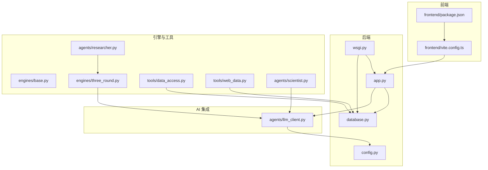
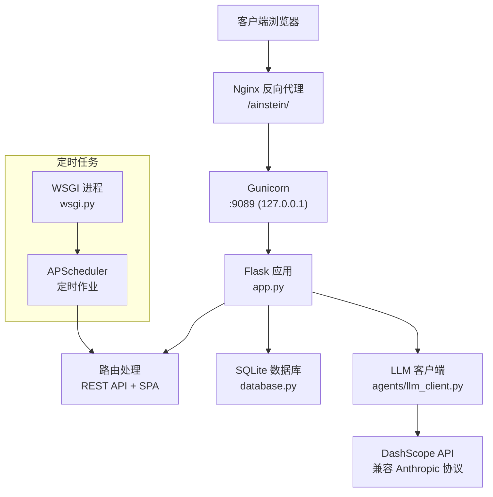
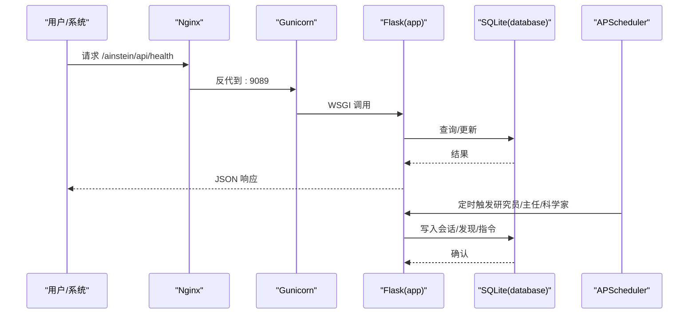
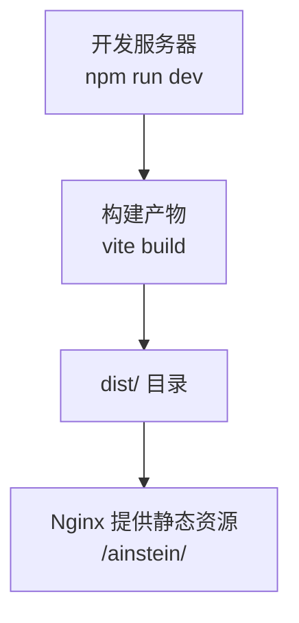
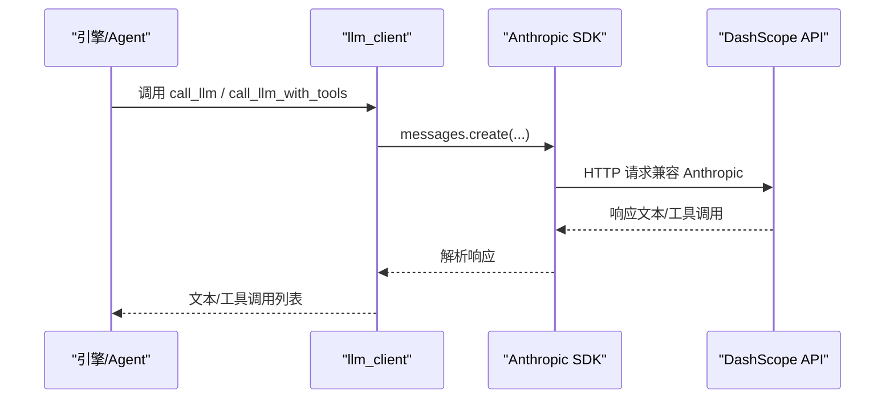
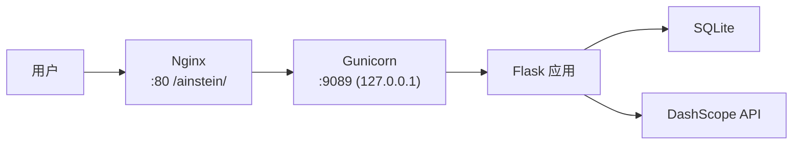
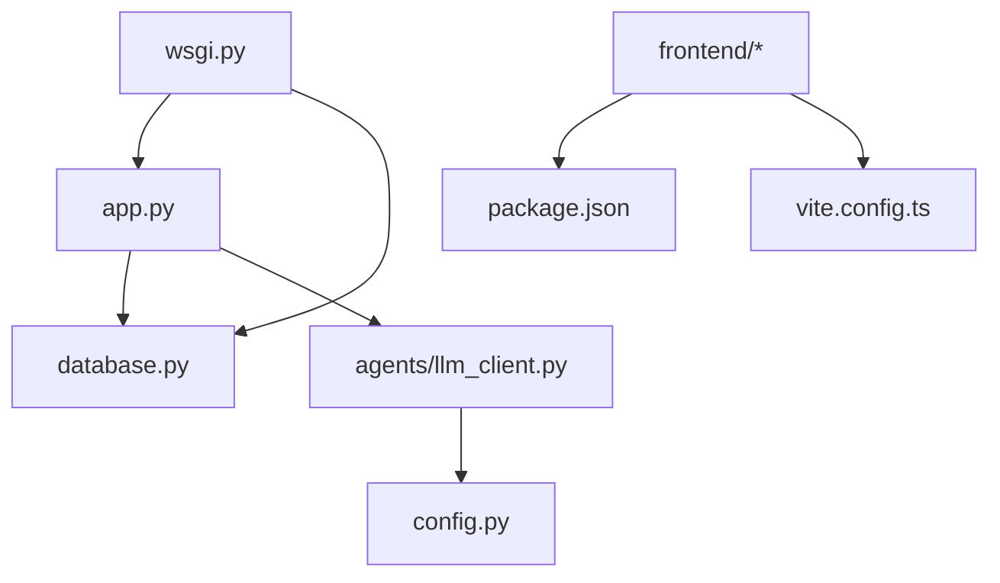

# 技术栈

<cite>
**本文引用的文件**
- [app.py](file://app.py)
- [wsgi.py](file://wsgi.py)
- [config.py](file://config.py)
- [database.py](file://database.py)
- [frontend/package.json](file://frontend/package.json)
- [frontend/vite.config.ts](file://frontend/vite.config.ts)
- [agents/llm_client.py](file://agents/llm_client.py)
- [engines/base.py](file://engines/base.py)
- [engines/three_round.py](file://engines/three_round.py)
- [agents/researcher.py](file://agents/researcher.py)
- [agents/scientist.py](file://agents/scientist.py)
- [tools/data_access.py](file://tools/data_access.py)
- [tools/web_data.py](file://tools/web_data.py)
- [README.md](file://README.md)
- [docs/ops-manual.md](file://docs/ops-manual.md)
</cite>

## 目录
1. [简介](#简介)
2. [项目结构](#项目结构)
3. [核心组件](#核心组件)
4. [架构总览](#架构总览)
5. [详细组件分析](#详细组件分析)
6. [依赖关系分析](#依赖关系分析)
7. [性能考虑](#性能考虑)
8. [故障排查指南](#故障排查指南)
9. [结论](#结论)
10. [附录](#附录)

## 简介
本文件系统化梳理 AInstein 的技术栈与选型理由，覆盖后端（Flask + Gunicorn + SQLite + APScheduler）、前端（React + TypeScript + Vite）、AI 集成（DashScope + Anthropic 协议兼容）、以及部署（Nginx + systemd）。同时给出版本兼容性建议与运维要点，帮助读者快速理解并稳定运行该平台。

## 项目结构
AInstein 采用“后端 API + 前端静态资源 + AI 引擎与工具”的分层组织方式：
- 后端入口与路由：Flask 应用负责 API 与静态资源托管
- WSGI 与调度：Gunicorn 作为 WSGI 服务器，APScheduler 在进程内运行定时任务
- 数据层：SQLite 存储项目、会话、发现、数据集等元数据
- 前端：React + TypeScript + Vite 构建，输出静态资源供 Nginx 提供
- AI 集成：DashScope（兼容 Anthropic 协议）提供大模型推理能力
- 部署：systemd 管理服务生命周期，Nginx 提供反向代理与静态资源服务

图表来源
- [app.py:1-182](file://app.py#L1-L182)
- [wsgi.py:1-83](file://wsgi.py#L1-L83)
- [database.py:1-344](file://database.py#L1-L344)
- [frontend/package.json:1-24](file://frontend/package.json#L1-L24)
- [frontend/vite.config.ts:1-12](file://frontend/vite.config.ts#L1-L12)
- [agents/llm_client.py:1-114](file://agents/llm_client.py#L1-L114)
- [engines/base.py:1-49](file://engines/base.py#L1-L49)
- [engines/three_round.py:1-179](file://engines/three_round.py#L1-L179)
- [agents/researcher.py:1-114](file://agents/researcher.py#L1-L114)
- [agents/scientist.py:1-75](file://agents/scientist.py#L1-L75)
- [tools/data_access.py:1-43](file://tools/data_access.py#L1-L43)
- [tools/web_data.py:1-164](file://tools/web_data.py#L1-L164)

章节来源
- [README.md:71-124](file://README.md#L71-L124)

## 核心组件
- 后端 Web 框架：Flask 提供路由、静态资源托管与 API 接口
- WSGI 服务器：Gunicorn 以多进程方式承载 Flask 应用
- 数据库：SQLite（WAL 模式 + 外键约束），配合索引提升查询效率
- 定时任务：APScheduler 在 WSGI 进程中按 UTC 时间表执行
- 前端：React + TypeScript + Vite，构建产物置于 frontend/dist 并由 Nginx 提供
- AI 集成：DashScope（兼容 Anthropic 协议）作为 LLM 服务，支持工具调用
- 部署：systemd 管理服务，Nginx 提供反向代理与静态资源缓存

章节来源
- [app.py:1-182](file://app.py#L1-L182)
- [wsgi.py:1-83](file://wsgi.py#L1-L83)
- [database.py:1-344](file://database.py#L1-L344)
- [frontend/package.json:1-24](file://frontend/package.json#L1-L24)
- [frontend/vite.config.ts:1-12](file://frontend/vite.config.ts#L1-L12)
- [agents/llm_client.py:1-114](file://agents/llm_client.py#L1-L114)
- [README.md:85-92](file://README.md#L85-L92)

## 架构总览
下图展示请求从 Nginx 到后端、再到 AI 与数据库的整体流程：

图表来源
- [docs/ops-manual.md:37-47](file://docs/ops-manual.md#L37-L47)
- [wsgi.py:27-71](file://wsgi.py#L27-L71)
- [app.py:43-177](file://app.py#L43-L177)
- [database.py:101-123](file://database.py#L101-L123)
- [agents/llm_client.py:14-44](file://agents/llm_client.py#L14-L44)

## 详细组件分析

### 后端：Flask + Gunicorn + SQLite + APScheduler
- Flask 路由与静态资源
  - 提供健康检查、项目/会话/发现/数据集等 API
  - 将前端构建产物作为静态资源托管于 /ainstein/static
- Gunicorn WSGI
  - 生产模式以多进程方式启动，超时设置合理，便于长时间推理
- SQLite 数据层
  - WAL 模式提升并发读写；外键约束保证参照完整性
  - 为高频查询建立索引，降低延迟
- APScheduler 定时任务
  - 每日 03:30 UTC 运行研究员；每日 10:00 UTC 运行主任；每周一 06:00 UTC 运行科学家
  - 使用文件锁避免多实例重复调度

图表来源
- [docs/ops-manual.md:37-47](file://docs/ops-manual.md#L37-L47)
- [wsgi.py:27-71](file://wsgi.py#L27-L71)
- [app.py:43-177](file://app.py#L43-L177)
- [database.py:101-123](file://database.py#L101-L123)

章节来源
- [app.py:15-182](file://app.py#L15-L182)
- [wsgi.py:13-83](file://wsgi.py#L13-L83)
- [database.py:10-98](file://database.py#L10-L98)
- [README.md:85-92](file://README.md#L85-L92)

### 前端：React + TypeScript + Vite
- 依赖与脚本
  - React 18.3.x、React DOM 18.3.x、React Router 6.x
  - Vite 5.x、TypeScript 5.x、@vitejs/plugin-react
- 构建与部署
  - 基础路径 /ainstein/，输出至 dist/assets
  - Nginx 直接提供静态资源，index.html 设置 no-cache，assets 带哈希可缓存

图表来源
- [frontend/package.json:6-10](file://frontend/package.json#L6-L10)
- [frontend/vite.config.ts:4-11](file://frontend/vite.config.ts#L4-L11)

章节来源
- [frontend/package.json:1-24](file://frontend/package.json#L1-L24)
- [frontend/vite.config.ts:1-12](file://frontend/vite.config.ts#L1-L12)
- [docs/ops-manual.md:165-195](file://docs/ops-manual.md#L165-L195)

### AI 集成：DashScope + Anthropic 协议兼容
- LLM 客户端
  - 通过 anthropic SDK 调用 DashScope 的 Anthropic 兼容接口
  - 支持普通对话与工具调用两种模式，自动提取 JSON
- 模型选择
  - 默认模型为 kimik2.6，可通过环境变量配置
- 使用场景
  - 科学家生成战略指令与初始主题
  - 研究员三轮引擎中的假设生成、工具检验与验证总结

图表来源
- [agents/llm_client.py:24-71](file://agents/llm_client.py#L24-L71)
- [agents/scientist.py:47](file://agents/scientist.py#L47)
- [engines/three_round.py:66-177](file://engines/three_round.py#L66-L177)

章节来源
- [agents/llm_client.py:1-114](file://agents/llm_client.py#L1-L114)
- [config.py:6-10](file://config.py#L6-L10)
- [agents/scientist.py:14-75](file://agents/scientist.py#L14-L75)
- [engines/three_round.py:22-179](file://engines/three_round.py#L22-L179)

### 部署：Nginx + systemd
- systemd 服务
  - 自动启动/停止/重启，开机自启；日志通过 journalctl 跟踪
- Nginx 反向代理
  - 将 /ainstein/ 映射到前端 dist 目录；静态资源设置长缓存
- 端口与安全
  - Gunicorn 监听 127.0.0.1:9089；Nginx 对外暴露 80
  - 安全组限制仅开放 80，9089 仅本地访问

图表来源
- [docs/ops-manual.md:37-47](file://docs/ops-manual.md#L37-L47)
- [docs/ops-manual.md:445-452](file://docs/ops-manual.md#L445-L452)

章节来源
- [docs/ops-manual.md:1-514](file://docs/ops-manual.md#L1-L514)
- [README.md:61-70](file://README.md#L61-L70)

## 依赖关系分析
- 组件耦合
  - Flask 路由依赖 database.py 进行数据持久化
  - Agent 与引擎通过 LLM 客户端调用 DashScope
  - Vite 构建产物直接由 Nginx 提供，前后端解耦
- 外部依赖
  - anthropic SDK、pandas、requests 等第三方库
- 版本与兼容性
  - Python 3.10+、Node.js 18+、React 18.3.x、Vite 5.x、TypeScript 5.x

图表来源
- [app.py:1-182](file://app.py#L1-L182)
- [wsgi.py:1-83](file://wsgi.py#L1-L83)
- [database.py:1-344](file://database.py#L1-L344)
- [frontend/package.json:1-24](file://frontend/package.json#L1-L24)
- [frontend/vite.config.ts:1-12](file://frontend/vite.config.ts#L1-L12)
- [agents/llm_client.py:1-114](file://agents/llm_client.py#L1-L114)
- [config.py:1-11](file://config.py#L1-L11)

章节来源
- [README.md:17-24](file://README.md#L17-L24)
- [frontend/package.json:11-22](file://frontend/package.json#L11-L22)

## 性能考虑
- Gunicorn 工作进程数
  - 当前 2 个工作进程，适合低内存云服务器；可根据 CPU 核心数调整
- SQLite 优化
  - 已启用 WAL 模式与外键；可按需增加缓存与同步策略
- 前端缓存
  - assets 带哈希，静态资源设置长缓存；index.html no-cache 确保热更新
- LLM 调用
  - 合理设置温度与最大令牌；对工具调用进行批处理与去重

章节来源
- [docs/ops-manual.md:409-424](file://docs/ops-manual.md#L409-L424)
- [docs/ops-manual.md:425-440](file://docs/ops-manual.md#L425-L440)
- [docs/ops-manual.md:441-452](file://docs/ops-manual.md#L441-L452)

## 故障排查指南
- 服务无法启动
  - 检查端口占用、依赖安装、文件权限；systemd 日志定位错误
- LLM 调用失败
  - 核对 API Key、网络连通性；手动测试 LLM 客户端
- 调度器不执行
  - 检查调度器日志与锁文件；必要时重启服务或手动触发
- 前端 404
  - 确认 dist 目录存在；检查 Nginx 配置；重新构建并重载
- 数据集上传失败
  - 检查文件存在与编码；手动解析验证

章节来源
- [docs/ops-manual.md:249-367](file://docs/ops-manual.md#L249-L367)

## 结论
AInstein 采用轻量而稳健的技术栈：Flask + Gunicorn + SQLite + APScheduler 构成后端骨架，React + Vite 提供现代前端体验，DashScope（兼容 Anthropic 协议）支撑 AI 能力，Nginx + systemd 实现稳定部署。整体方案易于上手、便于维护，并具备良好的扩展性（如数据库迁移、分布式调度等）。

## 附录
- 版本与兼容性摘要
  - Python：3.10+
  - Node.js：18+
  - React：18.3.x
  - Vite：5.x
  - TypeScript：5.x
- 关键环境变量
  - DASHSCOPE_API_KEY、DASHSCOPE_BASE_URL、RESEARCH_MODEL、SCIENTIST_MODEL、DIRECTOR_MODEL
- 部署路径与端口
  - /opt/ainstein/ 应用根目录
  - 9089：Gunicorn（本地）
  - 80：Nginx（对外）

章节来源
- [README.md:17-24](file://README.md#L17-L24)
- [config.py:4-10](file://config.py#L4-L10)
- [docs/ops-manual.md:12-47](file://docs/ops-manual.md#L12-L47)