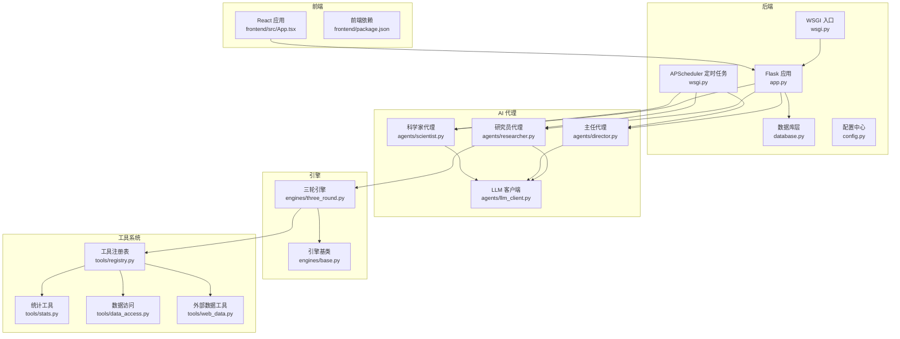
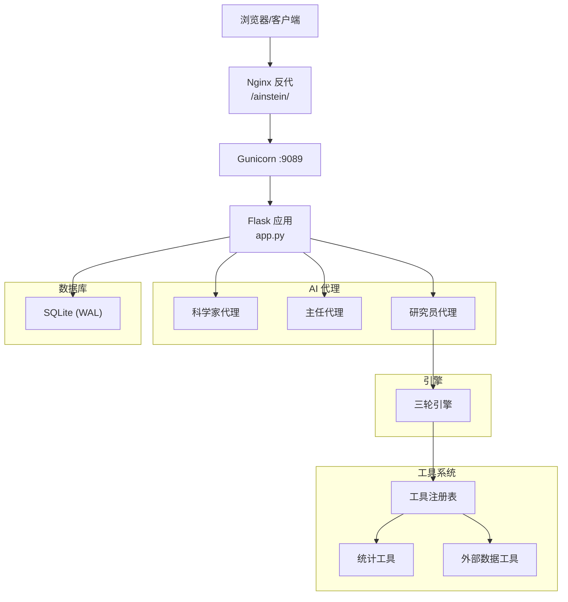
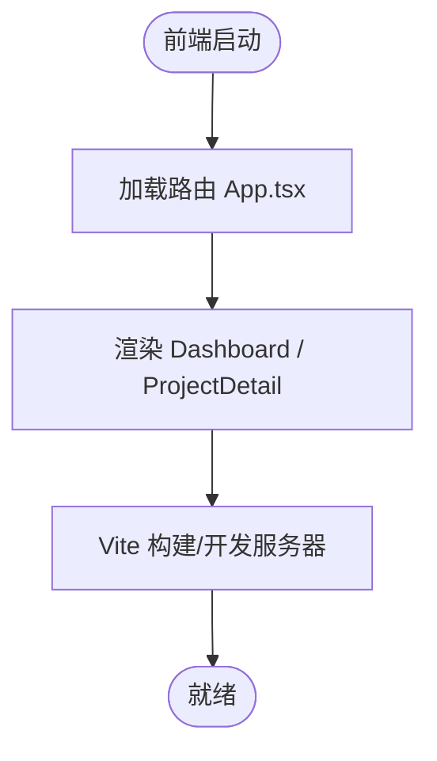
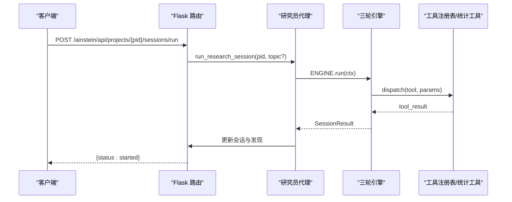
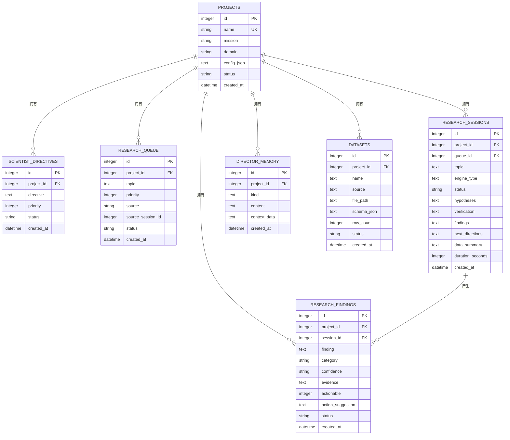
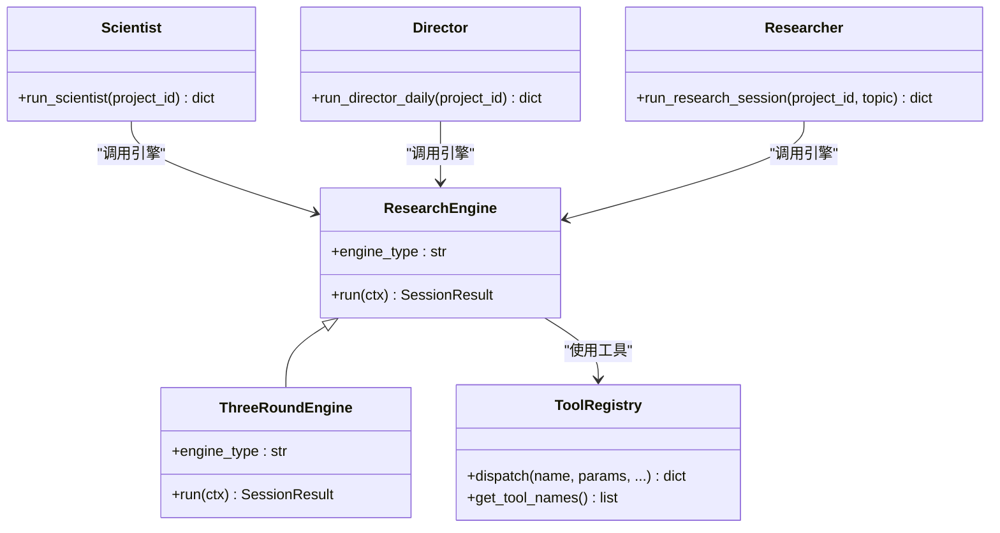
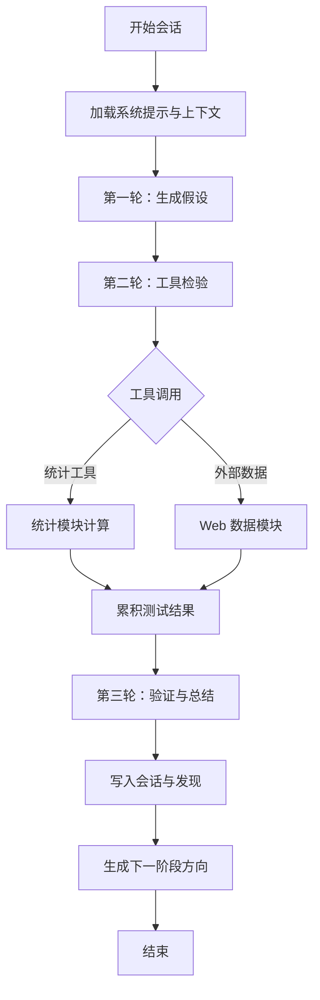
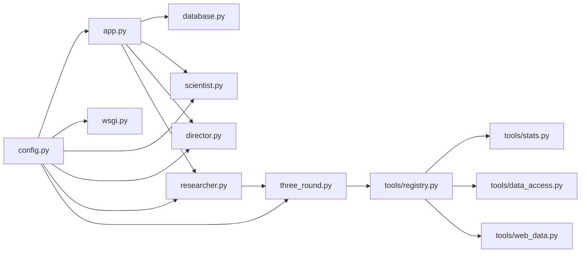

# 架构概览

<cite>
**本文引用的文件**
- [README.md](file://README.md)
- [app.py](file://app.py)
- [wsgi.py](file://wsgi.py)
- [database.py](file://database.py)
- [config.py](file://config.py)
- [scientist.py](file://agents/scientist.py)
- [director.py](file://agents/director.py)
- [researcher.py](file://agents/researcher.py)
- [llm_client.py](file://agents/llm_client.py)
- [base.py](file://engines/base.py)
- [three_round.py](file://engines/three_round.py)
- [registry.py](file://tools/registry.py)
- [stats.py](file://tools/stats.py)
- [data_access.py](file://tools/data_access.py)
- [web_data.py](file://tools/web_data.py)
- [App.tsx](file://frontend/src/App.tsx)
- [package.json](file://frontend/package.json)
</cite>

## 目录
1. [简介](#简介)
2. [项目结构](#项目结构)
3. [核心组件](#核心组件)
4. [架构总览](#架构总览)
5. [详细组件分析](#详细组件分析)
6. [依赖关系分析](#依赖关系分析)
7. [性能考虑](#性能考虑)
8. [故障排除指南](#故障排除指南)
9. [结论](#结论)
10. [附录](#附录)

## 简介
AInstein 是一个通用的 AI 深度研究平台，采用前后端分离的三层架构：前端 React 应用、后端 Flask API、SQLite 数据库层。系统通过三级 AI 代理（科学家、主任、研究员）协同工作，围绕“三轮研究引擎”进行自动化深度研究，支持多种统计与外部数据工具，持续积累知识库。

技术选型原因：
- 前端：React + Vite + TypeScript，现代化开发体验与类型安全。
- 后端：Flask + Gunicorn，轻量易部署；APScheduler 实现定时任务。
- 数据库：SQLite（WAL 模式），满足中小规模数据持久化与高并发读取。
- LLM：DashScope（兼容 Anthropic 协议），默认 Kimi-K2.6，便于多模型切换。
- 部署：Nginx + systemd，生产级反向代理与进程管理。

## 项目结构
项目采用按功能域划分的目录组织方式，清晰分离后端 API、AI 代理、引擎与工具系统，并包含前端 React 应用与文档。

图表来源
- [app.py:1-182](file://app.py#L1-L182)
- [wsgi.py:1-83](file://wsgi.py#L1-L83)
- [database.py:1-344](file://database.py#L1-L344)
- [config.py:1-11](file://config.py#L1-L11)
- [scientist.py:1-75](file://agents/scientist.py#L1-L75)
- [director.py:1-124](file://agents/director.py#L1-L124)
- [researcher.py:1-114](file://agents/researcher.py#L1-L114)
- [base.py:1-49](file://engines/base.py#L1-L49)
- [three_round.py:1-179](file://engines/three_round.py#L1-L179)
- [registry.py:1-181](file://tools/registry.py#L1-L181)
- [stats.py:1-120](file://tools/stats.py#L1-L120)
- [data_access.py:1-43](file://tools/data_access.py#L1-L43)
- [App.tsx:1-13](file://frontend/src/App.tsx#L1-L13)
- [package.json:1-24](file://frontend/package.json#L1-L24)

章节来源
- [README.md:71-124](file://README.md#L71-L124)
- [app.py:11-182](file://app.py#L11-L182)
- [wsgi.py:27-83](file://wsgi.py#L27-L83)
- [database.py:10-98](file://database.py#L10-L98)
- [config.py:4-11](file://config.py#L4-L11)
- [scientist.py:14-75](file://agents/scientist.py#L14-L75)
- [director.py:14-124](file://agents/director.py#L14-L124)
- [researcher.py:14-114](file://agents/researcher.py#L14-L114)
- [base.py:11-49](file://engines/base.py#L11-L49)
- [three_round.py:22-179](file://engines/three_round.py#L22-L179)
- [registry.py:24-181](file://tools/registry.py#L24-L181)
- [stats.py:10-120](file://tools/stats.py#L10-L120)
- [data_access.py:10-43](file://tools/data_access.py#L10-L43)
- [App.tsx:1-13](file://frontend/src/App.tsx#L1-L13)
- [package.json:1-24](file://frontend/package.json#L1-L24)

## 核心组件
- 前端 React 应用：提供仪表盘与项目详情页面，路由基于 react-router-dom。
- Flask API：统一的 REST 接口，负责项目、会话、队列、发现、数据集等资源管理。
- 数据库层：SQLite（WAL 模式），定义项目、指令、队列、会话、发现、记忆、数据集等表及索引。
- AI 代理系统：科学家（制定战略）、主任（每日审核与记忆）、研究员（三轮引擎执行）。
- 研究引擎：三轮引擎（假设生成 → 工具检验 → 验证总结），可扩展为多引擎。
- 工具系统：内置统计工具与外部数据工具，通过注册表统一调度。

章节来源
- [app.py:48-177](file://app.py#L48-L177)
- [database.py:10-98](file://database.py#L10-L98)
- [scientist.py:14-75](file://agents/scientist.py#L14-L75)
- [director.py:14-124](file://agents/director.py#L14-L124)
- [researcher.py:14-114](file://agents/researcher.py#L14-L114)
- [three_round.py:22-179](file://engines/three_round.py#L22-L179)
- [registry.py:24-181](file://tools/registry.py#L24-L181)

## 架构总览
系统采用前后端分离的三层架构，后端以 Flask 承载 API，Gunicorn 提供生产级 WSGI 服务，APScheduler 在单实例中协调定时任务。数据库层使用 SQLite 并启用 WAL 模式提升并发读写性能。AI 代理通过 LLM 客户端与研究引擎协作，工具系统提供统计与外部数据能力。

图表来源
- [README.md:71-83](file://README.md#L71-L83)
- [wsgi.py:27-83](file://wsgi.py#L27-L83)
- [app.py:1-182](file://app.py#L1-L182)
- [database.py:101-123](file://database.py#L101-L123)
- [scientist.py:14-75](file://agents/scientist.py#L14-L75)
- [director.py:14-124](file://agents/director.py#L14-L124)
- [researcher.py:14-114](file://agents/researcher.py#L14-L114)
- [three_round.py:22-179](file://engines/three_round.py#L22-L179)
- [registry.py:24-181](file://tools/registry.py#L24-L181)

## 详细组件分析

### 前端组件分析
- 路由与页面：App 使用 react-router-dom 管理路由，提供仪表盘与项目详情页面。
- 依赖与构建：使用 Vite + TypeScript，开发与生产构建脚本明确。

图表来源
- [App.tsx:1-13](file://frontend/src/App.tsx#L1-L13)
- [package.json:6-10](file://frontend/package.json#L6-L10)

章节来源
- [App.tsx:1-13](file://frontend/src/App.tsx#L1-L13)
- [package.json:1-24](file://frontend/package.json#L1-L24)

### 后端 API 组件分析
- 前端静态资源托管：支持 SPA 路由回退到 index.html。
- 健康检查接口：/ainstein/api/health。
- 项目管理：增删查改、统计信息。
- 队列管理：添加/查询研究主题，优先级与来源管理。
- 会话管理：创建/查询研究会话，触发一次性研究会话。
- 发现管理：查询发现，支持状态与分类过滤。
- 数据集管理：上传 CSV/JSON/XLSX，解析模式与行数，入库记录。
- 科学家/主任：触发科学家与主任的运行任务。

图表来源
- [app.py:95-104](file://app.py#L95-L104)
- [researcher.py:14-114](file://agents/researcher.py#L14-L114)
- [three_round.py:28-179](file://engines/three_round.py#L28-L179)
- [registry.py:24-43](file://tools/registry.py#L24-L43)

章节来源
- [app.py:24-177](file://app.py#L24-L177)

### 数据库层组件分析
- 表结构：projects、scientist_directives、research_queue、research_sessions、research_findings、director_memory、datasets。
- 索引：为高频查询字段建立索引，优化读取性能。
- 事务：上下文管理器封装连接与提交/回滚，确保一致性。
- 功能：项目 CRUD、队列调度、会话生命周期、发现管理、记忆存储、数据集元数据。

图表来源
- [database.py:10-98](file://database.py#L10-L98)

章节来源
- [database.py:101-344](file://database.py#L101-L344)

### AI 代理系统架构
- 科学家：根据项目使命与领域，结合数据集摘要，生成初始指令与研究主题，写入队列与记忆。
- 主任：每日审查最近会话、开放发现、队列与记忆，进行验证/拒绝、新增主题与记忆条目。
- 研究员：从队列挑选主题，构造上下文，调用引擎执行，持久化会话与发现，生成下一阶段方向。

图表来源
- [scientist.py:14-75](file://agents/scientist.py#L14-L75)
- [director.py:14-124](file://agents/director.py#L14-L124)
- [researcher.py:14-114](file://agents/researcher.py#L14-L114)
- [base.py:38-49](file://engines/base.py#L38-L49)
- [three_round.py:22-179](file://engines/three_round.py#L22-L179)
- [registry.py:24-181](file://tools/registry.py#L24-L181)

章节来源
- [scientist.py:14-75](file://agents/scientist.py#L14-L75)
- [director.py:14-124](file://agents/director.py#L14-L124)
- [researcher.py:14-114](file://agents/researcher.py#L14-L114)
- [base.py:11-49](file://engines/base.py#L11-L49)
- [three_round.py:22-179](file://engines/three_round.py#L22-L179)
- [registry.py:24-181](file://tools/registry.py#L24-L181)

### 研究引擎与工具系统
- 三轮引擎：第一轮生成假设，第二轮使用工具进行检验，第三轮汇总验证与结论。
- 工具注册表：集中管理工具函数、输入模式与 LLM 工具定义，支持统计与外部数据工具。
- 统计工具：描述性统计、相关性、t 检验、回归、异常检测、分布拟合、分组统计。
- 数据访问：按项目目录加载 CSV/JSON/XLSX 文件，生成数据集摘要供 LLM 使用。

图表来源
- [three_round.py:28-179](file://engines/three_round.py#L28-L179)
- [registry.py:24-181](file://tools/registry.py#L24-L181)
- [stats.py:10-120](file://tools/stats.py#L10-L120)
- [data_access.py:10-43](file://tools/data_access.py#L10-L43)

章节来源
- [three_round.py:16-179](file://engines/three_round.py#L16-L179)
- [registry.py:57-181](file://tools/registry.py#L57-L181)
- [stats.py:10-120](file://tools/stats.py#L10-L120)
- [data_access.py:10-43](file://tools/data_access.py#L10-L43)

## 依赖关系分析
- 组件耦合：后端 API 与数据库层强耦合；AI 代理与引擎/工具弱耦合，通过 LLM 客户端与注册表解耦。
- 外部依赖：Flask、Gunicorn、APScheduler、SQLite、pandas/numpy/scipy、DashScope API。
- 配置依赖：通过 config.py 读取环境变量，集中管理数据库路径、数据目录与模型名称。

图表来源
- [config.py:4-11](file://config.py#L4-L11)
- [app.py:1-182](file://app.py#L1-L182)
- [wsgi.py:1-83](file://wsgi.py#L1-L83)
- [scientist.py:1-75](file://agents/scientist.py#L1-L75)
- [director.py:1-124](file://agents/director.py#L1-L124)
- [researcher.py:1-114](file://agents/researcher.py#L1-L114)
- [three_round.py:1-179](file://engines/three_round.py#L1-L179)
- [registry.py:1-181](file://tools/registry.py#L1-L181)
- [stats.py:1-120](file://tools/stats.py#L1-L120)
- [data_access.py:1-43](file://tools/data_access.py#L1-L43)

章节来源
- [config.py:4-11](file://config.py#L4-L11)
- [app.py:1-182](file://app.py#L1-L182)
- [wsgi.py:1-83](file://wsgi.py#L1-L83)
- [database.py:101-344](file://database.py#L101-L344)

## 性能考虑
- 数据库：启用 WAL 模式与外键约束，合理索引覆盖高频查询字段，减少锁竞争。
- 引擎：限制工具调用轮次与消息长度，避免长对话导致延迟；对统计工具输入进行数据校验。
- API：异步线程触发一次性研究会话，避免阻塞请求；批量查询时使用分页与索引。
- 前端：构建产物放置在 dist 目录，配合 Nginx 反代，减少后端压力。

## 故障排除指南
- 健康检查：访问 /ainstein/api/health 确认服务可用。
- 日志定位：后端使用标准日志格式，错误堆栈与关键事件均有记录。
- 数据库初始化：首次启动需初始化数据库，确认 DB_PATH 权限与目录存在。
- 定时任务：确认锁文件 /tmp/ainstein-scheduler.lock 仅被一个实例持有，避免重复执行。
- LLM 调用：检查 DASHSCOPE_API_KEY 与 BASE_URL，确保模型名称正确。

章节来源
- [app.py:43-46](file://app.py#L43-L46)
- [wsgi.py:13-25](file://wsgi.py#L13-L25)
- [database.py:101-106](file://database.py#L101-L106)
- [config.py:6-11](file://config.py#L6-L11)

## 结论
AInstein 通过清晰的三层架构与三级 AI 代理协作，实现了数据驱动的自动化深度研究。三轮引擎与工具系统的结合，使得研究过程可解释、可追踪且可扩展。SQLite 的轻量部署与 Gunicorn/APScheduler 的稳定组合，满足中小型场景的性能与可靠性需求。前端 React 应用提供直观的可视化界面，配合后端 API 形成完整的研发闭环。

## 附录
- 目录结构参考：README.md 中的目录结构与技术栈说明。
- 部署建议：Nginx 反代 + systemd 管理，生产环境使用 Gunicorn 多进程与超时配置。

章节来源
- [README.md:94-124](file://README.md#L94-L124)
- [README.md:85-93](file://README.md#L85-L93)