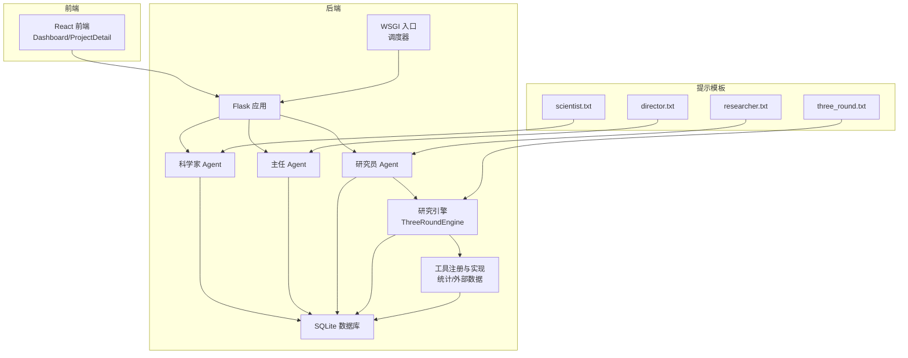
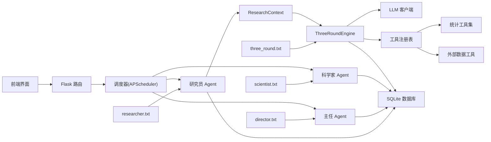
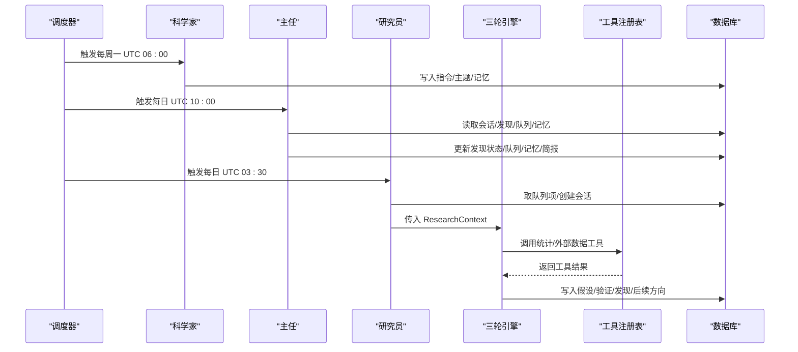
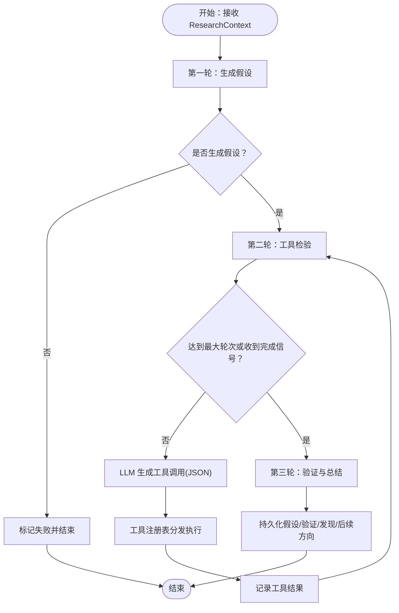
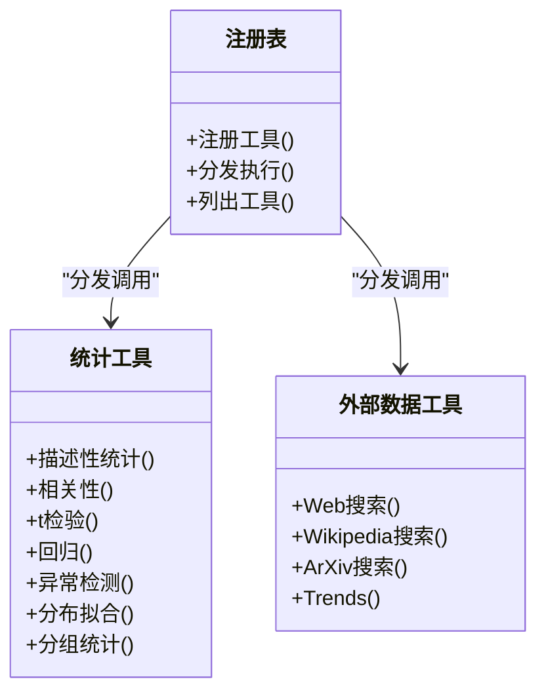
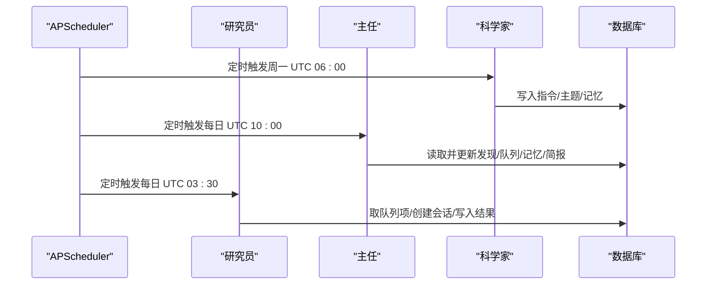
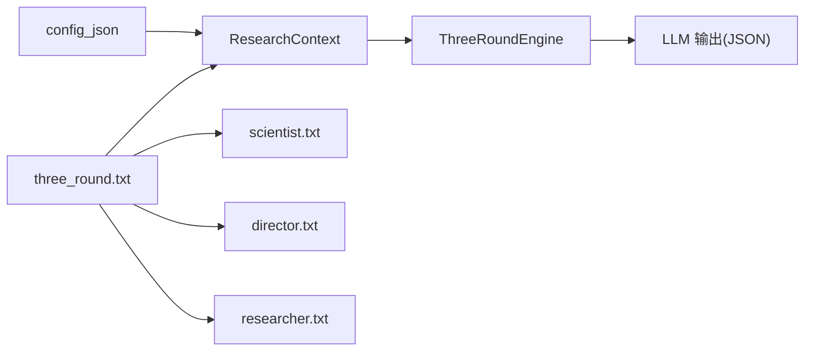
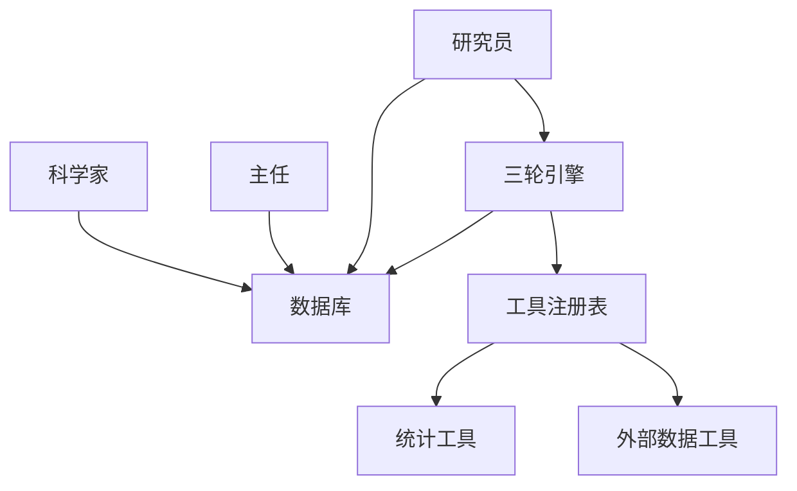

# 核心特性

<cite>
**本文引用的文件**
- [README.md](file://README.md)
- [config.py](file://config.py)
- [database.py](file://database.py)
- [agents/scientist.py](file://agents/scientist.py)
- [agents/director.py](file://agents/director.py)
- [agents/researcher.py](file://agents/researcher.py)
- [engines/base.py](file://engines/base.py)
- [engines/three_round.py](file://engines/three_round.py)
- [tools/registry.py](file://tools/registry.py)
- [tools/stats.py](file://tools/stats.py)
- [tools/web_data.py](file://tools/web_data.py)
- [prompts/scientist.txt](file://prompts/scientist.txt)
- [prompts/director.txt](file://prompts/director.txt)
- [prompts/researcher.txt](file://prompts/researcher.txt)
- [prompts/three_round.txt](file://prompts/three_round.txt)
</cite>

## 目录
1. [简介](#简介)
2. [项目结构](#项目结构)
3. [核心组件](#核心组件)
4. [架构总览](#架构总览)
5. [详细组件分析](#详细组件分析)
6. [依赖关系分析](#依赖关系分析)
7. [性能与可扩展性](#性能与可扩展性)
8. [故障排查指南](#故障排查指南)
9. [结论](#结论)
10. [附录](#附录)

## 简介
本文件系统化阐述 AInstein 的核心特性与实现方式，围绕“三级 AI 团队协作机制”“三轮研究引擎”“统计与外部数据工具”“自动化调度与知识库积累”“领域无关性与配置-提示模板设计”展开，辅以关键流程图与时序图，帮助读者快速理解并高效使用该平台。

## 项目结构
AInstein 采用前后端分离、后端以 Flask + Gunicorn + SQLite + APScheduler 为核心的架构，Agent 层负责角色编排，Engine 层负责研究流程，Tools 层提供统计与外部数据能力，Prompts 层通过模板变量实现领域无关性。

图表来源
- [README.md:71-92](file://README.md#L71-L92)
- [agents/scientist.py:14-75](file://agents/scientist.py#L14-L75)
- [agents/director.py:14-124](file://agents/director.py#L14-L124)
- [agents/researcher.py:14-114](file://agents/researcher.py#L14-L114)
- [engines/three_round.py:22-179](file://engines/three_round.py#L22-L179)
- [tools/registry.py:24-181](file://tools/registry.py#L24-L181)
- [database.py:100-344](file://database.py#L100-L344)
- [prompts/scientist.txt:1-32](file://prompts/scientist.txt#L1-L32)
- [prompts/director.txt:1-43](file://prompts/director.txt#L1-L43)
- [prompts/researcher.txt:1-14](file://prompts/researcher.txt#L1-L14)
- [prompts/three_round.txt:1-15](file://prompts/three_round.txt#L1-L15)

章节来源
- [README.md:71-124](file://README.md#L71-L124)

## 核心组件
- 三级 AI 团队
  - 科学家：制定战略、播种初始主题、定义发现分类与总体策略
  - 主任：每日复盘、质量把关、队列治理、记忆沉淀、撰写简报
  - 研究员：按主题执行三轮研究、产出发现与后续方向
- 三轮研究引擎
  - 假设生成：生成可检验的假设与测试计划
  - 工具检验：在限定回合内调用统计/外部数据工具进行实证
  - 验证总结：综合证据形成结论、发现、建议与数据摘要
- 统计与外部数据工具
  - 统计工具：描述性统计、相关性、t 检验、回归、异常检测、分布拟合、分组统计
  - 外部数据：Web Search、Wikipedia、arXiv、Google Trends
- 自动化调度与知识库
  - 调度：研究员每日 UTC 03:30、主任每日 UTC 10:00、科学家每周一 UTC 06:00
  - 知识库：Findings 与 Director Memory 持续积累洞察
- 领域无关性与提示模板
  - 通过 config_json + prompt 模板变量，实现跨领域研究

章节来源
- [README.md:7-15](file://README.md#L7-L15)
- [agents/scientist.py:14-75](file://agents/scientist.py#L14-L75)
- [agents/director.py:14-124](file://agents/director.py#L14-L124)
- [agents/researcher.py:14-114](file://agents/researcher.py#L14-L114)
- [engines/three_round.py:22-179](file://engines/three_round.py#L22-L179)
- [tools/registry.py:24-181](file://tools/registry.py#L24-L181)
- [tools/stats.py:10-120](file://tools/stats.py#L10-L120)
- [tools/web_data.py:13-164](file://tools/web_data.py#L13-L164)
- [prompts/scientist.txt:1-32](file://prompts/scientist.txt#L1-L32)
- [prompts/director.txt:1-43](file://prompts/director.txt#L1-L43)
- [prompts/researcher.txt:1-14](file://prompts/researcher.txt#L1-L14)
- [prompts/three_round.txt:1-15](file://prompts/three_round.txt#L1-L15)

## 架构总览
下图展示从前端到后端、再到 Agent/Engine/Tools 的完整链路，以及数据库与提示模板的作用点。

图表来源
- [README.md:71-92](file://README.md#L71-L92)
- [agents/scientist.py:28-44](file://agents/scientist.py#L28-L44)
- [agents/director.py:62-72](file://agents/director.py#L62-L72)
- [agents/researcher.py:41-50](file://agents/researcher.py#L41-L50)
- [engines/three_round.py:32-37](file://engines/three_round.py#L32-L37)
- [tools/registry.py:24-43](file://tools/registry.py#L24-L43)
- [database.py:100-344](file://database.py#L100-L344)
- [prompts/scientist.txt:1-32](file://prompts/scientist.txt#L1-L32)
- [prompts/director.txt:1-43](file://prompts/director.txt#L1-L43)
- [prompts/researcher.txt:1-14](file://prompts/researcher.txt#L1-L14)
- [prompts/three_round.txt:1-15](file://prompts/three_round.txt#L1-L15)

## 详细组件分析

### 三级 AI 团队协作机制
- 科学家（每周）
  - 输入：项目使命、领域、数据集概要
  - 输出：战略指令、初始主题、发现分类、总体策略笔记
  - 关键点：将使命拆解为可执行的指令与主题，定义领域相关的发现分类，沉淀到 Director Memory 作为后续上下文
- 主任（每日）
  - 输入：最近会话、开放发现、队列、记忆
  - 输出：发现审核（验证/拒绝/保留）、队列变更、新增主题、记忆条目、简报
  - 关键点：质量把关、队列治理、记忆沉淀、形成可读简报
- 研究员（每日）
  - 输入：队列中下一个主题（或指定主题），结合 config_json、近期发现、指令
  - 输出：会话状态、假设、验证过程、发现、后续方向、耗时
  - 关键点：严格遵循三轮流程，将发现持久化至数据库，向队列追加新方向

图表来源
- [agents/scientist.py:14-75](file://agents/scientist.py#L14-L75)
- [agents/director.py:14-124](file://agents/director.py#L14-L124)
- [agents/researcher.py:14-114](file://agents/researcher.py#L14-L114)
- [engines/three_round.py:28-179](file://engines/three_round.py#L28-L179)
- [tools/registry.py:24-43](file://tools/registry.py#L24-L43)
- [database.py:171-344](file://database.py#L171-L344)

章节来源
- [agents/scientist.py:14-75](file://agents/scientist.py#L14-L75)
- [agents/director.py:14-124](file://agents/director.py#L14-L124)
- [agents/researcher.py:14-114](file://agents/researcher.py#L14-L114)
- [README.md:13-14](file://README.md#L13-L14)

### 三轮研究引擎（假设生成 → 工具检验 → 验证总结）
- 假设生成（Round 1）
  - 基于主题与上下文（近期发现、指令），生成 2–4 个可检验假设及测试计划
- 工具检验（Round 2）
  - 在限定回合内，LLM 以“纯 JSON 工具调用”的形式驱动工具执行
  - 支持统计工具与外部数据工具，逐步累积证据
- 验证总结（Round 3）
  - 基于证据对假设给出判定（支持/反驳/不确定），提炼关键发现、建议方向与数据摘要

图表来源
- [engines/three_round.py:28-179](file://engines/three_round.py#L28-L179)
- [engines/base.py:11-49](file://engines/base.py#L11-L49)
- [tools/registry.py:24-43](file://tools/registry.py#L24-L43)

章节来源
- [engines/three_round.py:28-179](file://engines/three_round.py#L28-L179)
- [engines/base.py:11-49](file://engines/base.py#L11-L49)

### 统计工具与外部数据工具
- 统计工具（7 类）
  - 描述性统计、相关性（皮尔逊/斯皮尔曼）、t 检验、回归（多元线性回归）、异常检测（Z-Score/IQR）、分布拟合（Shapiro-Wilk）、分组统计
- 外部数据工具
  - Web Search（含维基百科回退）、Wikipedia 搜索、arXiv 学术搜索、Google Trends（兴趣曲线、趋势方向、相关查询）

图表来源
- [tools/registry.py:24-181](file://tools/registry.py#L24-L181)
- [tools/stats.py:10-120](file://tools/stats.py#L10-L120)
- [tools/web_data.py:13-164](file://tools/web_data.py#L13-L164)

章节来源
- [tools/registry.py:24-181](file://tools/registry.py#L24-L181)
- [tools/stats.py:10-120](file://tools/stats.py#L10-L120)
- [tools/web_data.py:13-164](file://tools/web_data.py#L13-L164)

### 自动化调度与知识库积累
- 调度
  - 研究员：每日 UTC 03:30
  - 主任：每日 UTC 10:00
  - 科学家：每周一 UTC 06:00
- 知识库
  - 发现（Findings）：结构化存储发现、置信度、证据、可操作性等
  - 主任记忆（Director Memory）：沉淀洞察、模式、决策与简报，作为后续上下文

图表来源
- [README.md:13](file://README.md#L13)
- [agents/scientist.py:54-66](file://agents/scientist.py#L54-L66)
- [agents/director.py:84-116](file://agents/director.py#L84-L116)
- [agents/researcher.py:82-101](file://agents/researcher.py#L82-L101)
- [database.py:171-344](file://database.py#L171-L344)

章节来源
- [README.md:13](file://README.md#L13)
- [database.py:171-344](file://database.py#L171-L344)

### 领域无关性与 config_json + 提示模板设计
- 领域无关性
  - 通过 config_json 传递项目特定配置（如任务参数、阈值、偏好），通过提示模板变量注入 mission/domain/datasets/tool 列表等上下文
- 设计要点
  - Prompt 模板集中于 prompts/*.txt，统一约束输出格式与语言
  - 三轮引擎在系统提示中注入 mission、domain、datasets_summary、可用工具列表
  - 科学家/主任/研究员分别有独立提示，确保角色边界清晰

图表来源
- [engines/three_round.py:32-37](file://engines/three_round.py#L32-L37)
- [prompts/three_round.txt:1-15](file://prompts/three_round.txt#L1-L15)
- [prompts/scientist.txt:1-32](file://prompts/scientist.txt#L1-L32)
- [prompts/director.txt:1-43](file://prompts/director.txt#L1-L43)
- [prompts/researcher.txt:1-14](file://prompts/researcher.txt#L1-L14)
- [engines/base.py:11-24](file://engines/base.py#L11-L24)

章节来源
- [engines/three_round.py:32-37](file://engines/three_round.py#L32-L37)
- [prompts/three_round.txt:1-15](file://prompts/three_round.txt#L1-L15)
- [engines/base.py:11-24](file://engines/base.py#L11-L24)

## 依赖关系分析
- 组件耦合
  - Agent 依赖数据库层进行读写；Engine 依赖 Tools 与 LLM 客户端；Tools 通过注册表解耦具体实现
- 外部依赖
  - LLM（DashScope/Anthropic 协议）、SQLite、第三方 Web API（DuckDuckGo、Wikipedia、arXiv、pytrends）
- 潜在循环依赖
  - 未见直接循环导入；Engine 与 Tools 通过注册表间接耦合，符合解耦设计

图表来源
- [agents/scientist.py:16-26](file://agents/scientist.py#L16-L26)
- [agents/director.py:24-27](file://agents/director.py#L24-L27)
- [agents/researcher.py:35-36](file://agents/researcher.py#L35-L36)
- [engines/three_round.py:126-128](file://engines/three_round.py#L126-L128)
- [tools/registry.py:24-43](file://tools/registry.py#L24-L43)
- [database.py:100-344](file://database.py#L100-L344)

章节来源
- [tools/registry.py:24-43](file://tools/registry.py#L24-L43)
- [database.py:100-344](file://database.py#L100-L344)

## 性能与可扩展性
- 性能特征
  - 三轮引擎限制工具调用轮次，避免长对话与昂贵计算；Round 3 解析失败时降级为 partial 状态，保证系统稳健
  - 统计工具对小样本进行错误提示，避免误导结论
- 可扩展性
  - 工具注册表支持新增工具，无需修改引擎逻辑
  - config_json 可承载领域参数，便于定制化
  - 数据库索引覆盖常用查询字段，提升读取效率

章节来源
- [engines/three_round.py:103-115](file://engines/three_round.py#L103-L115)
- [engines/three_round.py:172-175](file://engines/three_round.py#L172-L175)
- [tools/stats.py:24-25](file://tools/stats.py#L24-L25)
- [database.py:92-97](file://database.py#L92-L97)

## 故障排查指南
- 常见问题
  - LLM 输出非 JSON：三轮引擎在多处对 JSON 解析失败进行容错处理，必要时降级为 partial 或失败状态
  - 工具调用失败：工具注册表捕获异常并返回错误信息，检查工具参数与数据集是否存在
  - 数据不足：统计工具对样本量进行校验并返回错误提示
- 建议步骤
  - 检查数据库连接与 WAL 模式
  - 核对 config_json 与提示模板变量是否正确注入
  - 查看最近会话与发现状态，确认队列流转是否正常

章节来源
- [engines/three_round.py:109-111](file://engines/three_round.py#L109-L111)
- [engines/three_round.py:172-175](file://engines/three_round.py#L172-L175)
- [tools/registry.py:40-42](file://tools/registry.py#L40-L42)
- [tools/stats.py:24-25](file://tools/stats.py#L24-L25)
- [database.py:113-122](file://database.py#L113-L122)

## 结论
AInstein 通过“科学家-主任-研究员”的三级协作与“三轮研究引擎”，实现了从战略到执行再到质量把关的闭环；借助 7 种统计工具与外部数据工具，结合自动化调度与知识库积累，形成可持续的知识沉淀与迭代优化路径。领域无关性通过 config_json 与提示模板变量得以实现，既保证了灵活性，也确保了跨领域的可移植性。

## 附录
- 使用场景示例
  - 科学研究：科学家播种主题，主任每日复盘，研究员按主题进行相关性与回归分析，最终形成可操作的发现与后续方向
  - 商业分析：利用 Google Trends 与 Web Search 获取宏观背景，统计工具识别异常与分组差异，形成策略建议
  - 医学研究：t 检验与分组统计对比治疗组与对照组，分布拟合判断数据正态性，回归预测风险因素
- 实际效果
  - 通过队列与记忆机制，避免重复劳动，提高研究效率
  - 严格的三轮流程与质量把关，减少噪声发现，提升可信度
  - 可视化与报告（前端）辅助项目管理者跟踪进展与洞察