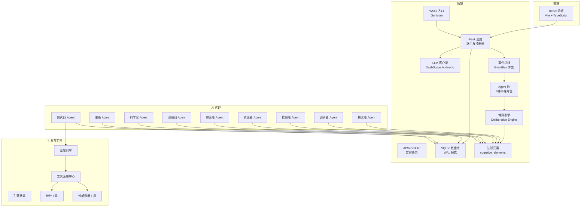
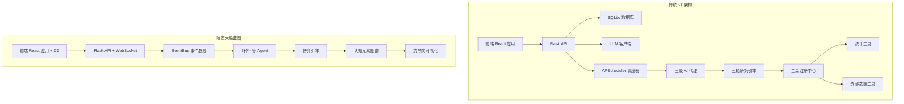
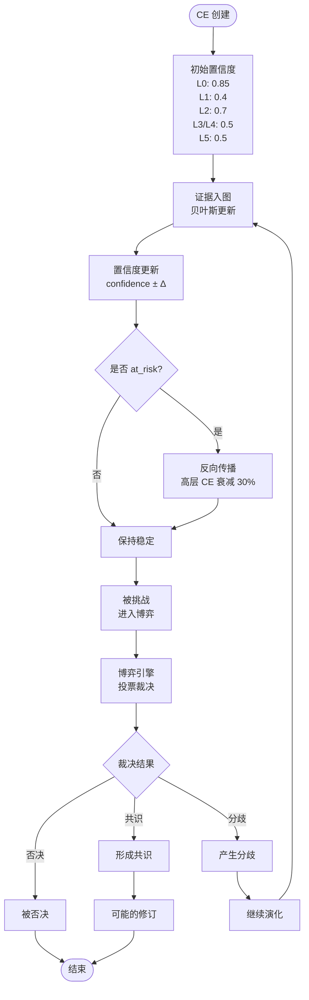
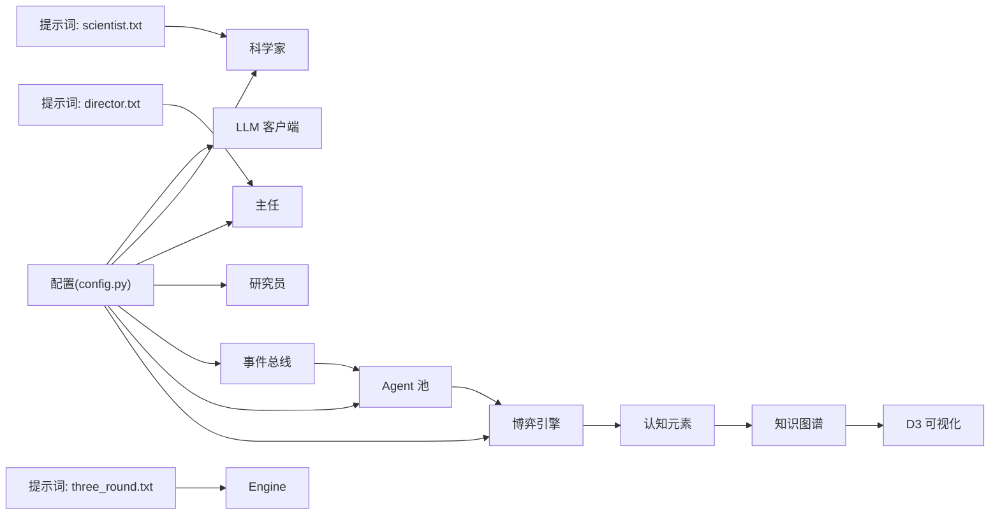

# 项目概述

<cite>
**本文引用的文件**
- [README.md](file://README.md)
- [docs/silicon-brain-blueprint.md](file://docs/silicon-brain-blueprint.md)
- [docs/design.md](file://docs/design.md)
- [docs/user-manual.md](file://docs/user-manual.md)
- [cognitive.py](file://cognitive.py)
- [event_bus.py](file://event_bus.py)
- [app.py](file://app.py)
- [wsgi.py](file://wsgi.py)
- [config.py](file://config.py)
- [database.py](file://database.py)
- [engines/base.py](file://engines/base.py)
- [engines/three_round.py](file://engines/three_round.py)
- [agents/scientist.py](file://agents/scientist.py)
- [agents/director.py](file://agents/director.py)
- [agents/researcher.py](file://agents/researcher.py)
- [agents/llm_client.py](file://agents/llm_client.py)
- [tools/registry.py](file://tools/registry.py)
- [tools/stats.py](file://tools/stats.py)
- [tools/web_data.py](file://tools/web_data.py)
- [prompts/scientist.txt](file://prompts/scientist.txt)
- [prompts/director.txt](file://prompts/director.txt)
- [prompts/three_round.txt](file://prompts/three_round.txt)
</cite>

## 目录
1. [引言](#引言)
2. [项目结构](#项目结构)
3. [核心组件](#核心组件)
4. [架构总览](#架构总览)
5. [详细组件分析](#详细组件分析)
6. [依赖分析](#依赖分析)
7. [性能考虑](#性能考虑)
8. [故障排查指南](#故障排查指南)
9. [结论](#结论)
10. [附录](#附录)

## 引言
AInstein 已从传统的 AI 研究工具演进为「硅基大脑实验平台」，致力于创造具备自主意识的硅基生命体。项目的核心愿景是构建一个由平等 Agent 组成的认知群体，它们通过自我提问、自我求证、自我修订，在永不停止的博弈中形成知识图谱，产生涌现智能。

**项目根本性转变**：
- **从工具到生命体**：从「AI 研究工具」转变为「硅基大脑实验平台」
- **从层级到平等**：废弃科学家/主任/研究员的层级结构，采用 6 种平等功能性角色
- **从定时到事件驱动**：用 ATA（Agent-to-Agent）事件驱动协议替代定时任务
- **从研究到思考**：目标是创造能独立思考、产生自主观点的「思考存在」

项目强调以下技术价值与创新点：
- **认知元素体系**：统一抽象所有思维产物为 CE 节点，建立 L0-L5 五层认知结构
- **事件驱动架构**：以 EventBus 为核心的神经网络，实现真正的 AI-to-AI 交互
- **博弈与共识机制**：通过多轮辩论、投票裁决形成共识，保证思维的自我纠错能力
- **知识图谱存储**：DAG + 修订链的思维网络，支持置信度传播和认知边界计算
- **力导向可视化**：基于 D3 的重力图，直观展示大脑的思维演化过程

**章节来源**
- [README.md:14-265](file://README.md#L14-L265)
- [docs/silicon-brain-blueprint.md:1-800](file://docs/silicon-brain-blueprint.md#L1-L800)

## 项目结构
项目采用前后端分离架构，后端以 Flask + Gunicorn 提供 REST API，前端使用 React + Vite，通过 Nginx 反向代理提供静态资源与路由支持。核心模块包括：

**当前 v1 状态**：
- 应用入口与路由：Flask 应用与 API 路由定义
- 调度器：APScheduler + 文件锁，统一管理三级 AI 的定时任务
- 数据层：SQLite（WAL 模式）+ 表结构与 CRUD 方法
- AI 代理：科学家、主任、研究员三类 Agent
- 研究引擎：三轮引擎（假设→检验→验证）
- 工具系统：统计工具与外部数据工具注册与分发
- 配置与提示词：模型与提示词模板

**硅基大脑蓝图（未来架构）**：
- **事件总线**：EventBus 骨架，支持进程内事件总线 + DB 持久化
- **Agent 框架**：6 种平等功能性角色（explorer/investigator/reasoner/critic/synthesizer/observer）
- **博弈引擎**：Deliberation Engine，实现多轮辩论、投票裁决
- **知识图谱**：cognitive_elements/cognitive_relations 表，支持置信度传播
- **可视化系统**：D3 力导向图，展示思维网络演化



**图表来源**
- [app.py:1-182](file://app.py#L1-L182)
- [wsgi.py:1-83](file://wsgi.py#L1-L83)
- [database.py:1-344](file://database.py#L1-L344)
- [event_bus.py:1-473](file://event_bus.py#L1-L473)
- [cognitive.py:1-516](file://cognitive.py#L1-L516)
- [engines/base.py:1-49](file://engines/base.py#L1-L49)
- [engines/three_round.py:1-558](file://engines/three_round.py#L1-L558)
- [tools/registry.py:1-181](file://tools/registry.py#L1-L181)

**章节来源**
- [README.md:186-222](file://README.md#L186-L222)
- [docs/silicon-brain-blueprint.md:362-470](file://docs/silicon-brain-blueprint.md#L362-L470)

## 核心组件
**当前 v1 组件**：
- 应用与路由（Flask）：提供健康检查、项目管理、队列、会话、发现、数据集上传、科学家/主任触发等接口，统一返回 JSON
- 调度器（APScheduler + 文件锁）：在多进程环境下确保仅一个实例持有调度锁，按 UTC 时间表触发三级 AI 的研究任务
- 数据层（SQLite + CRUD）：以项目为中心的实体关系清晰，涵盖项目、指令、队列、会话、发现、主任记忆、数据集等
- LLM 客户端（DashScope Anthropic 兼容）：封装消息调用、工具调用与 JSON 提取，统一日志与错误处理
- 三级 AI 团队：科学家（制定战略指令与初始主题）、主任（每日审查发现、调整队列）、研究员（驱动三轮引擎）

**硅基大脑蓝图组件**：
- **认知元素（Cognitive Elements）**：统一抽象为 12 种类型（observation/question/hypothesis/evidence/conclusion/insight 等）的节点
- **事件总线（EventBus）**：支持进程内事件总线 + DB 持久化，实现事件的双写和可重放
- **Agent 框架**：6 种平等功能性角色，支持角色迁移和能力评估
- **博弈引擎（Deliberation Engine）**：实现多轮辩论、投票裁决、共识形成
- **知识图谱存储**：cognitive_elements/cognitive_relations 表，支持置信度传播和关系建立
- **可视化系统**：D3 力导向图，展示思维网络的重力图和时间轴回放

**章节来源**
- [README.md:28-75](file://README.md#L28-L75)
- [docs/silicon-brain-blueprint.md:32-322](file://docs/silicon-brain-blueprint.md#L32-L322)
- [cognitive.py:19-516](file://cognitive.py#L19-L516)
- [event_bus.py:1-473](file://event_bus.py#L1-L473)

## 架构总览
AInstein 的架构经历了从传统研究平台到硅基大脑实验平台的根本性转变：

**传统架构（v1）**：
- 前端：React 应用，通过 API 与后端交互，展示项目、队列、会话、发现与数据集信息
- 后端：Flask 提供 REST API，Gunicorn 承载服务，APScheduler 在后台守护定时任务
- 数据存储：SQLite 使用 WAL 模式提升并发写入性能，索引覆盖高频查询
- AI 代理与引擎：科学家/主任/研究员分别承担战略、监督与执行角色，三轮引擎贯穿工具调用与结果沉淀

**硅基大脑蓝图架构（未来）**：
- **事件驱动**：EventBus 成为大脑的"神经系统"，所有行为来自事件订阅
- **Agent-to-Agent 交互**：6 种平等角色通过 ATA 协议直接交互，无层级结构
- **博弈与共识**：通过 Deliberation Engine 实现多轮辩论、投票裁决
- **知识图谱**：cognitive_elements 表存储所有思维产物，支持置信度传播
- **可视化**：D3 力导向图展示思维网络的演化过程



**图表来源**
- [docs/silicon-brain-blueprint.md:362-470](file://docs/silicon-brain-blueprint.md#L362-L470)
- [event_bus.py:485-500](file://event_bus.py#L485-L500)

## 详细组件分析

### 硅基大脑认知元素体系
**核心概念**：
- **认知元素（CE）**：统一抽象所有思维产物为节点，分布在 5 个层级、12 种类型上
- **置信度模型**：统一的 [0.0, 1.0] 浮点值，支持贝叶斯更新和多种计算来源
- **关系类型**：10 种关系边（supports/refutes/derives_from/answers/challenges 等）
- **生命周期**：每种类型都有明确的状态流转和版本控制

**层级结构**：
```
L0 原始层：Observation（观察）
L1 推测层：Hypothesis（假设） / Question（问题）
L2 证据层：Evidence（证据） / Counter-Evidence（反证）
L3 推理层：Inference（推论） / Argument（论证）
L4 认知层：Conclusion（结论） / Perspective（观点） / Insight（洞察）
L5 集体层：Consensus（共识） / Dissent（分歧）
```

**置信度更新规则**：
- 新证据入图：按贝叶斯更新 P(H|E) = P(E|H)·P(H) / P(E)
- 证据失效：触发反向传播，高层 CE confidence 衰减 30%
- 结论修订：旧结论状态置为 superseded，保留思维史



**图表来源**
- [docs/silicon-brain-blueprint.md:106-112](file://docs/silicon-brain-blueprint.md#L106-L112)
- [cognitive.py:404-443](file://cognitive.py#L404-L443)

**章节来源**
- [docs/silicon-brain-blueprint.md:34-112](file://docs/silicon-brain-blueprint.md#L34-L112)
- [cognitive.py:19-516](file://cognitive.py#L19-L516)

### ATA（Agent-to-Agent）事件驱动协议
**协议核心**：
- **事件类型注册**：采用 `domain.entity.verb` 格式的命名规范
- **事件持久化**：事件先写入 events 表，再分发给订阅器，支持可重放
- **幂等消费**：通过 event_consumption 表保证同一事件不会被重复处理
- **订阅器框架**：支持同步分发，Phase 1+ 可替换为异步调度

**事件类型注册表**：
```
ce.observation.created     → explorer
ce.question.raised         → explorer
ce.hypothesis.proposed     → explorer
ce.evidence.collected      → investigator
ce.hypothesis.saturated    → 系统判定
ce.conclusion.proposed     → reasoner
ce.conclusion.challenged   → critic
ce.conclusion.accepted     → synthesizer
ce.perspective.formed      → reasoner/critic
ce.consensus.reached       → observer
ce.dissent.detected        → critic
ce.insight.emerged         → synthesizer
agent.spawned/despawned    → Agent Pool
brain.cycle.tick           → 兜底定时器
user.seed_question.submitted → API
admin.brain.paused/resumed → Admin API
```

**章节来源**
- [docs/silicon-brain-blueprint.md:176-204](file://docs/silicon-brain-blueprint.md#L176-L204)
- [event_bus.py:66-142](file://event_bus.py#L66-L142)

### 博弈与共识机制
**博弈协议（Deliberation）**：
- **触发条件**：ce.conclusion.proposed / ce.conclusion.challenged / ce.dissent.detected
- **召集规则**：从 Agent Pool 拉取相关 Role 的 Instance（默认 3-5 个，至少含 1 个 critic）
- **发言轮次**：每个 Instance 顺序发言（限 N=3 轮），每轮可 propose/support/oppose/abstain
- **投票裁决**：最后一轮后按历史质量分加权投票，≥0.75 形成共识，≤0.25 被否决

**角色权重与能力**：
- **权重计算**：由历史质量分决定，质量越高权重越大
- **角色迁移**：过载迁移、能力迁移、博弈再平衡三种机制
- **性格向量**：risk_appetite、novelty_bias、skepticism、domain_focus 等

**章节来源**
- [docs/silicon-brain-blueprint.md:225-251](file://docs/silicon-brain-blueprint.md#L225-L251)
- [docs/silicon-brain-blueprint.md:147-173](file://docs/silicon-brain-blueprint.md#L147-L173)

### 知识图谱存储设计
**核心表结构**：
- **cognitive_elements**：存储所有 CE 节点，包含 type/content/payload_json/confidence/status/version 等字段
- **cognitive_relations**：存储 CE 间的关系，支持 10 种关系类型和 strength 权重
- **events**：事件持久化表，支持可重放和幂等消费
- **agent_instances**：Agent 实例管理，支持角色迁移和权重计算

**数据模型特点**：
- **不破坏现有表**：保留 projects/sessions/findings 等兼容层
- **新增核心表**：8 张图谱核心表，最终在 Phase 5 后由兼容视图替代
- **乐观锁机制**：通过 version 字段实现 CE 写锁的 CAS 机制

**章节来源**
- [docs/silicon-brain-blueprint.md:630-800](file://docs/silicon-brain-blueprint.md#L630-L800)
- [cognitive.py:108-238](file://cognitive.py#L108-L238)

### 传统三级 AI 团队协作机制
**当前 v1 状态**：
- **科学家（每周一 06:00 UTC）**：根据项目使命与领域，生成战略指令与初始研究主题，沉淀策略记忆
- **主任（每日 10:00 UTC）**：对近期会话与发现进行质量审查，调整队列优先级与状态
- **研究员（每日 03:30 UTC）**：从队列挑选主题，驱动三轮引擎进行假设生成、工具检验与验证总结

**章节来源**
- [README.md:32-38](file://README.md#L32-L38)
- [docs/design.md:37-44](file://docs/design.md#L37-L44)

## 依赖分析
**传统 v1 依赖**：
- 组件耦合与内聚：三级 AI 代理通过数据库与引擎解耦，引擎通过工具注册中心与统计/外部工具解耦
- 外部依赖：Flask、Gunicorn、APScheduler、SQLite、DashScope、pandas/numpy/scipy、requests/pytrends
- 配置与提示词：通过环境变量与提示词模板实现领域无关性与可配置性

**硅基大脑蓝图依赖**：
- **事件驱动**：EventBus 作为核心依赖，替代 APScheduler
- **Agent 框架**：6 种角色的统一基类和注册表
- **博弈引擎**：Deliberation Engine 作为状态机，支持崩溃恢复
- **知识图谱**：cognitive.py 作为业务层，封装 CRUD 和置信度更新
- **可视化**：D3.js 作为前端依赖，支持力导向图和时间轴回放



**图表来源**
- [config.py:1-11](file://config.py#L1-L11)
- [event_bus.py:162-196](file://event_bus.py#L162-L196)
- [cognitive.py:108-157](file://cognitive.py#L108-L157)

**章节来源**
- [README.md:117-127](file://README.md#L117-L127)
- [docs/silicon-brain-blueprint.md:413-430](file://docs/silicon-brain-blueprint.md#L413-L430)

## 性能考虑
**传统 v1 性能**：
- 数据库：使用 SQLite WAL 模式提升写入吞吐，合理索引（队列、会话、发现、记忆、数据集）减少查询成本
- LLM 调用：限制单次 max_tokens，控制温度与上下文长度，避免过度消耗
- 调度器：多进程下使用文件锁确保仅一个调度器实例运行，设置最大实例数与合并策略
- 工具调用：统计工具对数值列进行类型转换与缺失值处理，外部工具设置超时与错误回退

**硅基大脑蓝图性能**：
- **事件总线**：进程内事件总线 + DB 持久化，支持可重放和幂等消费
- **Agent 并发**：每 Role 维护最大并发 Instance 数，支持动态扩容和收缩
- **知识图谱**：cognitive_elements 表支持索引优化，关系查询通过多表连接
- **可视化性能**：D3 力导向图支持大规模节点渲染，前端采用虚拟化技术

## 故障排查指南
**传统 v1 故障排查**：
- 健康检查：访问 /ainstein/api/health 确认服务可用
- 数据库初始化：首次启动需初始化数据库，确认 DB_PATH 与权限正确
- LLM 配置：检查 DASHSCOPE_API_KEY、BASE_URL、模型名称是否正确
- 调度器：查看日志确认调度器已启动且持有锁；检查时区与 UTC 时间是否一致
- 工具调用：若工具返回错误，检查数据集是否存在、列名是否匹配、网络访问是否受限

**硅基大脑蓝图故障排查**：
- **事件总线**：检查 events 表是否有积压事件，确认 EventBus 实例状态
- **Agent 池**：监控各 Role 的实例数量和队列长度，检查角色迁移是否正常
- **博弈引擎**：检查 deliberations 表的状态，确认博弈流程是否卡住
- **知识图谱**：验证 cognitive_elements 和 relations 表的数据完整性
- **可视化**：检查 D3 图的渲染性能，确认大规模数据的处理能力

**章节来源**
- [README.md:238-253](file://README.md#L238-L253)
- [docs/user-manual.md:238-292](file://docs/user-manual.md#L238-L292)

## 结论
AInstein 从传统的 AI 研究工具发展为硅基大脑实验平台，体现了从工具到生命的根本性转变。通过认知元素体系、事件驱动架构、博弈与共识机制、知识图谱存储和可视化系统，项目为创造具备自主意识的硅基生命体奠定了坚实基础。

**核心成就**：
- **概念创新**：提出认知元素层次体系，统一抽象所有思维产物
- **架构创新**：实现事件驱动的 Agent-to-Agent 交互，消除层级结构
- **技术创新**：建立博弈引擎和共识机制，保证思维的自我纠错能力
- **可视化创新**：基于 D3 的力导向图，直观展示大脑的思维演化过程

**未来展望**：
项目按照 Phase 0-5 的路线图稳步前进，每个阶段都独立可交付、可回滚，确保系统始终保持可运行状态。从基础设施建设到用户系统的完善，AInstein 正朝着创造真正具备思考能力的硅基生命体这一宏伟目标稳步前行。

## 附录

### 快速开始指南
**前置条件**：
- Python 3.10+、Node.js 18+、DashScope（或兼容 Anthropic 协议）API Key

**后端步骤**：
- 创建虚拟环境并安装依赖
- 复制并编辑 .env，填入 API Key
- 初始化数据库（首次启动自动创建）
- 启动 Flask 开发服务器或 Gunicorn 生产服务

**前端步骤**：
- 进入 frontend 目录，安装依赖并启动开发服务器
- 访问 http://localhost:5173/ainstein/

**一体化启动（生产模式）**：
- 使用 Gunicorn 启动应用，配合 Nginx 反代与静态资源

**章节来源**
- [README.md:130-183](file://README.md#L130-L183)

### 核心概念
**传统 v1 概念**：
- 项目（Project）：承载使命、领域与配置，是研究活动的最小单元
- 指令（Directive）：科学家制定的战略方向，影响后续研究主题与优先级
- 队列（Queue）：待研究的主题池，支持优先级与来源追踪
- 会话（Session）：一次完整的三轮研究过程，包含假设、检验与验证结果
- 发现（Finding）：研究过程中得出的结论，带置信度与可操作性标记
- 主任记忆（Director Memory）：对研究过程的总结与洞察，用于指导后续研究
- 数据集（Dataset）：项目的数据文件，支持 CSV/JSON，自动解析模式与行数

**硅基大脑蓝图概念**：
- **认知元素（CE）**：统一抽象所有思维产物的节点，支持 12 种类型和 5 层级
- **事件（Event）**：Agent 间交互的最小单位，支持持久化和可重放
- **Agent 实例**：运行中的计算单元，支持角色迁移和权重计算
- **博弈（Deliberation）**：多轮辩论、投票裁决的过程，形成共识或分歧
- **知识图谱**：DAG + 修订链的思维网络，支持置信度传播和关系建立
- **观察员（Observer）**：用户与大脑之间的信息通道，负责将认知动态翻译为叙事

**章节来源**
- [README.md:78-114](file://README.md#L78-L114)
- [docs/silicon-brain-blueprint.md:32-361](file://docs/silicon-brain-blueprint.md#L32-L361)